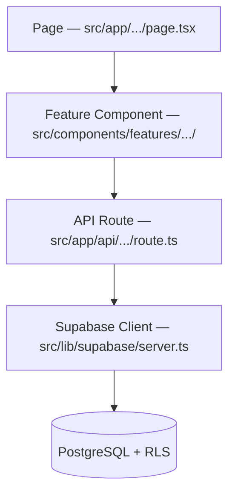
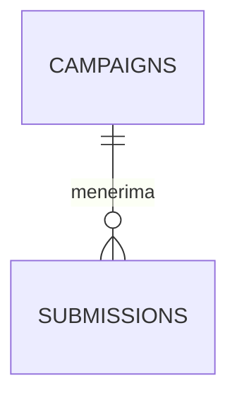
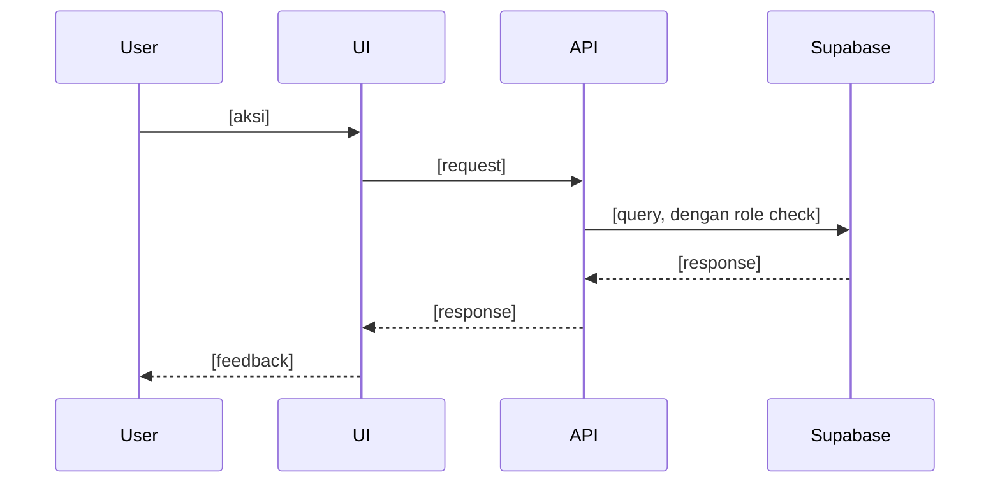

# Kiro Spec Generator — Marketiv Edition

Versi khusus [kiro-spec-generator](https://kiro.dev) yang di-preload dengan konteks
project **Marketiv (marketiv-web)**, sehingga tidak perlu tanya ulang tech stack,
arsitektur, role, atau business rules setiap kali bikin spec baru. Spec ini akan
dieksekusi oleh AI coding agent, jadi **presisi dan tidak ambigu** lebih penting
daripada kelengkapan kosmetik.

Gunakan skill generik `kiro-spec-generator` untuk project LAIN. Skill ini **hanya**
untuk Marketiv/marketiv-web.

---

## Aturan Kritis (Jangan Dilanggar)

1. **Jangan tanya ulang** tech stack, architecture pattern, role/persona, atau
   struktur folder — semua sudah didefinisikan di bagian "Konteks Project Marketiv"
   di bawah. Cukup ekstrak detail spesifik fitur dari percakapan.
2. **Jangan generate ketiga file sekaligus.** Selesaikan satu fase → berhenti →
   minta approval eksplisit → baru lanjut ke fase berikutnya.
3. **Jangan menulis kode implementasi** di ketiga file ini — hanya rencana.
4. **Setiap fase WAJIB lolos "Marketiv Compliance Check"** (lihat § Compliance
   Checklist) sebelum ditampilkan ke user. Kalau ada requirement/desain/task yang
   melanggar business rule Marketiv (misal: chat di Campaign Mode, transfer dana
   tanpa escrow, upload video ke server sendiri), **tolak dan usulkan alternatif
   yang sesuai** — jangan diam-diam diloloskan.
5. Kalau ada info spesifik fitur yang hilang (nama fitur, role terlibat, halaman
   terkait), **tanyakan semuanya sekaligus dalam satu batch** di awal.
6. Setiap acceptance criteria, komponen desain, dan task harus **testable** dan
   **traceable**.

---

## Workflow Wajib

```
Idea → requirements.md → [APPROVAL] → design.md → [APPROVAL] → tasks.md → [APPROVAL] → Execute
```

Setiap fase harus disetujui secara **eksplisit** oleh user sebelum lanjut.

---

## Konteks Project Marketiv (Baked-In — Jangan Ditanya Ulang)

### Tech Stack Aktual

| Layer | Teknologi |
|---|---|
| Frontend | Next.js 16 (App Router), React 19, TypeScript, Tailwind CSS v4 |
| Styling | Tailwind `@theme` tokens di `src/app/globals.css` (bukan `tailwind.config.ts` — project sudah migrasi ke Tailwind v4 CSS-first config) |
| Font | **Poppins** (`next/font/google`, di-load di `src/app/layout.tsx`) — catatan: `TECHNICAL_GUIDELINES.md` menyebut Inter, tapi implementasi aktual pakai Poppins. Ikuti kode aktual, bukan dokumen lama, kecuali user minta ganti. |
| Utility | `cn()` di `src/lib/utils.ts` (clsx + tailwind-merge) — pakai ini untuk conditional className, jangan bikin helper baru |
| Backend/DB | Supabase (PostgreSQL + Auth + Realtime) — **BELUM ter-install** (`@supabase/supabase-js` tidak ada di `package.json` saat ini). Kalau spec adalah fitur pertama yang butuh backend, task-nya WAJIB mencakup setup client Supabase (`src/lib/supabase/client.ts` & `server.ts`) sebagai foundational task. |
| Payment | Midtrans (VA, e-Wallet, QRIS) — juga belum ter-install, sama seperti di atas |
| AI — Chatbot "Tivvy" | **OpenRouter** (bukan OpenAI langsung), lihat `src/app/api/chat/route.ts`. Model default `qwen/qwen3-30b-a3b:free` via `OPENROUTER_API_KEY`/`OPENROUTER_BASE_URL`/`OPENROUTER_MODEL` |
| AI — Brief Assistant | Di `FEATURES.md` disebut pakai OpenAI (`gpt-4o-mini`) — ini rencana, belum diimplementasi. Kalau spec menyentuh AI Brief Assistant, klarifikasi ke user apakah tetap pakai OpenAI atau disatukan ke OpenRouter yang sudah jalan. |
| Deployment | Vercel/Netlify, free-tier-first (constraint P2MW) |

### Struktur Folder Aktual (ikuti pola ini, jangan bikin pola baru)

```
src/
├── app/
│   ├── page.tsx                  → Landing Page (public)
│   ├── umkm/page.tsx              → Halaman browse UMKM (belum di /dashboard/umkm)
│   ├── creator/page.tsx           → Halaman browse Kreator (belum di /dashboard/kreator)
│   └── api/chat/route.ts          → API route existing (pola: NextRequest/NextResponse, try-catch, env var check)
├── components/
│   ├── ui/                        → "Dumb" komponen presentational murni (Button, dst) — TIDAK ADA business logic
│   ├── features/[domain]/         → "Smart" komponen per domain (dashboard/, landing/, chatbot/) — state, fetch, logic
│   └── layouts/                   → Struktural (Navbar, dst) — dipakai di layout.tsx/page.tsx
├── data/                          → Konten statis & dummy data, dipisah dari komponen:
│                                     content.ts (copy/label per halaman, contoh: UMKM_CONTENT, CARD_CONTENT),
│                                     campaigns.ts / creators.ts (dummy data, akan diganti Supabase query),
│                                     chatbotKnowledge.ts (knowledge base chatbot)
├── types/                         → Interface TypeScript per domain (campaign.ts, chat.ts, dst)
└── lib/                           → utils.ts (cn helper) — nanti tambah supabase/, midtrans.ts, openai.ts di sini
```

**Catatan penting**: routing saat ini masih flat (`/umkm`, `/creator`) sebagai halaman publik
browse-only dengan dummy data — BELUM ada auth, dashboard `/dashboard/umkm`, `/dashboard/kreator`,
`/admin`, atau proteksi role seperti yang dispesifikasikan di `TECHNICAL_GUIDELINES.md § 2`.
Kalau spec yang diminta menyentuh area ini, **cek dulu ke user**: apakah scope-nya lanjutan
dari halaman publik yang sudah ada, atau memang mulai bangun dashboard + auth dari nol.

### Role & RBAC

Tiga role: `UMKM`, `KREATOR`, `ADMIN` (enum di kolom `role` tabel `users`). Setiap
requirement yang butuh akses data harus jelas role mana yang boleh akses, sesuai
matriks RBAC di `FEATURES.md § 1.3`.

### Skema Database yang Sudah Ada (reuse dulu sebelum bikin tabel baru)

`USERS`, `CAMPAIGNS`, `SUBMISSIONS`, `RATE_CARDS`, `RATE_CARD_ORDERS`,
`TRANSACTIONS`, `MESSAGES` — detail kolom lengkap di `DATABASE.md`. Kalau fitur baru
butuh tabel baru, cek dulu apakah bisa jadi kolom tambahan di tabel existing sebelum
mengusulkan tabel baru (hindari over-normalisasi untuk MVP).

### Dua Mode Bisnis Inti (jangan pernah dicampur)

| | Campaign Mode | Rate Card Mode |
|---|---|---|
| Model | Pay-per-view, performance-based | Fixed price, konsultatif |
| Chat | ❌ **TIDAK BOLEH ADA SAMA SEKALI** | ✅ Wajib ada (Supabase Realtime) |
| Bukti kerja | URL publik TikTok/IG (kreator posting di akun sendiri) | Collab Post (posting muncul di 2 akun) |
| Komisi | 15% dari budget, dibebankan ke UMKM | 10% dari harga final, dibebankan ke UMKM |
| Escrow | Wajib, cair tiered sesuai views tervalidasi | Wajib, cair setelah Collab Post terverifikasi |

---

## Compliance Checklist — Wajib Dicek di Setiap Fase

Sebelum menampilkan `requirements.md`, `design.md`, atau `tasks.md`, pastikan **tidak
ada satupun** dari ini yang dilanggar. Kalau user secara eksplisit minta sesuatu yang
melanggar, **tolak dan jelaskan alasannya**, lalu usulkan alternatif yang sesuai:

- [ ] Tidak ada fitur chat/pesan/kontak/komentar di area Campaign Mode
- [ ] Tidak ada tombol download/upload video final langsung ke server Marketiv
- [ ] Semua asset video mentah UMKM pakai URL eksternal (Google Drive/Dropbox), bukan file upload
- [ ] Upload file langsung (foto/logo) divalidasi maks 100MB di frontend DAN backend
- [ ] Tidak ada penyimpanan data kartu kredit/debit — delegasikan ke Midtrans
- [ ] Webhook Midtrans divalidasi signature-nya sebelum update status transaksi
- [ ] Dana tidak pernah transfer langsung UMKM → Kreator tanpa melalui Escrow
- [ ] Rate Card dibatasi maksimal 3 paket aktif per kreator
- [ ] Password di-hash Bcrypt, tidak ada plaintext di manapun (log, DB, response)
- [ ] Tidak ada API key (Supabase service role, Midtrans server key, OpenAI/OpenRouter key)
      yang diakses dari client-side — semua lewat API Route
- [ ] RLS/role check ada di setiap akses data yang scoped ke user tertentu
- [ ] UI mobile-first (mulai 375px), teks UI dalam Bahasa Indonesia sederhana
- [ ] Solusi tidak menambah biaya infra berbayar tanpa alasan kuat (free-tier-first)

---

## Langkah 1 — Kumpulkan Konteks Spesifik Fitur

Karena konteks project sudah baked-in, cukup ekstrak atau tanyakan (dalam satu batch)
hal-hal yang **spesifik ke fitur ini saja**:

| Field | Keterangan |
|---|---|
| **Nama fitur** | kebab-case → nama folder `.kiro/specs/[feature-name]/` |
| **Deskripsi singkat** | 2-3 kalimat: apa yang dibangun dan kenapa |
| **Mode terkait** | Campaign Mode / Rate Card Mode / Keduanya / Tidak terkait mode (contoh: Auth, Admin Report) |
| **Role yang terlibat** | UMKM / KREATOR / ADMIN — bisa lebih dari satu |
| **Halaman/route terkait** | Contoh: `/dashboard/kreator/job-pool` atau path aktual kalau masih di struktur flat saat ini |
| **Fitur/tabel existing yang berinteraksi** | Supaya tidak bentrok dan reuse skema yang sudah ada |
| **Scope (termasuk)** | Daftar yang masuk iterasi ini |
| **Scope (tidak termasuk)** | Yang sengaja tidak dibangun sekarang |
| **Constraint tambahan** | Di luar constraint standar Marketiv yang sudah baked-in di atas |

Kalau konteks sudah cukup dari percakapan yang ada (misal user sudah jelasin fiturnya
panjang lebar), langsung generate tanpa tanya ulang.

---

## Langkah 2 — Generate `requirements.md`

Simpan di: `.kiro/specs/[feature-name]/requirements.md`

### Self-Check Sebelum Output

- [ ] Setiap requirement punya user story (As a UMKM/KREATOR/ADMIN / I want / so that)
- [ ] Semua acceptance criteria pakai EARS notation dan testable
- [ ] Success Metrics punya angka/kondisi jelas
- [ ] Out of Scope eksplisit ditulis
- [ ] **Compliance Checklist di atas sudah dicek — tidak ada pelanggaran**

### EARS Notation

| Keyword | Kapan digunakan |
|---|---|
| `WHEN [event] THE SYSTEM SHALL [behavior]` | Trigger event → system response |
| `IF [kondisi] THEN the system SHALL [response]` | Kondisi opsional / state-dependent |
| `WHILE [kondisi berlangsung] the system SHALL [behavior]` | Perilaku kontinu |
| `WHERE [konteks/role/halaman] the system SHALL [behavior]` | Konteks spesifik role/halaman |

### Contoh — Bagus vs Buruk (kasus Marketiv)

❌ **Buruk** (ambigu, dan diam-diam melanggar rule):
> Sistem harus memudahkan UMKM menghubungi kreator di Campaign Mode kalau ada pertanyaan.

✅ **Bagus** (spesifik, testable, sesuai rule):
> WHERE user berada di Job Pool atau halaman Campaign manapun, THE SYSTEM SHALL
> tidak menampilkan tombol chat, form kontak, atau link WhatsApp — pertanyaan UMKM
> ke kreator diarahkan ke FAQ, bukan komunikasi langsung.

### Template `requirements.md`

```markdown
# Requirements — [Feature Name]

## Introduction

[Ringkasan singkat fitur, mode terkait (Campaign/Rate Card/N-A), dan nilai bisnis
yang diberikan. 2-3 kalimat.]

---

## Requirements

### 1. [Judul Requirement]

**User Story:** As a [UMKM/KREATOR/ADMIN], I want [functionality], so that [benefit].

#### Acceptance Criteria

1. WHEN [kondisi/event] THE SYSTEM SHALL [perilaku yang diharapkan]
2. WHEN [kondisi/event] THE SYSTEM SHALL [perilaku yang diharapkan]
3. IF [kondisi] THEN the system SHALL [respons kondisional]
4. WHERE [halaman/role] the system SHALL [perilaku spesifik]

---

### 2. [Judul Requirement]

**User Story:** As a [UMKM/KREATOR/ADMIN], I want [functionality], so that [benefit].

#### Acceptance Criteria

1. WHEN [kondisi/event] THE SYSTEM SHALL [perilaku yang diharapkan]
2. IF [kondisi] THEN the system SHALL [respons kondisional]

---

## Success Metrics

- [Metrik kuantitatif — contoh: "Form wizard bisa diselesaikan dalam < 4 langkah"]
- [Metrik kuantitatif — contoh: "Validasi file size < 500ms sebelum upload dimulai"]

## Constraints

- Mobile-first mulai 375px, teks UI Bahasa Indonesia sederhana
- [Constraint spesifik fitur ini, di luar yang sudah baked-in]

## Out of Scope

- [Fitur yang eksplisit tidak dibangun dalam spec ini]
```

### Approval Gate Setelah requirements.md

> *"Apakah requirements sudah sesuai? Kalau sudah, kita lanjut ke fase design."*

**Berhenti di sini. Jangan lanjut sebelum ada persetujuan eksplisit.**

---

## Langkah 3 — Generate `design.md`

Simpan di: `.kiro/specs/[feature-name]/design.md`

Design **harus menjawab semua requirement** dari Fase 1, dan **konsisten dengan
struktur folder aktual** (`src/components/ui` vs `src/components/features/[domain]`
vs `src/components/layouts` — lihat § Konteks Project Marketiv).

### Self-Check Sebelum Output

- [ ] Semua requirement dari requirements.md tercakup
- [ ] Minimal 1 diagram Mermaid (architecture / sequence / ER)
- [ ] Komponen baru ditempatkan di folder yang benar (ui/features/layouts)
- [ ] Kalau butuh Supabase dan belum ter-install, task setup client disebutkan
- [ ] Error handling, security (RLS/RBAC), dan performance dibahas
- [ ] **Compliance Checklist sudah dicek — tidak ada pelanggaran**

### Panduan Component Description — Bagus vs Buruk

❌ **Buruk**:
> `JobPoolCard` — nampilin campaign card.

✅ **Bagus**:
> **`JobPoolCard`** (`src/components/features/dashboard/JobPoolCard.tsx`)
> - **Tanggung jawab**: render 1 campaign di Job Pool kreator + tombol klaim,
>   disabled otomatis kalau `kuota_terpakai >= kuota_kreator`
> - **Input**: `campaign: Campaign` (extend type di `src/types/campaign.ts`)
> - **Output**: memanggil `onClaim(campaignId)` yang diteruskan dari parent
> - **Interaksi dengan**: `POST /api/campaigns/[id]/claim` (API route baru, cek
>   role KREATOR + kuota sebelum insert ke `submissions`)

### Template `design.md`

```markdown
# Design — [Feature Name]

## Overview

[Bagaimana desain ini memenuhi requirements. Sebutkan mode terkait (Campaign/Rate
Card/N-A) dan role yang terlibat.]

---

## Architecture



---

## Components and Interfaces

### [Nama Komponen] (`src/components/features/[domain]/[Nama].tsx`)

- **Tanggung jawab**: [...]
- **Input**: [props + tipe, referensi ke `src/types/`]
- **Output**: [...]
- **Interaksi dengan**: [API route / komponen lain]

---

## Data Models



_Kalau reuse tabel existing, cukup tunjukkan relasi yang relevan dari `DATABASE.md`.
Kalau ada kolom/tabel baru, tandai jelas mana yang baru._

### Type Interfaces

```typescript
// src/types/[domain].ts
interface FeatureModel {
  id: string;
  // ...
}
```

---

## API Design

_Skip kalau fitur murni UI tanpa backend baru._

| Endpoint | Method | Role | Purpose | Request | Response |
|---|---|---|---|---|---|
| `/api/[resource]` | GET | [role] | [...] | — | `{ data: T[] }` |
| `/api/[resource]` | POST | [role] | [...] | `{...}` | `{ data: T }` |

---

## Sequence Diagrams



---

## Error Handling Strategy

- **Validasi input**: frontend + backend (wajib dua-duanya, lihat § Compliance Checklist)
- **File size**: [kalau relevan — validasi 100MB, error message actionable]
- **Network/API error**: [...]
- **Auth/RBAC error**: [403 kalau role tidak sesuai matriks FEATURES.md § 1.3]

---

## Security Considerations

- **Authentication**: [role yang boleh akses]
- **RLS Policy**: [policy Supabase spesifik, reuse pola dari DATABASE.md § 8 kalau bisa]
- **Secrets**: [API key apa saja yang terlibat — pastikan hanya di server-side]
- **Escrow/Financial**: [kalau fitur ini menyentuh dana — jelaskan alur escrow]

## Performance Considerations

- **Query optimization**: [index, select field spesifik, pagination]
- **Lazy loading**: [komponen berat yang di-lazy-load]

## Testing Strategy

- **Unit tests**: [...]
- **Integration tests**: [alur kritis end-to-end]
- **Edge cases**: [termasuk kasus pelanggaran compliance yang harus DITOLAK sistem —
  contoh: submit file > 100MB, kreator submit ke campaign yang kuotanya penuh]
```

### Approval Gate Setelah design.md

> *"Apakah design sudah sesuai? Kalau sudah, kita lanjut ke implementation plan."*

**Berhenti di sini. Jangan lanjut sebelum ada persetujuan eksplisit.**

---

## Langkah 4 — Generate `tasks.md`

Simpan di: `.kiro/specs/[feature-name]/tasks.md`

### Aturan Wajib

- **Hanya aktivitas coding** — bukan meeting, deployment manual, riset.
- **Incremental** — task membangun di atas task sebelumnya.
- **Traceable** — setiap task mereferensikan requirement: `_Requirements: 1.1, 1.2_`
- **File path eksplisit** — sebutkan path aktual sesuai struktur folder Marketiv
  (`src/components/features/...`, `src/app/api/...`, dst), bukan path generik.
- **Executable** — bisa langsung dikerjakan AI coding agent tanpa bertanya balik.

### Self-Check Sebelum Output

- [ ] Setiap task mereferensikan requirement (`_Requirements: X.X_`)
- [ ] Task menyebutkan file path eksplisit sesuai konvensi folder Marketiv
- [ ] Kalau fitur pertama yang sentuh Supabase/Midtrans, ada task setup client duluan
- [ ] Quality Gates ada di bagian akhir, termasuk item dari Compliance Checklist

### Template `tasks.md`

```markdown
# Implementation Plan — [Feature Name]

## Overview

[Strategi implementasi dan urutan pengerjaan.]

---

## Task List

- [ ] 1. [Nama Epic / Kelompok Komponen Utama]
  - Setup type/interface di `src/types/[domain].ts`
  - _Requirements: 1.1, 1.2_

  - [ ] 1.1 [Sub-task spesifik]
    - Langkah implementasi di `src/[path spesifik]`
    - Tulis unit test
    - _Requirements: 1.1_

  - [ ] 1.2 [Sub-task spesifik]
    - Langkah implementasi
    - _Requirements: 1.2_

- [ ] 2. [Nama Epic Kedua — misal API Route]
  - Buat `src/app/api/[resource]/route.ts` — role check + validasi input
  - _Requirements: 2.1, 2.2_

  - [ ] 2.1 [Sub-task]
    - _Requirements: 2.1_

- [ ] 3. Integration & Quality Assurance
  - Pastikan semua komponen terintegrasi end-to-end
  - Jalankan semua unit test dan integration test
  - Validasi semua item di Compliance Checklist (§ SKILL.md)
  - Validasi semua acceptance criteria dari requirements.md
  - _Requirements: semua_

---

## Quality Gates

- [ ] Semua acceptance criteria di requirements.md tervalidasi
- [ ] Unit tests ditulis dan passing
- [ ] Integration test untuk alur kritis passing
- [ ] Error handling diimplementasikan di semua layer
- [ ] RLS/RBAC/validasi input terpenuhi
- [ ] Compliance Checklist Marketiv 100% tercentang, tidak ada pelanggaran
- [ ] Mobile-first ter-test di viewport 375px
- [ ] Tidak ada orphaned code

---

## Implementation Sequence

[Jelaskan urutan task secara singkat.]
```

### Approval Gate Setelah tasks.md

> *"Apakah tasks sudah sesuai? Spec siap dipakai di Kiro."*

---

## Anti-Pattern yang Harus Dihindari

| Anti-Pattern | Masalahnya | Solusi |
|---|---|---|
| Chat/kontak muncul di spec Campaign Mode | Melanggar hard constraint § 4.3 TECHNICAL_GUIDELINES.md | Tolak, arahkan ke FAQ atau redirect ke Rate Card Mode |
| Fitur upload video final ke server Marketiv | Melanggar batasan penyimpanan file | Ganti jadi submit URL publik TikTok/IG |
| Transfer dana langsung tanpa escrow | Melanggar prinsip keamanan platform | Selalu lewat tabel `TRANSACTIONS` + status Escrow |
| Requirement tanpa user story | Tidak jelas siapa yang butuh | Selalu "As a [role] / I want / so that" |
| Acceptance criteria generik | Tidak testable | Pakai EARS + kondisi terukur |
| Design tanpa diagram Mermaid | Susah dipahami AI agent | Minimal 1 diagram |
| Design pakai library/pattern baru tanpa alasan | Inkonsisten dengan repo (misal nambah shadcn padahal belum dipakai) | Pakai konvensi existing (`cn()`, struktur `ui/features/layouts`) |
| Task tanpa file path eksplisit | Ambigu untuk AI coding agent | Sebutkan path sesuai struktur folder aktual |
| Task tanpa referensi requirement | Tidak traceable | Tambahkan `_Requirements: X.X_` |
| Generate ketiga file sekaligus tanpa approval | Bug terbawa ke semua fase | Berhenti tiap file, minta approval |
| Asumsi Supabase/Midtrans sudah ter-install | Belum ada di `package.json` saat ini | Cek dulu, tambahkan task setup kalau perlu |

---

## Struktur Folder Output

```
.kiro/
└── specs/
    └── [feature-name]/          ← kebab-case dari nama fitur
        ├── requirements.md
        ├── design.md
        └── tasks.md
```

Contoh nama folder untuk Marketiv: `job-pool-kreator`, `wizard-buat-campaign`,
`custom-offer-rate-card`, `ai-brief-assistant`, `admin-dispute-management`,
`auth-registrasi-role`.

---

## Tips Reuse

- Kalau di kemudian hari tech stack aktual berubah (misal Supabase resmi
  ter-install, atau AI Brief Assistant beneran dibangun), update bagian
  "Konteks Project Marketiv" di skill ini duluan — supaya spec berikutnya
  tidak mengasumsikan state yang sudah usang.
- Untuk fitur besar (>8 requirement), pertimbangkan pecah jadi beberapa spec
  lebih kecil per sub-fitur.
- Selalu baca `requirements.md` menyeluruh sebelum approve `design.md`.
