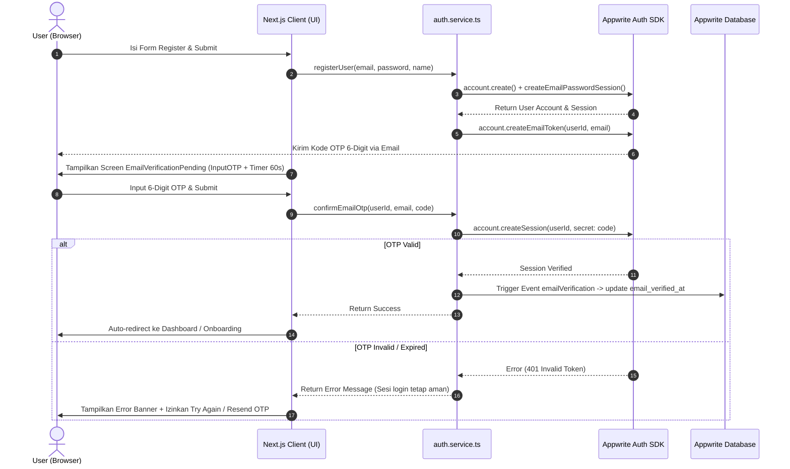
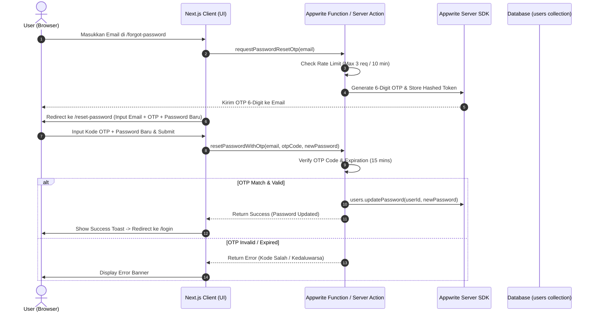

# 🎨 DESIGN SPECIFICATION: AUTHENTICATION & OTP SYSTEM

> **Arsitektur & Data Flow Sistem Otentikasi berbasis OTP (Email Token & Reset Password)**  
> **Modul**: Marketiv Auth Service  
> **Target Role**: Frontend Lead & Backend Engineer

---

## 1. ARCHITECTURE & DATA FLOW

### 1.1 Flow Verifikasi Email OTP saat Register



---

### 1.2 Flow Lupa & Reset Password via Kode OTP 6-Digit



---

## 2. COMPONENT & FUNCTION SPECIFICATIONS

### 2.1 Component: `EmailVerificationPending.tsx` (Refactored)

- **Input Control**: Ganti `<input type="text">` dengan `<InputOTP maxLength={6}>` yang memuat 6 `<InputOTPSlot>`.
- **State Management**:
  - `otpValue`: string (6 digit).
  - `countdown`: number (60 detik cooldown untuk resend).
  - `isResendDisabled`: boolean (`countdown > 0`).
  - `isSubmitting`: boolean (loading indicator pada tombol verifikasi).
- **Auto-Submit**: Ketika `otpValue.length === 6`, pemicu handler verifikasi berjalan otomatis tanpa mengharuskan pengguna menekan enter.

### 2.2 Component: `InputOTP` (`src/components/ui/input-otp.tsx`)

- **Slots**:
  - Slot 1 - 3: Blok pertama 3 digit.
  - Separator: Tanda hubung `-` di tengah.
  - Slot 4 - 6: Blok kedua 3 digit.
- **Visual Styles**: Border `border-neutral-200`, active state `border-orange-500 ring-2 ring-orange-500/20`, rounded-xl.

### 2.3 Service Function: `confirmEmailOtp` (`auth.service.ts`)

```typescript
export async function confirmEmailOtp(args: {
  userId: string;
  email: string;
  code: string;
}): Promise<ServiceResult<null>> {
  // Sesi pengguna TIDAK dihapus secara destruktif sebelum verifikasi.
  // Panggil createSession dengan OTP token.
}
```

---

## 3. SECURITY & PERFORMANCE CONSIDERATIONS

1. **OTP Token Lifespan**: Ditetapkan tepat **15 menit** sejak diterbitkan.
2. **Rate Limiting**: Maksimal 3 kali request OTP per 10 menit per IP / Email address untuk mencegah email flooding & SMS API abuse.
3. **No Sensitive Leaks**: Kode OTP mentah *TIDAK BOLEH* dikembalikan dalam HTTP Response payload client maupun tercatat di `console.log` browser.
4. **Session Protection**: Kegagalan verifikasi OTP *TIDAK BOLEH* membatalkan sesi login dasar pengguna jika pengguna sudah berhasil melakukan autentikasi password.
