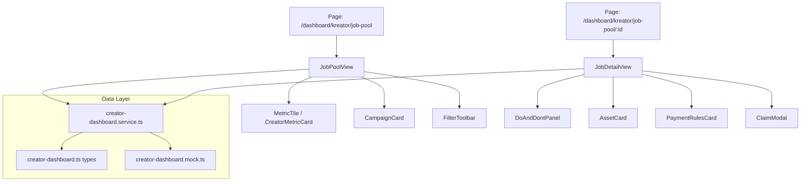
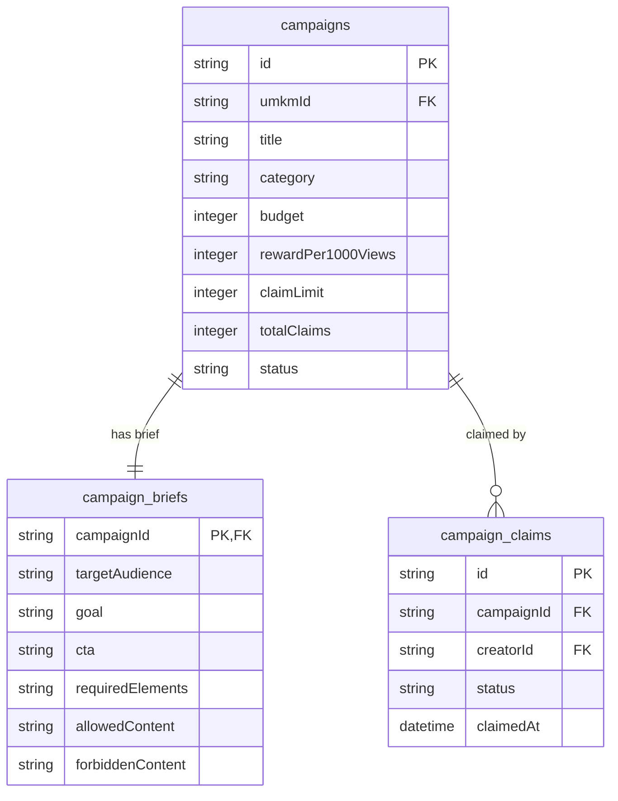
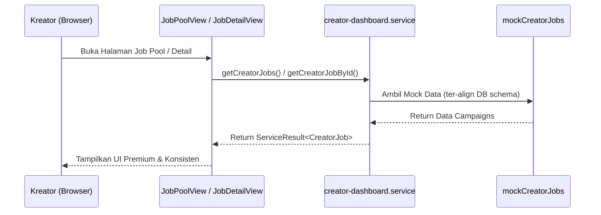

# Design — Refactor UI Job Pool & Job Detail Kreator

## Overview

Desain ini merekonstruksi UI/UX halaman Job Pool dan Detail Job pada dashboard Kreator untuk mencapai konsistensi visual premium dengan Dashboard Overview. Desain ini juga menyelaraskan data model frontend dengan skema database Appwrite resmi dari modul `Campaigns` (`campaigns` dan `campaign_briefs`).

---

## Architecture



---

## Components and Interfaces

### 1. `JobPoolView` (`src/components/features/creator-dashboard/JobPoolView.tsx`)
- **Tanggung jawab**: Halaman utama direktori lowongan campaign bagi kreator. Menampung metrik summary, toolbar filter, dan grid card campaign.
- **Modifikasi**:
  - Ganti render metrik lama dengan `MetricTile` (gaya glassmorphism, rounded-22px, hover translate, highlight untuk Reward Tertinggi).
  - Ganti card list dengan `CampaignCard` yang di-copy dari `CreatorDashboardView.tsx` (gaya cover aspect 4:3, brand row overlay, niche tags, slot remaining, gradient progress bar, action buttons: Detail & Klaim).
  - Standarisasi control inputs di toolbar menjadi `rounded-xl` (rectangular modern) dengan state feedback reset filter.

### 2. `JobDetailView` (`src/components/features/creator-dashboard/JobDetailView.tsx`)
- **Tanggung jawab**: Halaman detail brief campaign, informasi aset materi, aturan pembayaran, dan tombol klaim utama.
- **Modifikasi**:
  - Struktur layout 2 kolom (Kiri: Brief & Aturan, Kanan: Cover, Materi Aset, Aturan Pembayaran, Tombol Klaim).
  - Bungkus setiap seksi dalam container bergaya premium (`bg-white/70 backdrop-blur-md border border-neutral-200/60 rounded-[22px] p-6 shadow-sm`).
  - Redesign seksi metrik detail dalam grid 5 kolom horizontal yang clean.
  - Implementasi Do & Don'ts panel dengan visual side-by-side soft green dan soft red.
  - Tombol aksi Drive/Dropbox hijau tua, tombol klaim ungu-oranye gradien (disabled otomatis jika kuota penuh).

### 3. `CreatorJob` Type (`src/types/creator-dashboard.ts`)
- **Tanggung jawab**: Menyelaraskan kontrak objek campaign di UI dengan skema DB Appwrite.
- **Peta Properti**:
  - `niche` -> dipetakan dari tabel `campaigns.category`
  - `ratePerThousandViews` -> dipetakan dari `campaigns.rewardPer1000Views` (integer CPM)
  - `quota` -> dipetakan dari `campaigns.claimLimit`
  - `usedQuota` -> dipetakan dari `campaigns.totalClaims`
  - `totalBudget` -> dipetakan dari `campaigns.budget`
  - `externalAssetUrl` -> dipetakan dari `campaigns.asset_external_url`
  - `productDescription` -> dipetakan dari `campaign_briefs.goal` atau `campaigns.description`
  - `contentInstruction` -> dipetakan dari `campaign_briefs.requiredElements`
  - `doAndDont.do` -> dipetakan dari `campaign_briefs.allowedContent`
  - `doAndDont.dont` -> dipetakan dari `campaign_briefs.forbiddenContent`
  - `targetAudience` -> dipetakan dari `campaign_briefs.targetAudience`
  - `ctaInstruction` -> dipetakan dari `campaign_briefs.cta`

---

## Data Models



### Type Mapping Interface

```typescript
// Penyelarasan interface di src/types/creator-dashboard.ts
export interface CreatorJob {
  id: string;
  title: string;
  brandName: string;
  brandAvatar: string;
  brief: string;
  niche: CreatorNiche;              // category di DB
  quota: number;                    // claimLimit di DB
  usedQuota: number;                // totalClaims di DB
  ratePerThousandViews: number;     // rewardPer1000Views di DB
  status: CampaignStatus;           // status di DB (active/paused/completed)
  totalBudget: number;              // budget di DB
  createdAt: string;
  targetViews?: number;             // minViews di DB
  productDescription?: string;      // description di DB / brief.goal
  contentInstruction?: string;      // brief.requiredElements di DB
  doAndDont?: {
    do: string[];                   // brief.allowedContent di DB
    dont: string[];                 // brief.forbiddenContent di DB
  };
  targetAudience?: string;          // brief.targetAudience di DB
  ctaInstruction?: string;          // brief.cta di DB
  externalAssetUrl?: string;        // asset_external_url di DB
  thumbnailUrl?: string;
}
```

---

## Sequence Diagrams



---

## Error Handling Strategy

- **Simulator Error**: Mempertahankan fungsionalitas `isErrorSimulated` untuk QA review dengan tombol pemulihan. Menggunakan `DashboardStateCard` yang terstandarisasi.
- **Empty States**: Jika list kosong atau hasil filter tidak ditemukan, render `CreatorEmptyState` dengan tombol reset filter beraksen soft red.
- **Validasi Klaim**: Modal klaim menampilkan checklist 4 aturan penting. Tombol "Klaim Sekarang" dikunci hingga keempat ketentuan dicentang untuk menghindari fraud pengerjaan.

---

## Security Considerations

- **Strict Role Isolation**: Halaman ini berada di bawah rute `/dashboard/kreator/*` yang hanya dapat diakses oleh user ber-role `KREATOR`.
- **Zero Chat Boundary**: Tidak ada komponen chat, input komentar, atau tautan komunikasi langsung antara Kreator dan UMKM pada Campaign Mode (sesuai spesifikasi domain logic).
- **Escrow-Based State**: Payout reward dirilis secara otomatis oleh sistem/admin, bukan dikelola langsung oleh frontend.

## Performance Considerations

- **Visual Assets**: Menggunakan Next.js `Image` dengan properti `sizes` yang optimal untuk mencegah layout shifting saat merender sampul card campaign.
- **Backdrop Blur Optimization**: Membatasi properti `backdrop-blur-md` hanya pada elemen card utama agar tetap ringan dijalankan pada device mobile low-end.

## Testing Strategy

### Automated & Manual Verification Cases:
1. **Verifikasi Responsif (375px - 1440px)**: Memastikan grid summary cards berganti dari `grid-cols-4` (desktop) menjadi grid 2 kolom / 1 kolom pada viewport mobile tanpa layout overflow.
2. **Uji Coba Klaim Campaign**:
   - Klik "Klaim Job" -> Modal checklist terbuka.
   - Centang 1-3 aturan -> Tombol klaim terkunci.
   - Centang semua -> Tombol aktif -> Sukses modal terbuka -> Kuota terpakai bertambah lokal.
3. **Penyelarasan Tipe Data**: Memastikan compile TypeScript lulus strict check setelah `CreatorJob` dan file mock dimodifikasi sesuai schema DB Appwrite.
