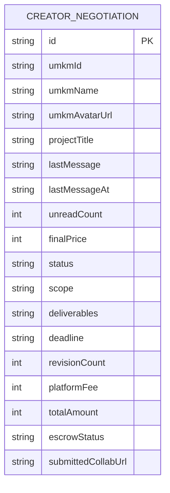
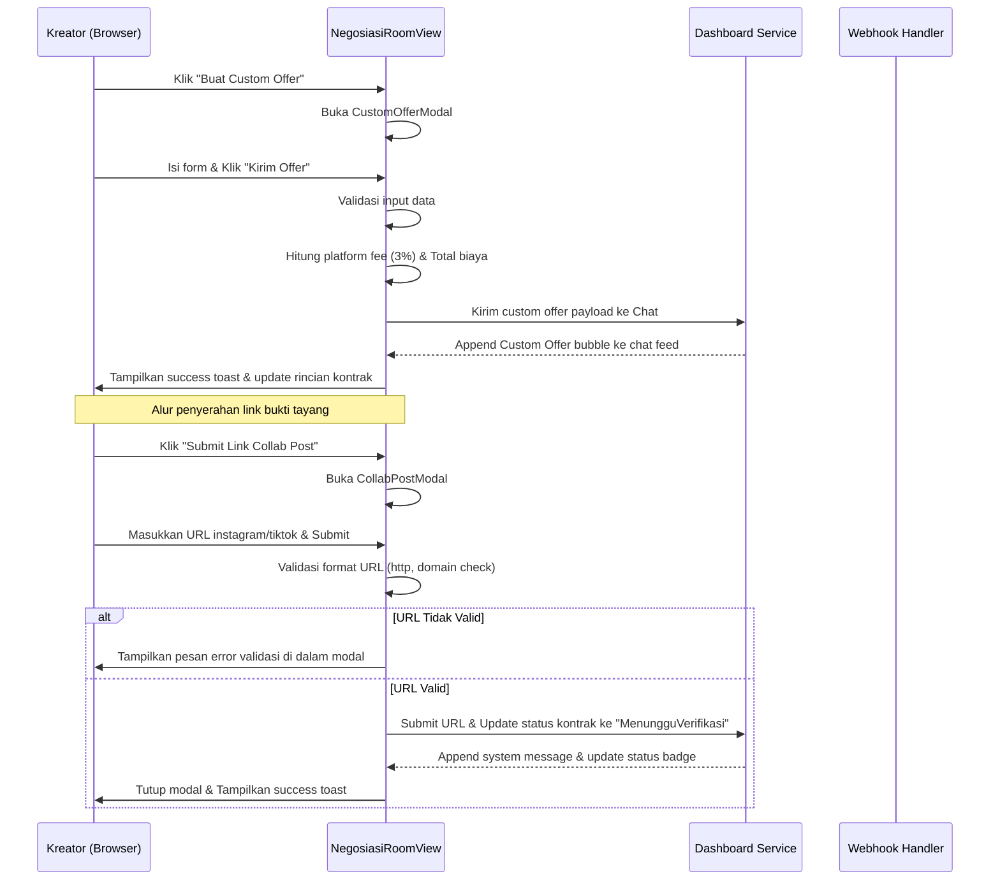

# Design — Negosiasi Rate Card Kreator

## Overview

Desain arsitektur untuk halaman Negosiasi Rate Card Kreator mengedepankan pemisahan tanggung jawab (*separation of concerns*) yang jelas antara presentasi antarmuka pengguna (UI) dan logika bisnis. Antarmuka ini dirancang agar responsif sepenuhnya (*mobile-first*) dan menggunakan token warna yang dideklarasikan di `globals.css` di bawah selektor `body.theme-kreator` untuk menjamin konsistensi palet abu-abu dingin/slate dan aksen violet/indigo.

Komponen utama dibagi menjadi dua bagian besar:
1. **NegosiasiView**: Komponen daftar transaksi negosiasi yang menampilkan filter status, kotak pencarian, ringkasan metrik, serta deretan kartu chat negosiasi aktif.
2. **NegosiasiRoomView**: Komponen ruang obrolan interaktif terbagi (*split-pane layout*) yang menyatukan log obrolan di sebelah kiri serta kartu detail kontrak kerja dan checklist penyerahan di sebelah kanan.

---

## Architecture

```mermaid
graph TD
    A[Page — src/app/dashboard/kreator/negosiasi/page.tsx] --> B[NegosiasiView — src/components/features/creator-dashboard/NegosiasiView.tsx]
    C[Page — src/app/dashboard/kreator/negosiasi/[id_order]/page.tsx] --> D[NegosiasiRoomView — src/components/features/creator-dashboard/NegosiasiRoomView.tsx]
    
    B --> E[CreatorMetricCard]
    B --> F[CreatorStatusBadge]
    
    D --> G[CustomOfferModal]
    D --> H[CollabPostModal]
    D --> I[ContractDetailsCard]
    D --> J[DeliverablesChecklistCard]
```

---

## Components and Interfaces

### 1. `NegosiasiView` (`src/components/features/creator-dashboard/NegosiasiView.tsx`)

- **Tanggung jawab**: 
  - Me-render daftar lengkap negosiasi Rate Card yang dikelompokkan dan dapat difilter.
  - Menampilkan metrik ringkasan status di barisan paling atas.
  - Menyediakan input pencarian dan filter dropdown status kontrak.
- **Input**:
  - `initialNegotiations: CreatorNegotiation[]` (dari service backend/mock).
- **State**:
  - `search: string` (kata kunci pencarian).
  - `selectedStatus: string` (status filter terpilih).
  - `sortBy: string` (kriteria pengurutan).
  - `isLoadingSimulated: boolean` (simulator loading state).
  - `isEmptySimulated: boolean` (simulator empty state).
  - `isErrorSimulated: boolean` (simulator error state).
- **Output**:
  - Me-render visual interaktif daftar negosiasi. Redirect ke room chat saat tombol dibuka diklik.

### 2. `NegosiasiRoomView` (`src/components/features/creator-dashboard/NegosiasiRoomView.tsx`)

- **Tanggung jawab**:
  - Menyediakan workspace chat negosiasi dua arah antara kreator dan UMKM.
  - Me-render pesan chat, penawaran khusus (*custom offer*), dan notifikasi sistem.
  - Mengelola form aksi dynamic toolbar sesuai status kontrak (Buat Custom Offer, Submit Link Collab Post).
- **Input**:
  - `negotiation: CreatorNegotiation | null`
  - `onRetry?: () => void`
- **State**:
  - `chatMessages: Array<{ id, sender, text, time, isCustomOffer?, offerData? }>` (daftar pesan obrolan aktif).
  - `inputMessage: string` (teks pesan input composer).
  - `isOfferModalOpen: boolean` (kontrol modal custom offer).
  - `isCollabModalOpen: boolean` (kontrol modal submit link collab post).
  - `collabUrl: string` (input link Collab Post).
  - `collabError: string | null` (pesan error validasi URL link).

### 3. `CustomOfferModal` (Internal Modal Component)

- **Tanggung jawab**: me-render formulir pembuatan kontrak penawaran khusus untuk negosiasi harga dan cakupan kerja baru.
- **Input Props**:
  - `isOpen: boolean`
  - `onClose: () => void`
  - `onSubmit: (data: OfferFormPayload) => void`
  - `initialData: { price: number; scope: string; deliverables: string; revisions: number; days: number }`

### 4. `CollabPostModal` (Internal Modal Component)

- **Tanggung jawab**: me-render input form validasi tautan URL Collab Post Instagram / TikTok yang telah dipublikasikan.
- **Input Props**:
  - `isOpen: boolean`
  - `onClose: () => void`
  - `onSubmit: (url: string) => void`
  - `error: string | null`

---

## Data Models



### Type Interfaces

```typescript
// src/types/creator-dashboard.ts

export type ContractStatus = 
  | "Negosiasi"
  | "MenungguPembayaran"
  | "Escrow"
  | "Revisi"
  | "MenungguVerifikasi"
  | "Selesai";

export type EscrowSecurityStatus = 
  | "Pending"
  | "Escrowed"
  | "Released";

export interface CreatorNegotiation {
  id: string;
  umkmId: string;
  umkmName: string;
  umkmAvatarUrl?: string;
  projectTitle: string;
  lastMessage: string;
  lastMessageAt: string;
  unreadCount: number;
  finalPrice: number;
  status: ContractStatus;
  scope: string;
  deliverables?: string;
  deadline: string;
  revisionCount?: number;
  platformFee?: number;
  totalAmount?: number;
  escrowStatus?: EscrowSecurityStatus;
  submittedCollabUrl?: string;
}

export interface OfferFormPayload {
  price: number;
  scope: string;
  deliverables: string;
  revisions: number;
  days: number;
}
```

---

## Sequence Diagrams



---

## Error Handling Strategy

1. **Validasi Formulir Custom Offer**:
   - Kolom harga penawaran (`offerPrice`) divalidasi tidak boleh kurang dari Rp 50.000 atau bernilai negatif.
   - Kolom durasi dan revisi maksimal divalidasi wajib bernilai bulat positif (`>= 1`).
   - Jika validasi gagal, tombol kirim dinonaktifkan atau formulir memunculkan pesan error penjelas di bawah input.
2. **Validasi Tautan URL Collab Post**:
   - URL disanitasi menggunakan fungsi `.trim()` untuk membuang spasi kosong.
   - Pola regex atau pencarian substring (`.includes()`) diterapkan untuk memverifikasi keberadaan domain platform sosial media.
   - Skema protokol URL wajib memuat awalan `http://` atau `https://`.
   - Pesan error validasi dimunculkan di dalam modal dialog tanpa menutup modal, menjaga data input tetap ada agar user tidak perlu mengetik ulang dari nol.
3. **Penyelamatan State Error Komunikasi Data**:
   - Jika pemuatan data inisiasi gagal, system me-render `CreatorErrorState` yang memuat tombol "Coba Lagi".
   - Setiap mutasi asinkronus dibungkus dalam blok `try-catch` dengan feedback toast yang informatif jika terjadi kegagalan jaringan atau timeout.

---

## Security Considerations

1. **Proteksi Akses Kontrak Negosiasi (RBAC)**:
   - Akses detail obrolan negosiasi dibatasi hanya untuk kreator pemilik Rate Card bersangkutan dan UMKM pembuat penawaran.
   - Pada integrasi database Supabase mendatang, baris data diproteksi menggunakan **Row Level Security (RLS)** dengan policy pengecekan ID pengguna:
     `auth.uid() = creator_id OR auth.uid() = umkm_id`.
2. **Perlindungan Terhadap Kebocoran Saldo**:
   - Komponen frontend dilarang keras melakukan manipulasi langsung atau memutasi saldo akun dompet (`wallet balance`), saldo escrow, maupun data pembayaran secara langsung.
   - Pemrosesan keuangan hanya dipicu via server secure endpoints (Server Actions / Webhook) yang divalidasi integritas signature key-nya (Midtrans).
3. **Penyimpanan Kunci API Tersembunyi (Server-Side Secrets)**:
   - Seluruh API Key berwewenang tinggi (seperti server key Midtrans atau token otentikasi admin) dilarang dimasukkan dalam bundle skrip klien. Kunci-kunci tersebut harus disimpan dalam Environment Variables aman dan hanya boleh diakses di tingkat API Route Next.js / Server Component.

---

## Performance Considerations

1. **Optimasi Rendering Chat Feed**:
   - Pesan chat yang berukuran panjang di-render menggunakan key unik berbasis ID pesan (`msg.id`) untuk meminimalkan re-render berlebihan dari React Virtual DOM.
   - Input chat composer memanfaatkan state lokal yang terisolasi untuk menghindari kelambatan respon saat pengguna mengetik karakter teks di keyboard.
2. **Optimasi Scrolling Behavior**:
   - Setelah pesan baru dikirim atau ditambahkan, panel obrolan akan melakukan auto-scroll ke dasar chat feed secara instan (`scrollTop = scrollHeight` atau `scrollIntoView({ behavior: 'smooth' })`).
3. **Lazy Loading Modals**:
   - Dialog modal Custom Offer dan Collab Post hanya di-render ke dalam DOM ketika state `isOpen` bernilai `true`, menghemat konsumsi memori browser klien.

---

## Testing Strategy

1. **Uji Validitas Format Input URL**:
   - Masukkan input tautan tidak valid (tanpa http, domain salah seperti `google.com`) -> pastikan modal memunculkan error validasi yang tepat dan mencegah pengiriman form.
   - Masukkan input tautan valid (misal: `https://www.instagram.com/reel/123/`) -> pastikan pengiriman lolos dan status kontrak berubah menjadi `MenungguVerifikasi`.
2. **Uji Perhitungan Biaya Klien (DoD)**:
   - Isi form Custom Offer seharga Rp 1.000.000 -> pastikan ringkasan samping menampilkan:
     - Biaya Platform (3%): Rp 30.000
     - Total Tagihan: Rp 1.030.000
3. **Uji Tampilan Mobile Viewport (375px)**:
   - Atur browser viewport ke ukuran 375px -> pastikan layout chat area dan detail kontrak samping melipat ke bawah secara rapi (samping menjadi baris terbawah) tanpa ada pemotongan teks atau tombol tersembunyi.
4. **Uji Simulasi State Kosong (Empty State)**:
   - Aktifkan simulator state kosong -> pastikan halaman menampilkan ilustrasi kosong dan pesan informatif yang membimbing pengguna untuk mereset filter pencarian.
