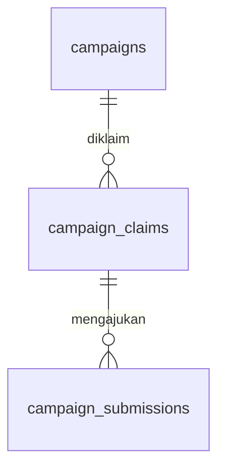
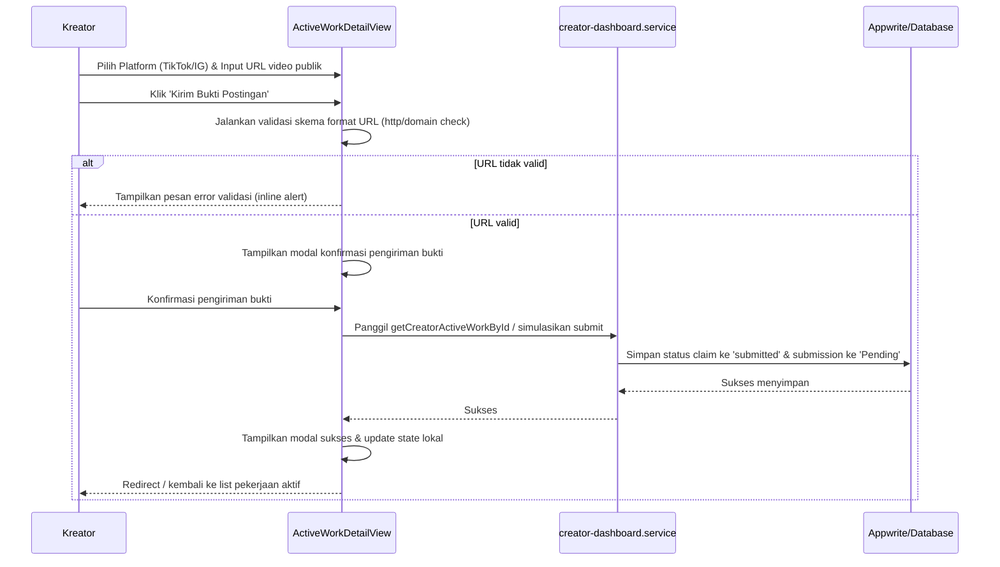

# Design — Pekerjaan Aktif Kreator Revamp

## Overview

Dokumen desain ini menerangkan arsitektur, komponen, struktur data, dan alur interaksi antarmuka (UX) untuk pembenahan halaman Pekerjaan Aktif Kreator di Marketiv. Desain ini dibuat selaras dengan layout modern bertema violet, menolak warna cream, dan mengoptimalkan formulir pengajuan bukti postingan (URL media sosial) sesuai kebijakan Campaign Mode.

---

## Architecture

```mermaid
graph TD
    A[Page: pekerjaan-aktif/page.tsx] --> B[PekerjaanAktifView]
    C[Page: pekerjaan-aktif/[id]/page.tsx] --> D[ActiveWorkDetailView]
    B --> E[MarketplaceCard]
    B --> F[DashboardMetricCard]
    D --> G[DashboardCard]
    D --> H[DashboardModal]
    D --> I[Timeline Progres Bukti]
```

---

## Components and Interfaces

### 1. `PekerjaanAktifView` (`src/components/features/creator-dashboard/PekerjaanAktifView.tsx`)

- **Tanggung jawab**:
  - Menampilkan daftar kampanye yang telah diklaim oleh kreator dengan layout grid modern.
  - Menyediakan filter pencarian teks, filter status pengerjaan, filter jangka waktu deadline, dan pengurutan (sorting) deadline/tanggal klaim.
  - Menampilkan 4 buah ringkasan metrik status pengerjaan (Belum Submit, Menunggu Validasi, Valid, Perlu Review/Fraud) dalam format card modern.
  - Merender peringatan anomali (fraud warning) pada card jika terdeteksi fraud.
- **Input**:
  - `initialWorks: CreatorActiveWork[]` (didefinisikan di `src/types/creator-dashboard.ts`)

---

### 2. `ActiveWorkDetailView` (`src/components/features/creator-dashboard/ActiveWorkDetailView.tsx`)

- **Tanggung jawab**:
  - Menampilkan spanduk hero gelap (`#0c172b`) dengan tombol kembali, detail advertiser, status/kategori, tarif CPM, target views, tombol klaim/submit, dan spanduk cover image produk di sisi kanan.
  - Menyajikan tab navigasi ("Detail" dan "Video Kamu") dengan transisi warna violet.
  - Merender instruksi brief produk dan do&apos;s/don&apos;ts secara side-by-side.
  - Merender form submit bukti URL postingan publik (TikTok/Instagram) dengan validasi format URL sebelum pengiriman.
  - Merender hasil audit data views, platform asal, dan rilis dana reward jika status verifikasi adalah `Valid`.
  - Merender panel samping kanan: pelacakan timeline progres verifikasi serta ringkasan syarat pembayaran escrow.
- **Input**:
  - `work: CreatorActiveWork | null`

---

## Data Models

Desain ini me-reuse skema data database `campaign_claims` dan `campaign_submissions` yang ada di dokumen backend `docs/02_Modules/Campaigns/50_Database.md`.



### Type Interfaces

Desain ini menggunakan tipe data yang telah didefinisikan di `src/types/creator-dashboard.ts`:
- `CreatorActiveWork` (gabungan data klaim dan submission untuk tampilan detail/list)

---

## Sequence Diagram: Submission Workflow



---

## Error & Validation Handling

1. **Validasi URL Platform**:
   - Platform **TikTok**: URL wajib memuat domain `tiktok.com` dan diawali `http://` atau `https://`.
   - Platform **Instagram**: URL wajib memuat domain `instagram.com` dan diawali `http://` atau `https://`.
   - Menampilkan alert merah inline di atas form pengisian jika tidak lolos validasi.
2. **Limitasi Upload**:
   - Sesuai P2MW Compliance, dilarang ada input file upload video di halaman ini (cukup berupa string URL tautan).

---

## Security & Compliance Check

- **Escrow Integrity**: Wallet balance dan status pembayaran tidak pernah dimutasi langsung oleh client. Halaman detail hanya membaca field `earnings` secara read-only dari backend.
- **Zero Communication Rule**: Dilarang ada tombol chat, komentar, atau tautan WhatsApp ke UMKM. Semua petunjuk pengerjaan tertera lengkap di brief.

---

## Testing Strategy

- **Test Input URL**: Memastikan form menolak tautan salah (misal: link youtube dikirim ke platform TikTok).
- **Test Simulasi State**: QA memverifikasi rendering alert merah peringatan fraud di list card ketika status klaim diset ke `Fraud` beserta alasan penolakannya.
