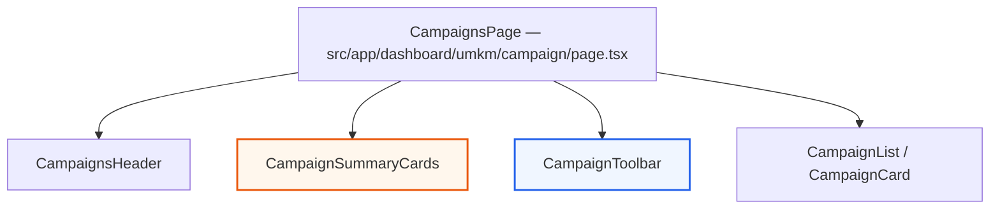
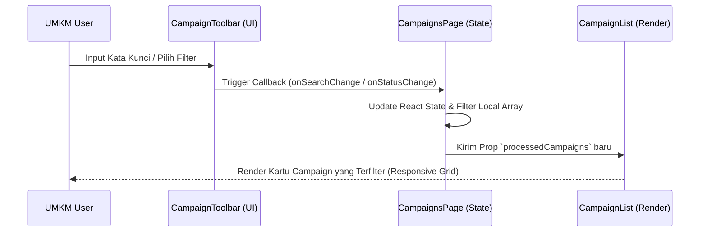

# Design — Refactor UI Campaigns & Campaign Detail

## Overview

Desain ini merestrukturisasi komponen layout, metrik summary cards, dan input controls pada seksi manajemen campaign UMKM. Refactoring ini memindahkan elemen-elemen visual agar mematuhi standar **Marketiv Studio System v5.8**, mengeliminasi duplikasi margin-bottom, menggunakan individual status pills, serta mengganti input capsule (`rounded-full`) menjadi rectangular modern (`rounded-xl`). Fitur select dropdown opsional menggunakan komponen `@/components/ui/select` berbasis Radix UI untuk keselarasan dengan UI kit internal.

---

## Component Flow Architecture

---

## Components and Interfaces

### 1. `CampaignsHeader` (`src/components/features/umkm-dashboard/campaign/CampaignsHeader.tsx`)
- **Tanggung jawab**: Merender header halaman manajemen campaign (title, deskripsi, tombol "Export Laporan" dan "Buat Campaign").
- **Perubahan Desain**: 
  - Menghapus style inline `marginBottom: 26`. Spacing vertikal diserahkan sepenuhnya ke parent wrapper (`UmkmPageWrapper`) yang memiliki `gap: 26px`.
  - Memastikan tombol aksi ("Export Laporan" dan "+ Campaign") menggunakan radius `rounded-xl` (12px) sesuai sistem desain v5.8, dengan font-weight `font-bold` (790/800).

### 2. `CampaignSummaryCards` (`src/components/features/umkm-dashboard/campaign/CampaignSummaryCards.tsx`)
- **Tanggung jawab**: Menampilkan ringkasan metrik (Total Campaign, Aktif, Selesai, Views, Pending, Budget).
- **Perubahan Desain**:
  - Mengubah layout grid dari `.dashboard-rule-grid mb-7` menjadi Tailwind CSS grid responsif: `grid grid-cols-2 md:grid-cols-3 xl:grid-cols-6 gap-4`.
  - Menata ulang `SummaryCard` menggunakan layout modern:
    - Card container: `rounded-[22px] border border-neutral-200 bg-gradient-to-b from-white to-neutral-50 shadow-xs p-4 sm:p-5 transition-all duration-300 hover:-translate-y-1 hover:shadow-md`.
    - Value font style: `--font-display` (Sora), font size `text-xl sm:text-2xl lg:text-[1.75rem]`, font weight `font-black text-neutral-900 tracking-tight leading-none mt-1.5`. Menghapus class `.metric-value` bawaan yang berukuran konstan `2.05rem` untuk mencegah auto-wrapping teks nominal panjang (misal `Rp 12.6jt`).
    - Label & Note font style: `text-[0.74rem] font-extrabold text-neutral-500 uppercase` dan `text-[0.78rem] text-neutral-400 mt-1.5`.

### 3. `CampaignListSkeleton` (`src/components/features/umkm-dashboard/campaign/CampaignListSkeleton.tsx`)
- **Tanggung jawab**: Menampilkan skeleton loading saat data sedang dimuat secara asinkron.
- **Perubahan Desain**:
  - Memperbarui class container pada `CampaignSummaryCardsSkeleton` agar sejalan dengan grid baru: `grid grid-cols-2 md:grid-cols-3 xl:grid-cols-6 gap-4` (menghapus `mb-6`).

### 4. `CampaignToolbar` (`src/components/features/umkm-dashboard/campaign/CampaignToolbar.tsx`)
- **Tanggung jawab**: Menyediakan control pencarian, dropdown filter kategori (Niche), dropdown sorting, status tab switcher, dan view mode toggle (card vs table).
- **Perubahan Desain**:
  - Container: Menghapus style inline (borderRadius, background, border, shadow, gap) dan class `mb-6`. Sebagai gantinya, menggunakan kelas Tailwind: `bg-white border border-neutral-200/80 rounded-2xl p-4 shadow-xs flex flex-col gap-4`.
  - Search Input: Mengubah shape dari `rounded-full` menjadi `rounded-xl`. Menghapus spacer flex kosong (`flex-1`) di antara filter dan view switcher, sehingga search input memiliki keleluasaan bertumbuh (`flex-grow min-w-[280px]`).
  - Select Dropdowns: Menggunakan komponen Radix UI `Select` (`src/components/ui/select.tsx`) atau select standar dengan pembungkus `rounded-xl border border-neutral-200 px-3 py-2 text-xs font-bold text-neutral-700` dengan ikon chevron kustom.
  - Active Indicator & Reset Button: Diubah menjadi `rounded-xl` dengan style warna premium (Reset: border merah dashed `border-red-200`, bg soft `bg-red-50`).
  - Status Tabs (Row 2): Dipindahkan di bawah garis pembatas tipis (`border-t border-neutral-100 pt-3`). Tombol diubah dari continuous grey pills menjadi tombol pill individual (`rounded-full border text-xs font-bold` dengan visual active/inactive yang konsisten dengan halaman dashboard lainnya seperti `FinanceToolbar`).

---

## Design Tokens (Marketiv Studio System v5.8)

Implementasi styling menggunakan variable token yang dipetakan ke utilitas Tailwind CSS v4:

- **Border Radius**:
  - `rounded-xl` (12px) untuk input, select dropdown, tombol aksi utama, dan active filter.
  - `rounded-2xl` (18px) untuk card summary metrics, card detail campaign, dan toolbar wrapper.
- **Warna & Aksen**:
  - Aksen Oranye: `text-primary-600 bg-primary-50 border-primary-200/50` untuk state aktif.
  - Neutral Base: `text-neutral-900 border-neutral-200 bg-white` untuk text, border, dan background controls.
  - Status Netral/Hover: `bg-neutral-50 border-neutral-200/60 text-neutral-500 hover:text-neutral-700` untuk tab/tombol non-aktif.

---

## Sequence Diagram (UI Filter Interaction)

---

## Security & Performance Considerations

- **Client-side Filtering Performance**: Penyaringan array campaign dilakukan di memori (in-memory filtering) menggunakan modul helper `filterCampaigns()`. Proses ini instan (<10ms untuk ~100 data) dan tidak menimbulkan load server.
- **Zero Secrets Leakage**: Seluruh parameter pencarian diproses secara internal di level state komponen dan service API internal, tanpa memaparkan credential database ke layer browser.

---

## Testing Strategy

- **Visual Checking**: Memastikan seluruh border radius pada inputs/controls konsisten di angka 12px (`rounded-xl`) dan layout metrics cards berada di 3 kolom pada resolusi laptop/tablet standar (1024px).
- **Responsive Layout Verification**: Memverifikasi vertical grid gap `26px` bekerja sempurna tanpa ada seksi yang berhimpitan di resolusi mobile (375px) dan tablet (768px).
