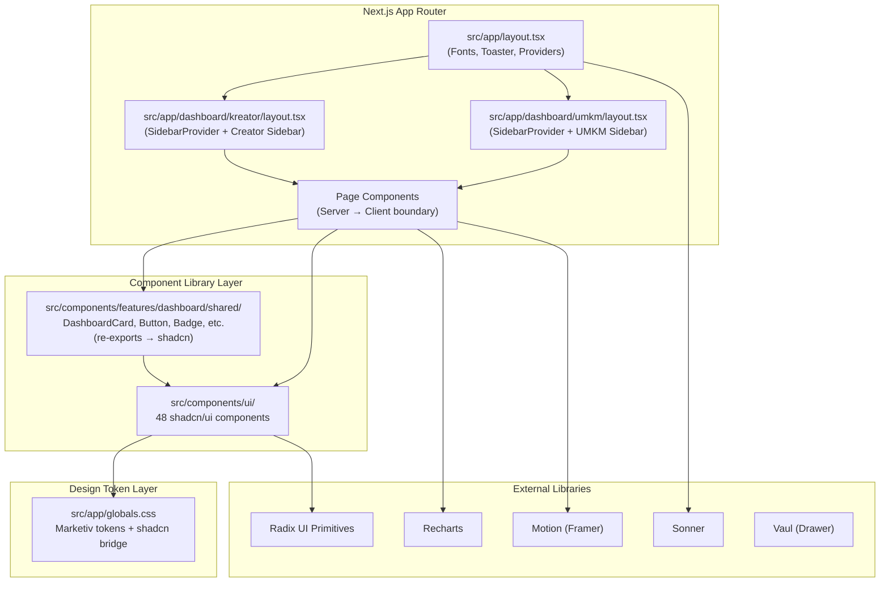
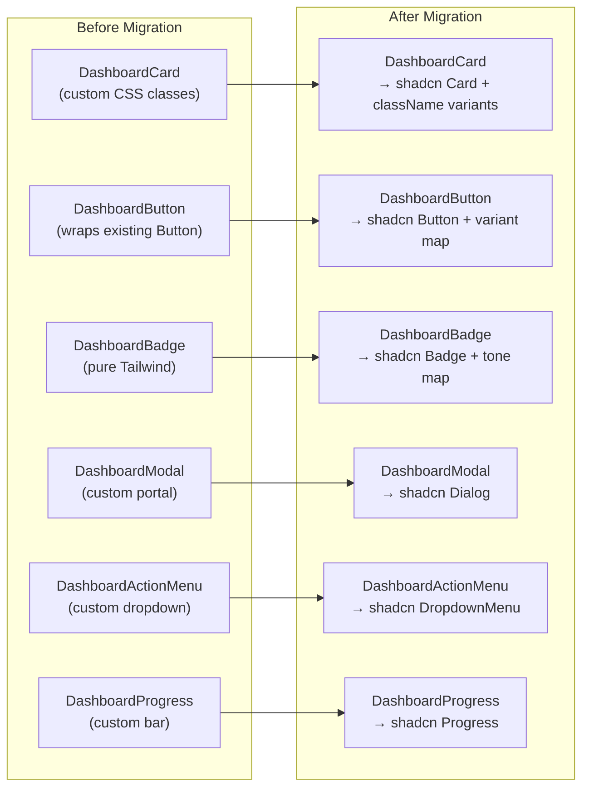
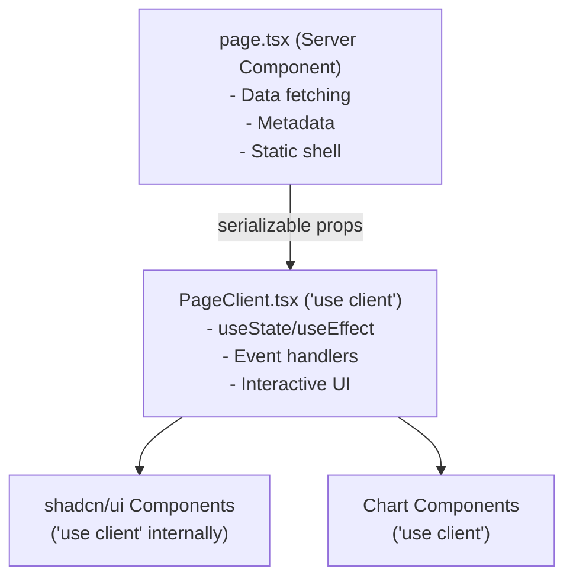

# Design Document: UI Kit Migration

## Overview

This design describes the migration of a React + Vite UI Kit prototype (48 shadcn/ui components, 18 pages, 2 layouts) into the production marketiv-web Next.js 16 codebase. The migration adopts shadcn/ui with Radix UI primitives as the canonical component library, bridges the existing Marketiv Studio System v5.8 design tokens with shadcn's CSS variable convention, replaces custom dashboard primitives with shadcn equivalents (maintaining backward compatibility), and converts all prototype pages to Next.js App Router patterns with proper Server/Client component boundaries.

### Source Reference (UI Kit Prototype)

All migrated UI originates from:  
**`C:\Users\user\Downloads\Implement PRD with UI Kits\`**

```
Implement PRD with UI Kits/
├── src/
│   ├── app/
│   │   ├── components/
│   │   │   ├── ui/                    ← 48 shadcn components (copy → adapt)
│   │   │   ├── campaign/             ← CampaignCard, CampaignEmptyState, CampaignSkeleton
│   │   │   ├── creator/              ← CreatorActionCard, CreatorEmptyState, CreatorFilterToolbar,
│   │   │   │                            CreatorMetricCard, CreatorPageHeader, CreatorSkeleton, CreatorStatusBadge
│   │   │   ├── RootLayout.tsx        ← UMKM sidebar+topbar (convert to shadcn Sidebar)
│   │   │   ├── CreatorLayout.tsx     ← Creator sidebar+topbar (convert to shadcn Sidebar)
│   │   │   ├── ActivityTimeline.tsx  ← Dashboard section component
│   │   │   ├── CampaignSection.tsx   ← Dashboard section component
│   │   │   ├── DashboardHeader.tsx   ← Header widget
│   │   │   ├── FinancialOverview.tsx ← Financial chart section
│   │   │   ├── HeroOverview.tsx      ← Hero metrics section
│   │   │   ├── InsightSection.tsx    ← Analytics insight component
│   │   │   ├── KPISection.tsx        ← KPI metrics component
│   │   │   └── QuickActions.tsx      ← Action buttons component
│   │   ├── pages/
│   │   │   ├── DashboardPage.tsx     ← UMKM overview (→ /dashboard/umkm)
│   │   │   ├── CampaignPage.tsx      ← Campaign list (→ /dashboard/umkm/campaign)
│   │   │   ├── CampaignCreatePage.tsx← Campaign wizard (→ /dashboard/umkm/campaign/buat)
│   │   │   ├── CampaignDetailPage.tsx← Campaign detail (→ /dashboard/umkm/campaign/[campaignId])
│   │   │   ├── KreatorPage.tsx       ← Kreator directory (→ /dashboard/umkm/kreator)
│   │   │   ├── KeuanganPage.tsx      ← Keuangan UMKM (→ /dashboard/umkm/keuangan)
│   │   │   ├── AnalitikPage.tsx      ← Analitik (→ /dashboard/umkm/analitik) [NEW ROUTE]
│   │   │   ├── PengaturanPage.tsx    ← Pengaturan (→ /dashboard/umkm/pengaturan) [NEW ROUTE]
│   │   │   └── kreator/
│   │   │       ├── KreatorOverviewPage.tsx  ← (→ /dashboard/kreator)
│   │   │       ├── JobPoolPage.tsx          ← (→ /dashboard/kreator/job-pool)
│   │   │       ├── JobDetailPage.tsx        ← (→ /dashboard/kreator/job-pool/[id])
│   │   │       ├── PekerjaanAktifPage.tsx   ← (→ /dashboard/kreator/pekerjaan-aktif)
│   │   │       ├── SubmitBuktiPage.tsx      ← (→ /dashboard/kreator/pekerjaan-aktif/[id])
│   │   │       ├── NegosiasiPage.tsx        ← (→ /dashboard/kreator/negosiasi)
│   │   │       ├── NegosiasiRoomPage.tsx    ← (→ /dashboard/kreator/negosiasi/[id_order])
│   │   │       ├── ProfilPage.tsx           ← (→ /dashboard/kreator/profil)
│   │   │       ├── RateCardPage.tsx         ← (→ /dashboard/kreator/rate-card)
│   │   │       └── KreatorKeuanganPage.tsx  ← (→ /dashboard/kreator/keuangan)
│   │   ├── mock/
│   │   │   ├── campaigns.ts           ← Mock data (reference for data shape)
│   │   │   ├── creator-dashboard.ts   ← Mock data
│   │   │   └── negotiation-orders.ts  ← Mock data
│   │   ├── services/
│   │   │   ├── campaign.service.ts    ← Service pattern reference
│   │   │   └── creator-dashboard.service.ts
│   │   ├── types/
│   │   │   ├── campaign.ts            ← Type definitions (merge with existing)
│   │   │   └── creator-dashboard.ts   ← Type definitions
│   │   └── routes.tsx                 ← Route structure reference
│   └── styles/
│       ├── theme.css                  ← shadcn CSS variables (override with Marketiv)
│       ├── globals.css                ← Global styles reference
│       ├── fonts.css                  ← Font configuration reference
│       ├── index.css                  ← Entry CSS
│       └── tailwind.css               ← Tailwind entry
└── package.json                       ← Dependency versions source of truth
```

### Key Design Decisions

1. **Token Bridge Strategy**: Extend existing `globals.css` with a shadcn compatibility layer that maps shadcn variable names to existing Marketiv tokens — no duplication of values.
2. **Component Replacement**: Existing 6 `src/components/ui/` files are replaced in-place with shadcn versions. Prop interfaces are preserved as supersets.
3. **Primitive Deprecation Path**: Dashboard primitives remain functional via re-exports but internally delegate to shadcn components. JSDoc `@deprecated` annotations guide consumers.
4. **Layout Architecture**: Prototype inline-style layouts are rebuilt using shadcn `Sidebar` + `SidebarProvider` with Tailwind classes, supporting collapsible (icon mode) and mobile Sheet modes.
5. **Client Boundary Strategy**: Each route has a thin Server Component `page.tsx` for data fetching, passing serializable props to a `"use client"` page-level component for interactivity.
6. **Icon Coexistence**: Lucide React for new/shadcn components, Phosphor Icons for existing components. No bulk replacement.


## Architecture

### High-Level System Diagram




### Migration Layer Architecture



### Component Boundary Strategy




### Conversion Best Practices (React 18 Vite → Next.js 16)

When converting each prototype file, apply these transformations:

| Prototype Pattern | Next.js Equivalent |
|---|---|
| `import { useNavigate } from "react-router"` | `import { useRouter } from "next/navigation"` → `router.push(path)` |
| `import { useParams } from "react-router"` | `import { useParams } from "next/navigation"` |
| `import { useLocation } from "react-router"` | `import { usePathname } from "next/navigation"` |
| `import { NavLink } from "react-router"` | `import Link from "next/link"` + manual `pathname` active check |
| `import { Outlet } from "react-router"` | `{children}` prop in `layout.tsx` |
| `` | `import Image from "next/image"` → `<Image />` |
| `React.forwardRef((props, ref) => ...)` | Direct `function Comp({ ref, ...props })` (React 19) |
| Inline `<style>` blocks | Tailwind classes or globals.css |
| `localStorage.getItem(...)` in initial state | Guard with `typeof window !== "undefined"` or `useEffect` |
| Component-scoped CSS keyframes | Move to globals.css `@keyframes` or use tw-animate-css |

**File naming convention**: Prototype uses PascalCase (`DashboardPage.tsx`). Production uses:
- `page.tsx` for route entry (Server Component)
- `PageNameClient.tsx` for client interactive shell
- kebab-case for UI components (`dropdown-menu.tsx`)

## Components and Interfaces

### 1. Design Token Bridge (`globals.css` additions)

The existing globals.css already has Marketiv tokens. We add a shadcn compatibility section that maps shadcn's expected variable names to Marketiv values:

```css
/* === shadcn/ui CSS Variable Bridge === */
:root {
  /* Core semantic tokens for shadcn */
  --background: #fbf7ef;
  --foreground: #111827;
  --card: #fffdf8;
  --card-foreground: #111827;
  --popover: #fffdf8;
  --popover-foreground: #111827;
  --primary: #f97316;
  --primary-foreground: #ffffff;
  --secondary: #f3f5f8;
  --secondary-foreground: #111827;
  --muted: #f3f5f8;
  --muted-foreground: #737f91;
  --accent: #fff7ed;
  --accent-foreground: #111827;
  --destructive: #dc2626;
  --destructive-foreground: #ffffff;
  --border: rgba(17, 24, 39, 0.10);
  --input: transparent;
  --input-background: #f3f5f8;
  --ring: #f97316;
  --radius: 12px;

  /* Sidebar tokens */
  --sidebar: #0c172b;
  --sidebar-foreground: rgba(255, 255, 255, 0.88);
  --sidebar-primary: #f97316;
  --sidebar-primary-foreground: #ffffff;
  --sidebar-accent: rgba(255, 255, 255, 0.10);
  --sidebar-accent-foreground: #ffffff;
  --sidebar-border: rgba(255, 255, 255, 0.07);
  --sidebar-ring: #f97316;

  /* Chart tokens */
  --chart-1: #f97316;
  --chart-2: #1e3a5f;
  --chart-3: #16a34a;
  --chart-4: #2563eb;
  --chart-5: #7c3aed;
}

/* Dark mode placeholder (light values duplicated) */
.dark {
  --background: #fbf7ef;
  --foreground: #111827;
  /* ... identical to light for now ... */
}
```


The `@theme inline` block in globals.css maps these to Tailwind classes:

```css
@theme inline {
  --color-background: var(--background);
  --color-foreground: var(--foreground);
  --color-card: var(--card);
  --color-card-foreground: var(--card-foreground);
  --color-popover: var(--popover);
  --color-popover-foreground: var(--popover-foreground);
  --color-primary: var(--primary);
  --color-primary-foreground: var(--primary-foreground);
  --color-secondary: var(--secondary);
  --color-secondary-foreground: var(--secondary-foreground);
  --color-muted: var(--muted);
  --color-muted-foreground: var(--muted-foreground);
  --color-accent: var(--accent);
  --color-accent-foreground: var(--accent-foreground);
  --color-destructive: var(--destructive);
  --color-destructive-foreground: var(--destructive-foreground);
  --color-border: var(--border);
  --color-input: var(--input);
  --color-input-background: var(--input-background);
  --color-ring: var(--ring);
  --color-chart-1: var(--chart-1);
  --color-chart-2: var(--chart-2);
  --color-chart-3: var(--chart-3);
  --color-chart-4: var(--chart-4);
  --color-chart-5: var(--chart-5);
  --color-sidebar: var(--sidebar);
  --color-sidebar-foreground: var(--sidebar-foreground);
  --color-sidebar-primary: var(--sidebar-primary);
  --color-sidebar-primary-foreground: var(--sidebar-primary-foreground);
  --color-sidebar-accent: var(--sidebar-accent);
  --color-sidebar-accent-foreground: var(--sidebar-accent-foreground);
  --color-sidebar-border: var(--sidebar-border);
  --color-sidebar-ring: var(--sidebar-ring);
  --radius-sm: calc(var(--radius) - 4px);
  --radius-md: calc(var(--radius) - 2px);
  --radius-lg: var(--radius);
  --radius-xl: calc(var(--radius) + 4px);
}
```

### 2. shadcn/ui Component Library Structure

All 48 components live at `src/components/ui/` with kebab-case filenames:


```
src/components/ui/
├── accordion.tsx          ├── alert-dialog.tsx
├── alert.tsx              ├── aspect-ratio.tsx
├── avatar.tsx             ├── badge.tsx (replaces existing)
├── breadcrumb.tsx         ├── button.tsx (replaces existing Button.tsx)
├── calendar.tsx           ├── card.tsx (replaces existing)
├── carousel.tsx           ├── chart.tsx
├── checkbox.tsx           ├── collapsible.tsx
├── command.tsx            ├── context-menu.tsx
├── dialog.tsx             ├── drawer.tsx
├── dropdown-menu.tsx      ├── form.tsx
├── hover-card.tsx         ├── input-otp.tsx
├── input.tsx (replaces existing) ├── label.tsx
├── menubar.tsx            ├── navigation-menu.tsx
├── pagination.tsx         ├── popover.tsx
├── progress.tsx           ├── radio-group.tsx
├── resizable.tsx          ├── scroll-area.tsx
├── select.tsx             ├── separator.tsx
├── sheet.tsx              ├── sidebar.tsx
├── skeleton.tsx (replaces existing) ├── slider.tsx
├── sonner.tsx             ├── switch.tsx
├── table.tsx              ├── tabs.tsx
├── textarea.tsx (replaces existing) ├── toggle-group.tsx
├── toggle.tsx             ├── tooltip.tsx
├── use-mobile.ts          └── utils.ts
```

**Key adaptations from prototype:**

1. **React 19 compatibility**: Remove `forwardRef` wrappers; accept `ref` as direct prop
2. **"use client" directive**: Added to all files using hooks/event handlers/browser APIs
3. **Named exports only**: No default exports (e.g., `export { Button, buttonVariants }`)
4. **Import path**: `./utils` → `@/lib/utils` (using existing project utility)

**Source**: Copy each file from `C:\Users\user\Downloads\Implement PRD with UI Kits\src\app\components\ui\` and apply adaptations.

**Adaptation checklist for each component file:**

```
□ Copy file from prototype ui/ → src/components/ui/
□ Change: import { cn } from "./utils" → import { cn } from "@/lib/utils"
□ Add "use client" as first line (if uses hooks, events, or window/document)
□ Remove React.forwardRef wrapper → accept ref as prop in function signature
□ Remove displayName assignments (unnecessary with named function exports)
□ Verify all @radix-ui/* imports are resolvable after dependency install
□ Run tsc --noEmit to confirm no type errors
```

**Components requiring "use client"** (use hooks/event handlers/browser APIs):
accordion, alert-dialog, calendar, carousel, chart, checkbox, collapsible, command, context-menu, dialog, drawer, dropdown-menu, form, hover-card, input-otp, menubar, navigation-menu, pagination, popover, progress, radio-group, resizable, scroll-area, select, sheet, sidebar, slider, sonner, switch, tabs, toggle, toggle-group, tooltip, use-mobile

**Components that are pure UI (no "use client" needed)**:
alert, aspect-ratio, avatar, badge, breadcrumb, button, card, input, label, separator, skeleton, table, textarea

### 3. Utility Function (`src/lib/utils.ts`)

The existing `src/lib/utils.ts` likely has a `cn()` function. It must use:

```typescript
import { clsx, type ClassValue } from "clsx";
import { twMerge } from "tailwind-merge";

export function cn(...inputs: ClassValue[]) {
  return twMerge(clsx(inputs));
}
```


### 4. Primitive Mapper Interface Design

Each dashboard primitive is refactored to use shadcn internals while preserving its public API:

#### DashboardCard → Card

```typescript
// src/components/features/dashboard/shared/DashboardCard.tsx
"use client";
import { Card, CardHeader, CardContent, CardFooter } from "@/components/ui/card";
import { cn } from "@/lib/utils";

export type DashboardCardVariant = "default" | "soft" | "elevated" | "featured" | "dark" | "danger";
export type DashboardCardPadding = "none" | "sm" | "md" | "lg";

export interface DashboardCardProps extends React.ComponentProps<"div"> {
  children: React.ReactNode;
  variant?: DashboardCardVariant;
  padding?: DashboardCardPadding;
  interactive?: boolean;
}

// Variant → className mapping for Card
const variantClasses: Record<DashboardCardVariant, string> = {
  default: "border-border/60 bg-card shadow-sm rounded-3xl",
  soft: "border-0 bg-muted/50 rounded-3xl",
  elevated: "border-border/60 bg-card shadow-lg rounded-3xl",
  featured: "border-orange-200/80 bg-gradient-to-br from-white via-[#FFF8ED] to-orange-50/70 shadow-[0_28px_70px_rgba(234,88,12,0.14)] rounded-3xl",
  dark: "border-0 bg-navy-900 text-white rounded-3xl",
  danger: "border-red-200/80 bg-red-50/80 shadow-[0_18px_45px_rgba(185,28,28,0.08)] rounded-3xl",
};

/** @deprecated Use shadcn Card directly for new code */
export function DashboardCard({ children, variant = "default", padding = "md", interactive, className, ...props }: DashboardCardProps) {
  return (
    <Card className={cn(variantClasses[variant], paddingClasses[padding], interactive && "transition hover:-translate-y-0.5", className)} {...props}>
      {children}
    </Card>
  );
}
```

#### DashboardButton → Button

```typescript
// Variant mapping:
// primary → "default" (shadcn uses orange via --primary)
// secondary → "secondary"
// outline → "outline"
// ghost → "ghost"
// soft → "secondary" (closest match)
// danger → "destructive"
// danger-outline → "outline" + destructive className
// icon → size="icon"
```

#### DashboardBadge → Badge

```typescript
// Tone → variant mapping:
// green → "success" variant (custom)
// amber → "warning" variant (custom)
// red → "danger" variant (custom)
// blue → "info" variant (custom)
// neutral → "secondary"
// orange → "default"
// purple → "secondary" + purple className
// slate → "secondary"
// Helper functions getDashboardStatusTone/getDashboardCategoryTone preserved unchanged
```


#### DashboardModal → Dialog

```typescript
// Props preserved: isOpen, title, description, footer, confirmLabel, cancelLabel, onConfirm, onClose, variant
// Maps to: Dialog → DialogContent → DialogHeader + DialogFooter
// Variant "danger" applies destructive styling to confirm button
```

#### DashboardActionMenu → DropdownMenu

```typescript
// Interface preserved: ActionMenuItem { label, icon, onClick, disabled, tone }
// Maps to: DropdownMenu → DropdownMenuTrigger + DropdownMenuContent → DropdownMenuItem
```

#### DashboardProgress → Progress

```typescript
// Props preserved: value, max, tone, label, valueLabel
// Tone colors applied via className on Progress indicator
```

### 5. Layout Components (shadcn Sidebar)

**Source files**:
- UMKM: `C:\Users\user\Downloads\Implement PRD with UI Kits\src\app\components\RootLayout.tsx`
- Creator: `C:\Users\user\Downloads\Implement PRD with UI Kits\src\app\components\CreatorLayout.tsx`
- Sidebar component: `C:\Users\user\Downloads\Implement PRD with UI Kits\src\app\components\ui\sidebar.tsx`

#### Conversion Strategy

The prototype uses **inline styles** extensively for the sidebar (fixed position, custom widths, CSS-in-JS transitions). The production version will use the **shadcn Sidebar component** which provides all this behavior via Tailwind classes and data attributes.

**Prototype RootLayout.tsx inline styles → shadcn Sidebar equivalents:**

| Prototype Pattern | shadcn Equivalent |
|---|---|
| `position: "fixed", top: 0, left: 0, bottom: 0` | Built into `Sidebar` (uses `fixed inset-y-0`) |
| `width: expanded ? 220 : 72` | `--sidebar-width: 16rem`, `--sidebar-width-icon: 3rem` + `collapsible="icon"` |
| `background: "#0c172b"` | `--sidebar: #0c172b` CSS variable |
| `NavLink` with `className={isActive => ...}` | `SidebarMenuButton` with `isActive` prop |
| Active gradient: `linear-gradient(135deg, #f97316, #f59e0b)` | Custom class on `data-[active=true]` |
| Mobile: hidden sidebar | shadcn Sidebar auto-renders as `Sheet` when `useIsMobile()` returns true |
| Toggle button (ChevronLeft/Right) | `SidebarTrigger` or `SidebarRail` |
| Topbar header with breadcrumb + actions | Remains as custom component inside `SidebarInset` |

#### UMKM Layout (`/dashboard/umkm/layout.tsx`)

```typescript
// Server Component shell
import { UmkmDashboardShell } from "@/components/features/dashboard/UmkmDashboardShell";

export default function UmkmLayout({ children }: { children: React.ReactNode }) {
  return <UmkmDashboardShell>{children}</UmkmDashboardShell>;
}
```

```typescript
// src/components/features/dashboard/UmkmDashboardShell.tsx
"use client";

import Link from "next/link";
import { usePathname } from "next/navigation";
import {
  SidebarProvider, Sidebar, SidebarHeader, SidebarContent,
  SidebarFooter, SidebarMenu, SidebarMenuItem, SidebarMenuButton,
  SidebarInset, SidebarTrigger, useSidebar
} from "@/components/ui/sidebar";
import {
  LayoutDashboard, Megaphone, Users, Wallet, TrendingUp, Settings
} from "lucide-react";

const UMKM_NAV = [
  { href: "/dashboard/umkm", icon: LayoutDashboard, label: "Dashboard", exact: true },
  { href: "/dashboard/umkm/campaign", icon: Megaphone, label: "Campaign" },
  { href: "/dashboard/umkm/kreator", icon: Users, label: "Kreator" },
  { href: "/dashboard/umkm/keuangan", icon: Wallet, label: "Keuangan" },
  { href: "/dashboard/umkm/analitik", icon: TrendingUp, label: "Analitik" },
  { href: "/dashboard/umkm/pengaturan", icon: Settings, label: "Pengaturan" },
];

export function UmkmDashboardShell({ children }: { children: React.ReactNode }) {
  return (
    <SidebarProvider defaultOpen={true}>
      <UmkmSidebar />
      <SidebarInset>
        <UmkmTopbar />
        <main className="flex-1 animate-in fade-in slide-in-from-bottom-2 duration-300">
          {children}
        </main>
      </SidebarInset>
    </SidebarProvider>
  );
}

function UmkmSidebar() {
  const pathname = usePathname();

  return (
    <Sidebar
      collapsible="icon"
      className="border-r-0 bg-[#0c172b]"
    >
      <SidebarHeader className="p-4 border-b border-white/7">
        {/* Brand mark: Marketiv logo + "Dashboard UMKM" */}
      </SidebarHeader>
      <SidebarContent>
        <SidebarMenu>
          {UMKM_NAV.map(item => {
            const isActive = item.exact
              ? pathname === item.href
              : pathname.startsWith(item.href);
            return (
              <SidebarMenuItem key={item.href}>
                <SidebarMenuButton
                  asChild
                  isActive={isActive}
                  tooltip={item.label}
                  className="data-[active=true]:bg-gradient-to-r data-[active=true]:from-orange-500 data-[active=true]:to-amber-500 data-[active=true]:text-white data-[active=true]:shadow-[0_10px_24px_rgba(249,115,22,0.22)]"
                >
                  <Link href={item.href}>
                    <item.icon className="size-5" />
                    <span>{item.label}</span>
                  </Link>
                </SidebarMenuButton>
              </SidebarMenuItem>
            );
          })}
        </SidebarMenu>
      </SidebarContent>
      <SidebarFooter className="border-t border-white/7 p-3">
        {/* User avatar + name */}
      </SidebarFooter>
    </Sidebar>
  );
}

function UmkmTopbar() {
  // Sticky header with: page title, search, notification bell, "Buat Campaign" CTA
  // Reference: RootLayout.tsx header section (lines ~115-143)
}
```

#### Creator Layout (`/dashboard/kreator/layout.tsx`)

Same structural pattern as UMKM but with:
- **Source**: `CreatorLayout.tsx` from prototype
- Active state: `bg-gradient-to-r from-blue-600 to-purple-600` (instead of orange)
- Nav items: Overview, Job Pool, Pekerjaan Aktif, Negosiasi, Profil, Rate Card, Keuangan
- Brand subtitle: "Dashboard Kreator"
- Different notification badge color (blue instead of orange)

### 6. Page Migration Pattern (Server/Client Split)

**General pattern for every page:**

```typescript
// src/app/dashboard/{role}/{route}/page.tsx (Server Component)
import { getDataFn } from "@/services/...";
import { PageNameClient } from "@/components/features/{role}-dashboard/{section}/PageNameClient";

export default async function PageName() {
  const data = await getDataFn();  // or import from mock if service not ready
  return <PageNameClient data={data} />;
}
```

```typescript
// src/components/features/{role}-dashboard/{section}/PageNameClient.tsx
"use client";
// Import shadcn components, hooks, local state management
// Convert prototype inline styles → Tailwind classes
// Replace react-router hooks → next/navigation hooks
```

#### Detailed Page-to-File Mapping (UMKM)

| Prototype Source | Production Target | Notes |
|---|---|---|
| `pages/DashboardPage.tsx` + `components/HeroOverview.tsx`, `KPISection.tsx`, `CampaignSection.tsx`, `ActivityTimeline.tsx`, `FinancialOverview.tsx`, `QuickActions.tsx` | `src/app/dashboard/umkm/page.tsx` → `src/components/features/umkm-dashboard/overview/UmkmOverviewClient.tsx` | Compose sub-sections; use shadcn Card for metric cards |
| `pages/CampaignPage.tsx` + `components/campaign/CampaignCard.tsx`, `CampaignEmptyState.tsx`, `CampaignSkeleton.tsx` | `src/app/dashboard/umkm/campaign/page.tsx` → `src/components/features/umkm-dashboard/campaign/CampaignListClient.tsx` | Use shadcn Table/Card grid, Badge for status, Input for search |
| `pages/CampaignCreatePage.tsx` | `src/app/dashboard/umkm/campaign/buat/page.tsx` → `src/components/features/umkm-dashboard/create-campaign/CampaignCreateClient.tsx` | Multi-step form; shadcn Tabs + Form + Input + Select |
| `pages/CampaignDetailPage.tsx` | `src/app/dashboard/umkm/campaign/[campaignId]/page.tsx` → `src/components/features/umkm-dashboard/campaign/detail/CampaignDetailClient.tsx` | Progress tracking, action buttons, submission section |
| `pages/KreatorPage.tsx` | `src/app/dashboard/umkm/kreator/page.tsx` → `src/components/features/umkm-dashboard/creators/CreatorDirectoryClient.tsx` | Card grid, search Input, Select filter |
| `pages/KeuanganPage.tsx` | `src/app/dashboard/umkm/keuangan/page.tsx` → `src/components/features/umkm-dashboard/finance/KeuanganClient.tsx` | Recharts charts, shadcn Table, summary cards |
| `pages/AnalitikPage.tsx` | `src/app/dashboard/umkm/analitik/page.tsx` → `src/components/features/umkm-dashboard/analytics/AnalitikClient.tsx` | **NEW ROUTE**; 2+ chart visualizations + metrics summary |
| `pages/PengaturanPage.tsx` | `src/app/dashboard/umkm/pengaturan/page.tsx` → `src/components/features/umkm-dashboard/settings/PengaturanClient.tsx` | **NEW ROUTE**; Form + Input + Select + Switch |

#### Detailed Page-to-File Mapping (Creator)

| Prototype Source | Production Target | Notes |
|---|---|---|
| `pages/kreator/KreatorOverviewPage.tsx` + `components/creator/CreatorMetricCard.tsx`, `CreatorActionCard.tsx` | `src/app/dashboard/kreator/page.tsx` → `src/components/features/creator-dashboard/overview/CreatorOverviewClient.tsx` | Metrics cards, activity list, quick action buttons |
| `pages/kreator/JobPoolPage.tsx` + `components/creator/CreatorFilterToolbar.tsx`, `CreatorStatusBadge.tsx` | `src/app/dashboard/kreator/job-pool/page.tsx` → `src/components/features/creator-dashboard/job-pool/JobPoolClient.tsx` | Toggle list/grid, filter Select, sort, job cards |
| `pages/kreator/JobDetailPage.tsx` | `src/app/dashboard/kreator/job-pool/[id]/page.tsx` → `src/components/features/creator-dashboard/job-pool/JobDetailClient.tsx` | Detail view with apply button |
| `pages/kreator/PekerjaanAktifPage.tsx` | `src/app/dashboard/kreator/pekerjaan-aktif/page.tsx` → `src/components/features/creator-dashboard/active-jobs/PekerjaanAktifClient.tsx` | Progress bars, deadline countdown, status badges |
| `pages/kreator/SubmitBuktiPage.tsx` | `src/app/dashboard/kreator/pekerjaan-aktif/[id]/page.tsx` → `src/components/features/creator-dashboard/active-jobs/SubmitBuktiClient.tsx` | URL input form, preview, confirmation dialog |
| `pages/kreator/NegosiasiPage.tsx` | `src/app/dashboard/kreator/negosiasi/page.tsx` → `src/components/features/creator-dashboard/negotiation/NegosiasiListClient.tsx` | Negotiation cards with status badges |
| `pages/kreator/NegosiasiRoomPage.tsx` | `src/app/dashboard/kreator/negosiasi/[id_order]/page.tsx` → `src/components/features/creator-dashboard/negotiation/NegosiasiRoomClient.tsx` | Chat message list, counter-offer form, accept/reject |
| `pages/kreator/ProfilPage.tsx` | `src/app/dashboard/kreator/profil/page.tsx` → `src/components/features/creator-dashboard/profile/ProfilClient.tsx` | react-hook-form + Zod, avatar upload |
| `pages/kreator/RateCardPage.tsx` | `src/app/dashboard/kreator/rate-card/page.tsx` → `src/components/features/creator-dashboard/rate-card/RateCardClient.tsx` | Pricing table, CRUD actions |
| `pages/kreator/KreatorKeuanganPage.tsx` | `src/app/dashboard/kreator/keuangan/page.tsx` → `src/components/features/creator-dashboard/finance/KreatorKeuanganClient.tsx` | Recharts earnings chart, withdrawal form, history |

#### Shared Section Components (from prototype `components/`)

These should be migrated as reusable client components:

| Prototype Component | Production Location | Used By |
|---|---|---|
| `HeroOverview.tsx` | `src/components/features/umkm-dashboard/overview/HeroOverview.tsx` | UMKM Overview |
| `KPISection.tsx` | `src/components/features/umkm-dashboard/overview/KPISection.tsx` | UMKM Overview |
| `CampaignSection.tsx` | `src/components/features/umkm-dashboard/overview/CampaignSection.tsx` | UMKM Overview |
| `ActivityTimeline.tsx` | `src/components/features/umkm-dashboard/overview/ActivityTimeline.tsx` | UMKM Overview |
| `FinancialOverview.tsx` | `src/components/features/umkm-dashboard/overview/FinancialOverview.tsx` | UMKM Overview |
| `QuickActions.tsx` | `src/components/features/umkm-dashboard/overview/QuickActions.tsx` | UMKM Overview |
| `InsightSection.tsx` | `src/components/features/umkm-dashboard/analytics/InsightSection.tsx` | Analitik |
| `campaign/CampaignCard.tsx` | `src/components/features/umkm-dashboard/campaign/CampaignCard.tsx` | Campaign list |
| `campaign/CampaignEmptyState.tsx` | `src/components/features/umkm-dashboard/campaign/CampaignEmptyState.tsx` | Campaign list |
| `creator/CreatorMetricCard.tsx` | `src/components/features/creator-dashboard/shared/CreatorMetricCard.tsx` | Creator Overview |
| `creator/CreatorActionCard.tsx` | `src/components/features/creator-dashboard/shared/CreatorActionCard.tsx` | Creator Overview |
| `creator/CreatorFilterToolbar.tsx` | `src/components/features/creator-dashboard/shared/CreatorFilterToolbar.tsx` | Job Pool |
| `creator/CreatorEmptyState.tsx` | `src/components/features/creator-dashboard/shared/CreatorEmptyState.tsx` | Multiple |
| `creator/CreatorStatusBadge.tsx` | `src/components/features/creator-dashboard/shared/CreatorStatusBadge.tsx` | Multiple |


### 7. Toast System Integration

**Source**: `C:\Users\user\Downloads\Implement PRD with UI Kits\src\app\components\ui\sonner.tsx`

```typescript
// src/components/ui/sonner.tsx
"use client";
import { Toaster as SonnerToaster } from "sonner";

export function Toaster() {
  return (
    <SonnerToaster
      position="bottom-right"
      duration={4000}
      visibleToasts={3}
      toastOptions={{
        classNames: {
          toast: "border rounded-[var(--radius-1)] shadow-[var(--shadow-1)]",
          success: "border-green-200 bg-green-50 text-green-800",
          error: "border-red-200 bg-red-50 text-red-800",
          warning: "border-amber-200 bg-amber-50 text-amber-800",
        },
      }}
    />
  );
}
```

```typescript
// src/app/layout.tsx (root) — add Toaster to body
import { Toaster } from "@/components/ui/sonner";
import { Plus_Jakarta_Sans, Sora } from "next/font/google";

const plusJakarta = Plus_Jakarta_Sans({ subsets: ["latin"], variable: "--font-plus-jakarta-sans" });
const sora = Sora({ subsets: ["latin"], variable: "--font-sora" });

export default function RootLayout({ children }: { children: React.ReactNode }) {
  return (
    <html lang="id" className={`${plusJakarta.variable} ${sora.variable}`}>
      <body className="font-sans antialiased">
        {children}
        <Toaster />
      </body>
    </html>
  );
}
```

**Usage in pages** (replacing ad-hoc toast patterns):
```typescript
import { toast } from "sonner";

// Success:
toast.success("Campaign berhasil dibuat!");

// Error:
toast.error("Gagal menyimpan data. Silakan coba lagi.");

// Replace existing patterns like:
// setShowToast(true); setTimeout(() => setShowToast(false), 3000);
```

### 8. Chart System Integration

**Source**: `C:\Users\user\Downloads\Implement PRD with UI Kits\src\app\components\ui\chart.tsx`

```typescript
// src/components/ui/chart.tsx
"use client";
// Copy from prototype, adapt imports to @/lib/utils
// Exports: ChartContainer, ChartTooltip, ChartTooltipContent, ChartLegend, ChartLegendContent, ChartStyle
// Uses: recharts ResponsiveContainer underneath

// Marketiv chart color config (used in page components):
const MARKETIV_CHART_CONFIG = {
  primary: { label: "Primary", color: "var(--chart-1)" },      // orange-500
  secondary: { label: "Secondary", color: "var(--chart-2)" },  // navy-700
  success: { label: "Success", color: "var(--chart-3)" },      // green
  info: { label: "Info", color: "var(--chart-4)" },            // blue
  accent: { label: "Accent", color: "var(--chart-5)" },        // purple
};
```

**Usage in Keuangan/Analitik pages:**
```typescript
import { ChartContainer, ChartTooltip, ChartTooltipContent } from "@/components/ui/chart";
import { LineChart, Line, BarChart, Bar, ResponsiveContainer, XAxis, YAxis } from "recharts";

// All chart components wrapped in "use client" files
// Minimum height: 200px
// Use ResponsiveContainer width="100%" for mobile responsiveness
// Empty state: when data array is empty, render placeholder instead of empty chart
```

### 9. Animation Integration

**Source files**:
- `C:\Users\user\Downloads\Implement PRD with UI Kits\src\styles\globals.css` (keyframes)
- Prototype uses `motion` library in some page transitions

**Strategy:**
- `tw-animate-css` — provides utility classes for shadcn component enter/exit animations
- `motion` library — only for page transitions and complex orchestrated sequences
- CSS transitions with `var(--ease)` — for micro-interactions (hover, focus states)

```css
/* globals.css additions */
@import "tw-animate-css";

/* Already existing: --ease: cubic-bezier(0.2, 0.8, 0.2, 1); */

/* Reduced motion support */
@media (prefers-reduced-motion: reduce) {
  *, *::before, *::after {
    animation-duration: 0.01ms !important;
    animation-iteration-count: 1 !important;
    transition-duration: 0.01ms !important;
  }
}
```

**Motion usage rules:**
- All `motion` imports require `"use client"` in the file
- Duration range: 150ms–500ms maximum
- Only for: page fade-in, staggered list reveals, modal entrance orchestration
- NOT for: button hovers, tooltip shows, dropdown opens (use tw-animate-css or CSS)

```typescript
// Example: Page transition wrapper
"use client";
import { motion } from "motion/react";

export function PageTransition({ children }: { children: React.ReactNode }) {
  return (
    <motion.div
      initial={{ opacity: 0, y: 12 }}
      animate={{ opacity: 1, y: 0 }}
      transition={{ duration: 0.3, ease: [0.2, 0.8, 0.2, 1] }}
    >
      {children}
    </motion.div>
  );
}
```

### 10. Mobile Responsive Pattern

**Source**: `C:\Users\user\Downloads\Implement PRD with UI Kits\src\app\components\ui\use-mobile.ts`

```typescript
// src/components/ui/use-mobile.ts
"use client";
import { useState, useEffect } from "react";

const MOBILE_BREAKPOINT = 768;

export function useIsMobile() {
  const [isMobile, setIsMobile] = useState(false); // SSR-safe default

  useEffect(() => {
    const mql = window.matchMedia(`(max-width: ${MOBILE_BREAKPOINT - 1}px)`);
    const onChange = () => setIsMobile(mql.matches);
    mql.addEventListener("change", onChange);
    setIsMobile(mql.matches);
    return () => mql.removeEventListener("change", onChange);
  }, []);

  return isMobile;
}
```

**Drawer/Dialog responsive pattern** (using Vaul):

**Source**: `C:\Users\user\Downloads\Implement PRD with UI Kits\src\app\components\ui\drawer.tsx`

```typescript
// Pattern: ResponsiveModal — renders Dialog on desktop, Drawer on mobile
"use client";
import { useIsMobile } from "@/components/ui/use-mobile";
import { Dialog, DialogContent, DialogHeader, DialogTitle } from "@/components/ui/dialog";
import { Drawer, DrawerContent, DrawerHeader, DrawerTitle } from "@/components/ui/drawer";

interface ResponsiveModalProps {
  open: boolean;
  onOpenChange: (open: boolean) => void;
  title: string;
  children: React.ReactNode;
}

export function ResponsiveModal({ open, onOpenChange, title, children }: ResponsiveModalProps) {
  const isMobile = useIsMobile();

  if (isMobile) {
    return (
      <Drawer open={open} onOpenChange={onOpenChange}>
        <DrawerContent>
          <DrawerHeader><DrawerTitle>{title}</DrawerTitle></DrawerHeader>
          <div className="px-4 pb-4">{children}</div>
        </DrawerContent>
      </Drawer>
    );
  }

  return (
    <Dialog open={open} onOpenChange={onOpenChange}>
      <DialogContent>
        <DialogHeader><DialogTitle>{title}</DialogTitle></DialogHeader>
        {children}
      </DialogContent>
    </Dialog>
  );
}
```

**Table responsive pattern (mobile):**
```typescript
// Wrap table with overflow container for horizontal scroll:
<div className="overflow-x-auto md:overflow-visible">
  <Table className="min-w-[600px] md:min-w-0">{/* ... */}</Table>
</div>

// Or conditional card layout:
{isMobile ? <MobileCardList data={data} /> : <DataTable data={data} />}
```

**Sidebar on mobile** — shadcn Sidebar handles this automatically:
- When `useIsMobile()` returns `true`, Sidebar renders as a `Sheet` (off-canvas drawer from left)
- Triggered by hamburger menu button in topbar via `SidebarTrigger`

### 11. Form Integration Pattern

**Source**: `C:\Users\user\Downloads\Implement PRD with UI Kits\src\app\components\ui\form.tsx`

Forms use existing react-hook-form + Zod pattern, wrapped by shadcn Form components:

```typescript
"use client";
import { useForm } from "react-hook-form";
import { zodResolver } from "@hookform/resolvers/zod";
import { z } from "zod";
import { Form, FormField, FormItem, FormLabel, FormControl, FormMessage } from "@/components/ui/form";
import { Input } from "@/components/ui/input";
import { Button } from "@/components/ui/button";
import { toast } from "sonner";

const schema = z.object({
  name: z.string().min(1, "Nama wajib diisi"),
  bio: z.string().max(200, "Bio maksimal 200 karakter").optional(),
});

export function ProfileForm() {
  const form = useForm({
    resolver: zodResolver(schema),
    mode: "onBlur", // validate on blur for subsequent field validations
  });

  async function onSubmit(data: z.infer<typeof schema>) {
    // Submit logic
    toast.success("Profil berhasil diperbarui");
  }

  return (
    <Form {...form}>
      <form onSubmit={form.handleSubmit(onSubmit)} className="space-y-6">
        <FormField
          control={form.control}
          name="name"
          render={({ field }) => (
            <FormItem>
              <FormLabel>Nama</FormLabel>
              <FormControl>
                <Input placeholder="Masukkan nama" {...field} />
              </FormControl>
              <FormMessage /> {/* Renders Zod error in --destructive color */}
            </FormItem>
          )}
        />
        <Button type="submit" disabled={form.formState.isSubmitting}>
          {form.formState.isSubmitting ? "Menyimpan..." : "Simpan"}
        </Button>
      </form>
    </Form>
  );
}
```

**Pages using forms:**
- Campaign Create (`CampaignCreatePage.tsx`) — multi-step with Tabs
- Pengaturan (`PengaturanPage.tsx`) — settings form with Switch/Select
- Profil Kreator (`ProfilPage.tsx`) — profile + avatar upload
- Rate Card (`RateCardPage.tsx`) — add/edit service item dialog with form
- Submit Bukti (`SubmitBuktiPage.tsx`) — URL input + confirmation
- Negosiasi Room (`NegosiasiRoomPage.tsx`) — counter-offer form

### 12. Icon System Integration

**Dual icon library coexistence:**

```typescript
// NEW components / shadcn components → use Lucide React
import { Bell, Search, Plus, ChevronLeft, Megaphone, Users, Wallet } from "lucide-react";

// EXISTING components that already use Phosphor → keep unchanged
import { Check, X, CaretDown } from "@phosphor-icons/react";

// Size conventions (consistent across both libraries):
// Inline/badge context: className="size-4" (16px)
// Button/nav context: className="size-5" (20px)
// Header/hero context: className="size-6" (24px)

// Icon-only buttons MUST have aria-label:
<Button variant="ghost" size="icon" aria-label="Notifikasi">
  <Bell className="size-5" />
</Button>
```

**Documentation note**: Add to project steering/README:
> - Use **Lucide React** for all new components and shadcn/ui components
> - Keep **Phosphor Icons** on existing legacy components — do not replace in bulk
> - Both libraries must not be mixed in the same component file


## Data Models

### Dependency Installation Manifest

```typescript
interface DependencyManifest {
  radixPackages: Record<string, string>; // package name → caret version
  utilityPackages: Record<string, string>;
  preservedPackages: string[]; // must not be modified
  peerDependencyNotes: Array<{
    package: string;
    conflict: string;
    resolution: string;
  }>;
}

// Concrete values from prototype package.json:
const radixPackages = {
  "@radix-ui/react-accordion": "^1.2.3",
  "@radix-ui/react-alert-dialog": "^1.1.6",
  "@radix-ui/react-aspect-ratio": "^1.1.2",
  "@radix-ui/react-avatar": "^1.1.3",
  "@radix-ui/react-checkbox": "^1.1.4",
  "@radix-ui/react-collapsible": "^1.1.3",
  "@radix-ui/react-context-menu": "^2.2.6",
  "@radix-ui/react-dialog": "^1.1.6",
  "@radix-ui/react-dropdown-menu": "^2.1.6",
  "@radix-ui/react-hover-card": "^1.1.6",
  "@radix-ui/react-label": "^2.1.2",
  "@radix-ui/react-menubar": "^1.1.6",
  "@radix-ui/react-navigation-menu": "^1.2.5",
  "@radix-ui/react-popover": "^1.1.6",
  "@radix-ui/react-progress": "^1.1.2",
  "@radix-ui/react-radio-group": "^1.2.3",
  "@radix-ui/react-scroll-area": "^1.2.3",
  "@radix-ui/react-select": "^2.1.6",
  "@radix-ui/react-separator": "^1.1.2",
  "@radix-ui/react-slider": "^1.2.3",
  "@radix-ui/react-slot": "^1.1.2",
  "@radix-ui/react-switch": "^1.1.3",
  "@radix-ui/react-tabs": "^1.1.3",
  "@radix-ui/react-toggle": "^1.1.2",
  "@radix-ui/react-toggle-group": "^1.1.2",
  "@radix-ui/react-tooltip": "^1.1.8",
};

const utilityPackages = {
  "recharts": "^2.15.2",
  "motion": "^12.23.24",
  "sonner": "^2.0.3",
  "vaul": "^1.1.2",
  "lucide-react": "^0.487.0",
  "cmdk": "^1.1.1",
  "embla-carousel-react": "^8.6.0",
  "date-fns": "^3.6.0",
  "react-dnd": "^16.0.1",
  "react-dnd-html5-backend": "^16.0.1",
  "input-otp": "^1.4.2",
  "react-day-picker": "^8.10.1",
  "react-resizable-panels": "^2.1.7",
  "tw-animate-css": "^1.3.8",
};
```


### Route Mapping Model

```typescript
interface RouteMapping {
  prototype: string;       // react-router path
  production: string;      // Next.js file path
  status: "existing" | "new";
  serverComponent: string; // page.tsx path
  clientComponent: string; // *Client.tsx path
}

// UMKM Routes
const umkmRoutes: RouteMapping[] = [
  { prototype: "/dashboard/umkm", production: "src/app/dashboard/umkm/page.tsx", status: "existing" },
  { prototype: "/dashboard/umkm/campaign", production: "src/app/dashboard/umkm/campaign/page.tsx", status: "existing" },
  { prototype: "/dashboard/umkm/campaign/create", production: "src/app/dashboard/umkm/campaign/buat/page.tsx", status: "existing" },
  { prototype: "/dashboard/umkm/campaign/:id", production: "src/app/dashboard/umkm/campaign/[campaignId]/page.tsx", status: "existing" },
  { prototype: "/dashboard/umkm/kreator", production: "src/app/dashboard/umkm/kreator/page.tsx", status: "existing" },
  { prototype: "/dashboard/umkm/keuangan", production: "src/app/dashboard/umkm/keuangan/page.tsx", status: "existing" },
  { prototype: "/dashboard/umkm/analitik", production: "src/app/dashboard/umkm/analitik/page.tsx", status: "new" },
  { prototype: "/dashboard/umkm/pengaturan", production: "src/app/dashboard/umkm/pengaturan/page.tsx", status: "new" },
];

// Creator Routes
const creatorRoutes: RouteMapping[] = [
  { prototype: "/dashboard/kreator", production: "src/app/dashboard/kreator/page.tsx", status: "existing" },
  { prototype: "/dashboard/kreator/job-pool", production: "src/app/dashboard/kreator/job-pool/page.tsx", status: "existing" },
  { prototype: "/dashboard/kreator/job-pool/:id", production: "src/app/dashboard/kreator/job-pool/[id]/page.tsx", status: "existing" },
  { prototype: "/dashboard/kreator/pekerjaan-aktif", production: "src/app/dashboard/kreator/pekerjaan-aktif/page.tsx", status: "existing" },
  { prototype: "/dashboard/kreator/pekerjaan-aktif/:id", production: "src/app/dashboard/kreator/pekerjaan-aktif/[id]/page.tsx", status: "existing" },
  { prototype: "/dashboard/kreator/negosiasi", production: "src/app/dashboard/kreator/negosiasi/page.tsx", status: "existing" },
  { prototype: "/dashboard/kreator/negosiasi/:id", production: "src/app/dashboard/kreator/negosiasi/[id_order]/page.tsx", status: "existing" },
  { prototype: "/dashboard/kreator/profil", production: "src/app/dashboard/kreator/profil/page.tsx", status: "existing" },
  { prototype: "/dashboard/kreator/rate-card", production: "src/app/dashboard/kreator/rate-card/page.tsx", status: "existing" },
  { prototype: "/dashboard/kreator/keuangan", production: "src/app/dashboard/kreator/keuangan/page.tsx", status: "existing" },
];
```

### Primitive Mapping Model

```typescript
interface PrimitiveMapping {
  source: string;            // existing component name
  target: string;            // shadcn component
  variantMap: Record<string, string>;
  propsPreserved: string[];
  propsAdded: string[];
  breakingChanges: string[];
}
```

### Existing UI Component Replacement Details

These 6 files currently exist at `src/components/ui/` and must be replaced:

| Current File | shadcn Replacement | Backward Compat Notes |
|---|---|---|
| `Button.tsx` | `button.tsx` | Current exports `Button` with variant/size props via CVA. shadcn Button has same interface (variant, size, asChild). Add `soft` and `danger` custom variants to match DashboardButton usage. Rename file to lowercase `button.tsx`. |
| `badge.tsx` | `badge.tsx` | Current has simple variant prop. shadcn Badge adds more variants. Extend with `success`, `warning`, `danger`, `info` variants matching tone system. |
| `card.tsx` | `card.tsx` | Current exports Card, CardHeader, CardContent, CardTitle, CardDescription, CardFooter. shadcn adds CardAction. Same interface — drop-in replacement. |
| `input.tsx` | `input.tsx` | Current is basic input with className. shadcn Input is same pattern. Superset. |
| `skeleton.tsx` | `skeleton.tsx` | Current is div with animation. shadcn same pattern. Drop-in. |
| `textarea.tsx` | `textarea.tsx` | Current is basic textarea with className. shadcn same. Drop-in. |

**Additional existing file to keep**: `empty-state.tsx` — not in shadcn, keep as custom utility component.

### Mock Data Reference

**Prototype mock data** (reference for type shapes and test data):
- `C:\Users\user\Downloads\Implement PRD with UI Kits\src\app\mock\campaigns.ts` — Campaign list data
- `C:\Users\user\Downloads\Implement PRD with UI Kits\src\app\mock\creator-dashboard.ts` — Creator metrics, jobs, activity
- `C:\Users\user\Downloads\Implement PRD with UI Kits\src\app\mock\negotiation-orders.ts` — Negotiation room data

**Production data layer** (already exists, keep intact):
- `src/data/` — Static mock data files
- `src/services/` — Appwrite SDK service functions
- `src/types/` — TypeScript interfaces

Merge prototype type definitions with existing types where overlapping. Do NOT replace production service layer with prototype services.


## Error Handling

### Build-Time Errors

| Error Category | Detection | Resolution |
|---|---|---|
| Dependency peer conflict (React 19) | `npm install` warnings | Use latest compatible version or `--legacy-peer-deps`; document in migration notes |
| TypeScript compilation errors | `tsc --noEmit` | Fix type issues in migrated components; ensure `forwardRef` removal doesn't break ref consumers |
| Client/Server boundary violations | `next build` | Add `"use client"` to files using hooks/event handlers; ensure no functions passed as props from Server → Client |
| Import resolution failures | `next build` | Verify all `@/components/ui/*` imports match renamed files (e.g., `Button.tsx` → `button.tsx`) |
| CSS variable undefined errors | Visual inspection / dark mode | Ensure `.dark` scope has all variables defined (even as placeholder duplicates) |

### Runtime Errors

| Error Category | Handling Strategy |
|---|---|
| Page render crash | `error.tsx` boundary at route segment level displays fallback UI with retry CTA |
| Data fetch failure | Server component try/catch → pass `error` prop to client; client shows error state |
| Empty data state | Client component checks for empty arrays → renders empty state with CTA |
| Chart render error | ErrorBoundary wrapper around Recharts components → shows "data unavailable" message |
| Toast system failure | Sonner gracefully degrades (no toast shown); core functionality unaffected |

### Error Boundary Placement

```
src/app/dashboard/umkm/
├── error.tsx          (catches layout-level errors)
├── campaign/
│   ├── error.tsx      (catches campaign page errors)
│   └── [campaignId]/
│       └── error.tsx  (catches detail page errors)
```

Each `error.tsx` file:
```typescript
"use client";
export default function Error({ error, reset }: { error: Error; reset: () => void }) {
  return (
    <div className="flex flex-col items-center justify-center p-8 text-center">
      <h2 className="text-lg font-semibold">Terjadi Kesalahan</h2>
      <p className="text-muted-foreground mt-2">{error.message}</p>
      <button onClick={reset} className="btn btn-primary mt-4">Coba Lagi</button>
    </div>
  );
}
```


## Correctness Properties

### Property 1: Build Integrity Preservation

After each migration phase, `next build` completes without errors related to dependency resolution, import resolution, type incompatibility, or Client/Server component boundary violations. This ensures no migration step introduces a broken state.

**Validates: Requirements 1.5, 3.7, 13.7**

### Property 2: Primitive Interface Backward Compatibility

For every dashboard primitive that is mapped to a shadcn equivalent (DashboardCard, DashboardButton, DashboardBadge, DashboardModal, DashboardActionMenu, DashboardProgress), all existing prop combinations that were valid before migration remain valid after migration — the TypeScript type of each primitive's props is a superset of its pre-migration type.

**Validates: Requirements 4.1, 4.2, 4.3, 4.4, 4.5, 4.6, 4.8**

### Property 3: Route Completeness and Renderability

Every route listed in the Route Mapping Model (9 UMKM routes + 10 Creator routes) responds with a rendered page (no blank page, no unhandled exception). If a component within a route errors, the error.tsx boundary catches it and displays a fallback UI.

**Validates: Requirements 12.1, 12.2, 12.3, 12.6**

### Property 4: Design Token Consistency

Every shadcn/ui component renders using Marketiv Studio System v5.8 design tokens (--primary: #f97316, --background: #fbf7ef, --radius: 12px, etc.) rather than shadcn default gray/neutral values. No component displays the default shadcn theme colors in production.

**Validates: Requirements 2.1, 2.2, 2.3, 2.4, 2.5, 2.6, 3.2**

### Property 5: Client/Server Boundary Correctness

No file without a "use client" directive uses React hooks (useState, useEffect, useRef, useCallback, useMemo), event handlers, or browser APIs. No Server Component passes non-serializable values (functions, class instances) as props to Client Components.

**Validates: Requirements 13.2, 13.3, 13.8**


## Testing Strategy

### PBT Assessment

Property-based testing is **NOT applicable** for this feature. The UI Kit migration is primarily:
- **UI rendering and layout** — component migration, styling, visual consistency
- **Configuration and setup** — dependency installation, CSS token mapping, file structure
- **Infrastructure wiring** — routing, Server/Client boundary setup, re-exports

None of these involve pure functions with meaningful input variation where 100+ iterations would find more bugs than targeted examples. The migration correctness is validated through build verification, visual regression, and integration tests.

### Testing Approach

#### 1. Build Verification (Smoke Tests)

```bash
# Must pass after each migration phase
npm run typecheck   # tsc --noEmit
npm run build       # next build (catches SSR/boundary issues)
npm run lint        # ESLint
```

- **Validates**: Req 1.5, 3.7, 13.7 (dependency resolution, type safety, build success)
- Each PR in the migration must pass `next build` without errors

#### 2. Component Unit Tests (Example-Based)

Using Vitest + React Testing Library:

```typescript
// Example: DashboardCard backward compatibility
describe("DashboardCard", () => {
  it("renders with variant='featured' applying orange gradient", () => {
    render(<DashboardCard variant="featured">Content</DashboardCard>);
    expect(screen.getByText("Content").closest("[data-slot='card']"))
      .toHaveClass("border-orange-200/80");
  });

  it("preserves padding prop", () => {
    render(<DashboardCard padding="lg">Content</DashboardCard>);
    // assert padding class
  });
});
```

- **Validates**: Req 4 (primitive mapping preserves interface)
- Test each primitive variant mapping produces correct className output
- Test re-exports resolve to correct components

#### 3. Route Integration Tests

```typescript
// Verify all routes render without crash
const routes = [
  "/dashboard/umkm",
  "/dashboard/umkm/campaign",
  "/dashboard/umkm/analitik",       // new
  "/dashboard/umkm/pengaturan",     // new
  "/dashboard/kreator",
  "/dashboard/kreator/job-pool",
  // ... all routes
];

describe("Route rendering", () => {
  routes.forEach(route => {
    it(`renders ${route} without error`, async () => {
      // Use Next.js test utils or Playwright
      const page = await renderServerComponent(route);
      expect(page).not.toContain("Error");
    });
  });
});
```

- **Validates**: Req 12 (route preservation and backward compatibility)

#### 4. Visual Regression Tests (Playwright)

```typescript
// Capture screenshots before/after migration for key pages
test("UMKM Dashboard visual snapshot", async ({ page }) => {
  await page.goto("/dashboard/umkm");
  await expect(page).toHaveScreenshot("umkm-dashboard.png", { threshold: 0.2 });
});
```

- **Validates**: Req 2 (design tokens applied correctly), Req 5/6 (page UI matches prototype)

#### 5. Accessibility Audit

- Run axe-core on each migrated page
- Verify all icon-only buttons have `aria-label` (Req 8.5)
- Verify form fields have associated labels (Req 14)

#### 6. Responsive Tests

```typescript
// Playwright viewport tests
const viewports = [
  { width: 375, height: 812 },   // iPhone
  { width: 768, height: 1024 },  // iPad
  { width: 1440, height: 900 },  // Desktop
];

viewports.forEach(vp => {
  test(`sidebar responsive at ${vp.width}px`, async ({ page }) => {
    await page.setViewportSize(vp);
    await page.goto("/dashboard/umkm");
    if (vp.width < 768) {
      // Sidebar should be hidden, hamburger visible
      await expect(page.locator("[data-slot='sidebar']")).toBeHidden();
    } else {
      await expect(page.locator("[data-slot='sidebar']")).toBeVisible();
    }
  });
});
```

- **Validates**: Req 7.4 (responsive sidebar), Req 15 (mobile responsiveness)

### Test Execution Order

1. **Phase 1 (Foundation)**: Build smoke tests after dependency + token + component library install
2. **Phase 2 (Primitives)**: Unit tests for each primitive mapping
3. **Phase 3 (Layouts)**: Integration test for sidebar rendering on UMKM + Creator
4. **Phase 4 (Pages)**: Route rendering + visual regression per page
5. **Phase 5 (Polish)**: Accessibility + responsive + animation tests

