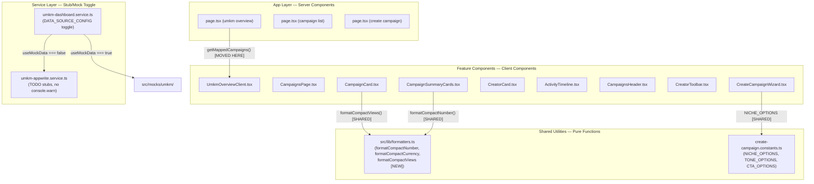
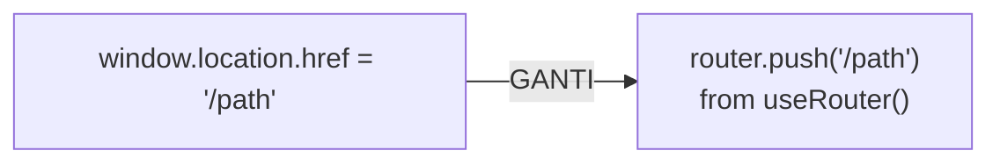
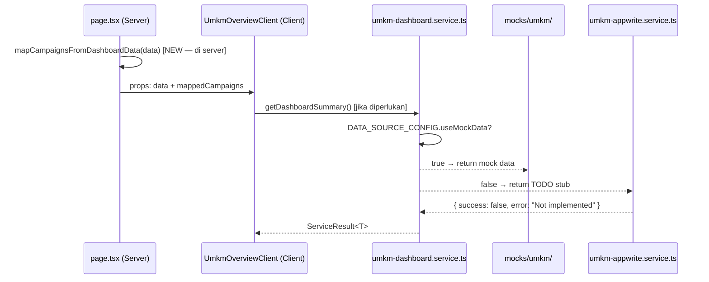

# Design — UMKM Codebase Cleanup & Best Practices Alignment

## Overview

Dokumen ini merinci **strategi teknis** untuk menyelesaikan 8 requirement dari
`requirements.md`. Semua perubahan bersifat **refactoring murni** — tidak ada
perubahan visual, tidak ada library baru, tidak ada perubahan business logic.

Mode terkait: Campaign Mode & Rate Card Mode (keduanya). Role: UMKM.

> **Prinsip utama**: _Minimum code change, maximum consistency._
> Setiap perbaikan dilakukan surgical per file, mengikuti pola yang sudah
> established di codebase — tidak ada batch rewrite.

---

## Architecture



---

## Perubahan per Requirement

### R1 — Inline Style Migration

Pendekatan: **Bukan rewrite seluruh file**. Setiap `style={{ propertyStatik }}` yang
memiliki padanan Tailwind token diganti secara targeted. Style dinamis runtime
(`style={{ width: \`${x}%\` }}`) **tidak disentuh**.

#### Token Mapping Table

| Nilai Inline Hardcoded | Class Tailwind v4 Padanan | File Terdampak |
|---|---|---|
| `color: "#ea580c"` | `text-orange-600` | `ActivityTimeline`, `CampaignsHeader` |
| `color: "#182033"` / `"#111827"` | `text-ink-950` | `ActivityTimeline`, `CampaignsHeader` |
| `color: "#737f91"` / `"#a0aaba"` | `text-ink-500` / `text-ink-400` | `ActivityTimeline`, `CreatorToolbar` |
| `color: "#556174"` | `text-ink-600` | `CampaignsHeader` |
| `background: "#f97316"` (span dekorasi) | `bg-orange-500` | `ActivityTimeline`, `CampaignsHeader` |
| `background: "rgba(255,255,255,.80)"` | `bg-white/80` | `CreatorToolbar` |
| `background: "#eef2f7"` | `bg-ink-100/60` atau `bg-slate-100` | `CreatorToolbar` |
| `fontSize: ".72rem"` / `".84rem"` | `text-[.72rem]` / `text-[.84rem]` (arbitrary ok) | Multiple |
| `display: "flex", alignItems: "center"` | `flex items-center` | `CampaignsHeader`, `ActivityTimeline` |
| `display: "grid", gap: 16` | `grid gap-4` | `ActivityTimeline` |
| `padding: "20px"` | `p-5` | `ActivityTimeline` |
| `borderRadius: 24` | `rounded-3xl` | `ActivityTimeline` |
| `fontFamily: "inherit"` | *(hapus — sudah diatur global body)* | `CreatorToolbar`, `CampaignsHeader` |
| `border: "1px solid rgba(17,24,39,.08)"` | `border border-border` | Multiple |
| `boxShadow: "0 8px 24px rgba(15,23,42,.06)"` | `shadow-sm` | `ActivityTimeline` |

#### Pengecualian yang Sah (tidak diubah)

Inline styles berikut **dipertahankan** karena bersifat dinamis atau tidak ada
padanan statik Tailwind:

```tsx
// ✅ Dinamis — dipertahankan
style={{ width: `${progressPercent}%` }}         // progress bar
style={{ background: coverGradient }}             // gradient berdasarkan niche
style={{ color: statusCfg.color, borderColor: statusCfg.border }} // dari STATUS_CONFIG
style={{ background: cfg.bg, border: `1px solid ${cfg.color}15` }} // dari ACTIVITY_CONFIG
style={{ gridTemplateColumns: 'minmax(220px, 1.4fr) 90px 130px 150px 170px' }} // table layout kustom
style={{ height: `${data.percent}%` }}           // chart bar height

// ✅ Gradient kompleks — dipertahankan (tidak ada token padanan)
style={{ background: "radial-gradient(circle at 100% 0%, rgba(249,115,22,.06), transparent 14rem), linear-gradient(180deg, #ffffff, #fffdf9)" }}
```

#### Komponen yang Direfactor

**`ActivityTimeline.tsx`** — File paling banyak menggunakan inline style (50+ baris).
Seluruh shell wrapper dan header dimigrasi ke Tailwind. Icon config (`ACTIVITY_CONFIG`)
mempertahankan inline style karena bersifat dinamis.

**`CampaignsHeader.tsx`** — Semua `style={{...}}` layout dimigrasi ke Tailwind.
Tombol-tombol CTA menggunakan utility class yang sudah ada.

**`CreatorToolbar.tsx`** — Wrapper toolbar, search bar, sort select, dan category
pills dimigrasi ke Tailwind.

**`CampaignSummaryCards.tsx`** — Props `iconBg`, `iconColor`, `iconBorder` tetap
sebagai props string (karena nilainya dikirim dari parent dan bervariasi) — ini
pengecualian yang sah untuk theming per-icon.

---

### R2 — Navigasi: `window.location.href` → `useRouter`

Tiga file terdampak, semua menggunakan pola yang sama:



#### **`CampaignCard.tsx`** (baris 70)

```tsx
// SEBELUM ❌
{ label: "Lihat Detail", onClick: () => { window.location.href = `/dashboard/umkm/campaign/${campaign.id}`; } }

// SESUDAH ✅
// CampaignCard sudah "use client", tambah import useRouter
import { useRouter } from "next/navigation";
// Di dalam komponen:
const router = useRouter();
// Di actionItems:
{ label: "Lihat Detail", onClick: () => router.push(`/dashboard/umkm/campaign/${campaign.id}`) }
```

> **Catatan**: Tombol "Lihat Detail" di body card sudah menggunakan `<Link>` (baris 171–181)
> yang benar. Hanya `actionItems` di DashboardActionMenu yang perlu diperbaiki.

#### **`CreatorCard.tsx`** (baris 80)

```tsx
// SEBELUM ❌
onClick={() => { window.location.href = "/dashboard/umkm/negosiasi"; }}

// SESUDAH ✅
// CreatorCard sudah "use client" — tambah import useRouter
const router = useRouter();
onClick={() => router.push("/dashboard/umkm/negosiasi")}
```

#### **`StartNegotiationModal.tsx`** (baris 83)

```tsx
// SEBELUM ❌
window.location.href = "/dashboard/umkm/negosiasi/rc-offer-simulated";

// SESUDAH ✅
// Komponen ini sudah punya "use client" — tambah import useRouter
const router = useRouter();
router.push("/dashboard/umkm/negosiasi/rc-offer-simulated");
```

---

### R3 — Duplikasi Formatter: Konsolidasi ke `@/lib/formatters`

#### Tambahan Fungsi ke `src/lib/formatters.ts`

```typescript
// Fungsi baru yang ditambahkan — menggantikan semua duplikat lokal
export function formatCompactViews(value: number): string {
  if (value >= 1_000_000) {
    return `${(value / 1_000_000).toLocaleString("id-ID", { maximumFractionDigits: 1 })}jt`;
  }
  if (value >= 1_000) {
    return `${(value / 1_000).toLocaleString("id-ID", { maximumFractionDigits: 0 })}rb`;
  }
  return String(value);
}
```

#### File yang Menggunakan Duplikat (dihapus dan diganti)

| File | Fungsi Lokal Duplikat | Pengganti dari `formatters.ts` |
|---|---|---|
| `campaign/CampaignCard.tsx` | `formatViews()`, `formatBudget()` | `formatCompactViews()`, `formatCompactCurrency()` |
| `campaign/CampaignSummaryCards.tsx` | `formatViews()` (baris 34–38) | `formatCompactViews()` |
| `overview/UmkmOverviewClient.tsx` | `(n / 1_000_000).toFixed(1) + "jt"` (baris 110–117) | `formatCompactCurrency()` atau `formatCompactViews()` |

---

### R4 — Duplikasi Konstanta: Konsolidasi ke `create-campaign.constants.ts`

#### `ProductInfoStep.tsx` — Duplikat Array Kategori

```tsx
// SEBELUM ❌ — array lokal di dalam komponen
const categories = [
  { id: "kuliner", label: "Kuliner", desc: "Makanan & Minuman" },
  ...
];

// SESUDAH ✅ — import dari konstanta terpusat
import { NICHE_OPTIONS } from "../create-campaign.constants";
// Gunakan NICHE_OPTIONS langsung
```

> **Catatan**: `categories` lokal memiliki field `id` dan `label` tanpa `desc` pada
> beberapa tempat. Pastikan `SelectableOptionCard` bisa menerima data dari `NICHE_OPTIONS`
> (yang punya `id`, `label`, `desc`) tanpa perubahan interface.

---

### R5 — RSC/Client Split: Pindahkan `getMappedCampaigns` ke Server

#### Sebelum (Semua di Client Component)

```tsx
// UmkmOverviewClient.tsx (Client Component) ❌
"use client";

export function UmkmOverviewClient({ data }: UmkmOverviewClientProps) {
  // Logika mapping data — ini tidak butuh browser API
  const getMappedCampaigns = (): Campaign[] => {
    // ... transformasi data statis
  };
  const mappedCampaigns = getMappedCampaigns();
  // ...
}
```

#### Sesudah (Logika di Server Component)

```tsx
// src/app/dashboard/umkm/page.tsx (Server Component) ✅
import type { Campaign, CampaignStatus } from "@/types/umkm-dashboard.types";
import type { UmkmDashboardData } from "@/types/umkmDashboard";

function mapCampaignsFromDashboardData(data: UmkmDashboardData): Campaign[] {
  // Pindahkan seluruh logika getMappedCampaigns() ke sini
  if (!data.campaign) return [];
  // ... transformasi
}

export default function UmkmDashboardPage() {
  const data = UMKM_DASHBOARD_MOCK_DATA;
  const mappedCampaigns = mapCampaignsFromDashboardData(data);
  return <UmkmOverviewClient data={data} mappedCampaigns={mappedCampaigns} />;
}

// UmkmOverviewClient.tsx (Client Component) ✅ — lebih ringan
interface UmkmOverviewClientProps {
  data: UmkmDashboardData;
  mappedCampaigns: Campaign[]; // Diterima sebagai prop, tidak dihitung sendiri
}
```

---

### R6 — Status Badge: Gunakan `DashboardBadge` yang Sudah Ada

`DashboardBadge` dengan `type="status"` sudah menangani semua status yang ada.
Duplikasi `STATUS_CONFIG` lokal di `CampaignCard.tsx` dan `CampaignSection.tsx`
bisa **dihapus** dan digantikan dengan `DashboardBadge`.

#### Analisis Perbandingan

| | `STATUS_CONFIG` Lokal | `DashboardBadge type="status"` |
|---|---|---|
| `active` | Hijau (`#177b42`) | ✅ `badge green` — sama |
| `draft` | Abu (`#687386`) | ✅ `badge gray` — sama |
| `full` | Oranye (`#bd4b0b`) | ✅ `badge orange` — sama |
| `completed` | Biru (`#2d5bd1`) | ✅ `badge navy` — sama |
| `cancelled` | Merah (`#b4232a`) | ✅ `badge red` — sama |

#### `CampaignCard.tsx` — Status Badge

```tsx
// SEBELUM ❌ — STATUS_CONFIG lokal + style inline dinamis
<span
  className="absolute top-3 left-3 ..."
  style={{ color: statusCfg.color, borderColor: statusCfg.border }}
>
  <span style={{ background: "currentColor" }} />
  {statusCfg.label}
</span>

// SESUDAH ✅ — gunakan DashboardBadge
import { DashboardBadge } from "../shared/DashboardBadge";
<DashboardBadge
  type="status"
  value={campaign.status}
  className="absolute top-3 left-3 bg-white/90 backdrop-blur-[10px]"
/>
```

> **Catatan**: `STATUS_CONFIG` lokal di `CampaignCard.tsx` yang juga menyimpan
> `coverGradient` terpisah dari status badge. `COVER_GRADIENTS` tetap dipertahankan
> karena itu untuk cover art, bukan untuk badge.

#### `CampaignSection.tsx` — Status Config

Di `CampaignSection.tsx` (overview), status digunakan untuk mewarnai card header.
Ini bukan badge — ini adalah `STATUS_CONFIG` sendiri yang mengatur `bg` background
card. Karena tidak identik dengan `DashboardBadge`, `STATUS_CONFIG` di sini
**dipertahankan** (pengecualian yang valid — use case berbeda).

---

### R7 — Service Layer: Bersihkan `console.warn`, Tambah TODO

#### `umkm-appwrite.service.ts` — Pola Perubahan

```typescript
// SEBELUM ❌
export async function getUmkmProfileFromAppwrite(): Promise<ServiceResult<UmkmProfile>> {
  console.warn("Appwrite getUmkmProfile is not implemented yet.");
  return { success: false, data: null, error: "Not implemented" };
}

// SESUDAH ✅
export async function getUmkmProfileFromAppwrite(): Promise<ServiceResult<UmkmProfile>> {
  // TODO: Query Appwrite collection "Profiles" — filter by $userId (current session)
  // RBAC: Requires active session, role UMKM
  // Ref: docs/marketiv-md/database/02-collections-schema.md → Profiles
  return { success: false, data: null, error: "Not implemented" };
}
```

Pola ini diterapkan ke seluruh 15 fungsi stub. Setiap TODO wajib menyebut:
1. Nama collection Appwrite target
2. Filter/query yang diperlukan
3. RBAC constraint yang berlaku

#### TODO per Fungsi

| Fungsi | Collection Appwrite | Filter/Query |
|---|---|---|
| `getUmkmProfileFromAppwrite` | `Profiles` | `$userId === currentUser.id` |
| `getDashboardSummaryFromAppwrite` | Aggregated dari `Campaigns`, `Transactions` | Computed dari beberapa collection |
| `getCampaignsFromAppwrite` | `Campaigns` | `umkmId === currentUser.id` |
| `getCampaignByIdFromAppwrite` | `Campaigns` | `$id === id AND umkmId === currentUser.id` |
| `getCampaignSubmissionsFromAppwrite` | `Submissions` (Claims) | `campaignId === campaignId` |
| `getPendingSubmissionsFromAppwrite` | `Submissions` | `umkmId === currentUser.id AND status === "pending"` |
| `getCreatorsFromAppwrite` | `Profiles` | `role === "KREATOR"` |
| `getCreatorByIdFromAppwrite` | `Profiles` | `$id === id AND role === "KREATOR"` |
| `getCreatorRateCardsFromAppwrite` | *(Rate Card collection — cek schema)* | `creatorId === id AND isActive === true` |
| `getNegotiationsFromAppwrite` | `Orders` | `umkmId === currentUser.id` |
| `getNegotiationByIdFromAppwrite` | `Orders` | `$id === id AND umkmId === currentUser.id` |
| `getMessagesByOrderIdFromAppwrite` | `Messages` | `orderId === orderId` (participant check) |
| `getTransactionsFromAppwrite` | `Transactions` | `userId === currentUser.id` — READ-ONLY |
| `getTransactionByIdFromAppwrite` | `Transactions` | `$id === id AND userId === currentUser.id` |
| `getFinanceSummaryFromAppwrite` | Aggregated dari `Transactions` | `userId === currentUser.id` |
| `getEscrowOverviewFromAppwrite` | Aggregated dari `Transactions` | `userId === currentUser.id AND status === "escrow"` |

#### Tambahan Field ke `umkm-dashboard.types.ts`

Interface `Campaign` perlu field tambahan agar selaras dengan schema Appwrite
collection `Campaigns` (lihat `docs/marketiv-md/database/02-collections-schema.md`):

```typescript
// TAMBAHKAN ke interface Campaign di umkm-dashboard.types.ts
export interface Campaign {
  // ... field yang sudah ada ...
  category: string;      // Alias dari niche — field yang digunakan di Wizard
  location?: string;     // Target lokasi kreator (opsional)
  videoStyle?: string;   // Gaya tone video
  callToAction?: string; // CTA yang dipilih
  hashtags?: string;     // Hashtag rekomendasi
  requiredPoints?: string; // Poin penting video
  assetNotes?: string;   // Catatan aset eksternal
}
```

---

### R8 — Aksesibilitas: `aria-label` & Semantik HTML

#### Audit Hasil

| File | Isu | Perbaikan |
|---|---|---|
| `CreatorToolbar.tsx:74` | Tombol ✕ — sudah ada `aria-label="Hapus pencarian"` ✅ | Tidak perlu diubah |
| `CampaignToolbar.tsx:74` | Tombol ✕ — sudah ada `aria-label="Hapus pencarian"` ✅ | Tidak perlu diubah |
| `NegotiationToolbar.tsx` | Audit diperlukan | Periksa saat implementasi |
| `FinanceToolbar.tsx` | Audit diperlukan | Periksa saat implementasi |
| Form wizard label-input | `<label>` terhubung ke `<Input id="...">` ✅ — sudah benar | Tidak perlu diubah |
| `CreatorCard.tsx:79` | Sudah ada `aria-label="Mulai negosiasi..."` ✅ | Tidak perlu diubah |
| `DashboardActionMenu` tombol trigger | Perlu audit `aria-label` | Periksa saat implementasi |

---

## Sequence Diagram — Data Flow Setelah Refactor



---

## Error Handling Strategy

- **Formatter error**: Semua fungsi di `formatters.ts` menerima `number` — tidak ada
  error path. Nilai `NaN` atau `undefined` dihandle oleh caller yang memasukkan
  fallback (`?? 0`).
- **Navigation error**: `useRouter().push()` tidak melempar exception — jika route
  tidak ditemukan, Next.js menampilkan 404 page.
- **Service stub error**: Fungsi stub return `{ success: false, error: "Not implemented" }`
  — komponen yang memanggil sudah menangani `error` state (pattern sudah konsisten
  di seluruh file UMKM: `if (res.success && res.data) { ... } else { setError(...) }`).

---

## Performance Considerations

- **Bundle size**: Memindahkan `getMappedCampaigns` ke Server Component mengurangi
  JS yang dikirim ke browser (logika mapping tidak perlu ada di bundle client).
- **No new re-renders**: Konsolidasi formatter dan konstanta tidak mempengaruhi
  render cycle — semuanya adalah pure function.
- **Tree-shaking**: Dengan menghapus fungsi formatter lokal yang terduplikasi,
  bundler lebih efisien mengoptimalkan chunk karena semua formatter ada di satu
  lokasi (`formatters.ts`).
- **console.warn removal**: `console.warn` di production build memperlambat rendering
  di Chrome DevTools profiler — menghapusnya dari 15 fungsi stub mengurangi noise.

## Security Considerations

- **Tidak ada perubahan akses data** — semua perubahan murni UI dan utility layer.
- **Server/Client boundary** tetap dipertahankan: page.tsx (Server) → Client Component.
- **No new API routes** — spec ini tidak menyentuh backend sama sekali.
- **`umkm-appwrite.service.ts`** stub tetap return `{ success: false }` — aman,
  tidak ada data yang bocor ke client.

## Testing Strategy

- **Build check**: `npm run build` — validasi TypeScript strict, tidak ada error kompilasi.
- **Lint check**: `npm run lint` — target 0 errors, 0 warnings.
- **Visual regression**: Tidak diperlukan testing visual (perubahan transparan dari
  perspektif user). Gunakan browser devtools untuk verifikasi tidak ada reflow/repaint
  yang tidak diinginkan.
- **Edge cases yang wajib diuji manual**:
  - Campaign card dengan status semua variant (`active`, `draft`, `full`, `completed`, `cancelled`)
  - Navigasi dari CampaignCard action menu → pastikan `router.push()` berfungsi
  - Navigasi dari CreatorCard ikon negosiasi → pastikan tidak full reload
  - Wizard campaign step 1 dengan `NICHE_OPTIONS` yang diimport → pastikan tampilan sama
