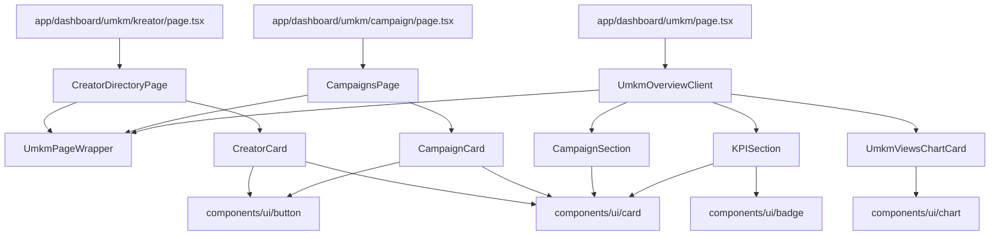
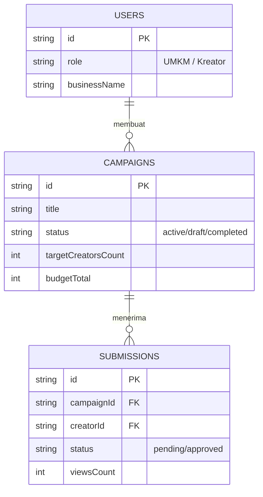
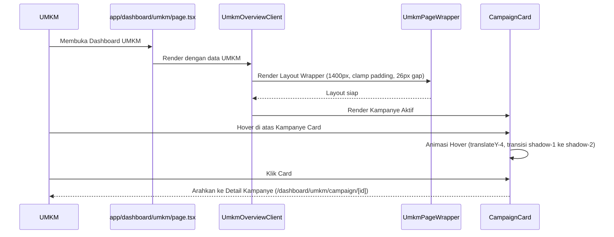

# Design — UMKM Dashboard Radix Refactor

## Overview

Dokumen desain ini merinci bagaimana memetakan persyaratan konsolidasi visual dan migrasi Radix UI/shadcn untuk 3 tab utama Dashboard UMKM (Overview, Campaign List, dan Discover Creators) sesuai dengan standar estetika **Marketiv Studio System v5.8**. 

Desain ini menggabungkan:
1. **Headless Accessiblity (Radix UI)**: Melalui integrasi komponen shadcn/ui.
2. **Visual Style Tokens (Studio System v5.8)**: Menggunakan CSS custom properties untuk warna base paper, bayangan (*shadows*), radius kelengkungan, border tipis, dan efek orange glow.
3. **Responsive Layouts**: Menggunakan utility CSS Grid konsolidasi (`.dashboard-rule-grid`, `.responsive-card-grid`, `.bento-grid`, dan `.chart-grid`) untuk mengeliminasi inline style.

Fitur ini mencakup area kerja **UMKM** (`role: UMKM`) dan mencakup **Campaign Mode** (dengan aturan ketat zero-chat) serta **Rate Card Mode** (pada halaman direktori kreator).

---

## Architecture

Mermaid diagram berikut menunjukkan aliran hierarki rendering dari route halaman (Next.js App Router) ke komponen fitur dan komponen UI Radix/shadcn yang sudah distandardisasi.



---

## Components and Interfaces

### 1. `UmkmPageWrapper` (`src/components/features/umkm-dashboard/shared/UmkmPageWrapper.tsx`)
- **Tanggung jawab**: Menjadi wrapper utama tata letak halaman UMKM, mengontrol batas lebar maksimum, padding responsif, dan jarak vertikal (*gap*) antar section tanpa menyebabkan double scroll.
- **Input**:
  - `children: React.ReactNode`
  - `maxWidth?: number` (Default: `1400`)
  - `className?: string` (Opsional, digabungkan dengan `cn()`)
- **Visual Style**:
  - `padding: clamp(16px, 3vw, 28px)`
  - `gap: 26px` (CSS Grid vertical spacing)
  - `maxWidth: 1400px` (atau override dari prop)
  - `margin: 0 auto` (Centering)

### 2. `KPISection` (`src/components/features/umkm-dashboard/overview/KPISection.tsx`)
- **Tanggung jawab**: Merender 4–6 kartu metrik utama performa bisnis UMKM secara responsif.
- **Input**:
  - `kpisData: UmkmKpis` (dari dashboard data types)
- **Desain & Migrasi**:
  - Mengganti deprecated `DashboardMetricCard` atau `DashboardCard` dengan komponen `Card` dari `@/components/ui/card`.
  - Mengatur susunan menggunakan grid class `.dashboard-rule-grid` (2→3→6 col).
  - Tampilan card mengadopsi style `--paper-2` (#fffdf8), `--radius-2` (18px), `--border`, dan `--shadow-1` (Studio System).

### 3. `CampaignCard` (`src/components/features/umkm-dashboard/campaign/CampaignCard.tsx`)
- **Tanggung jawab**: Merender visual representatif untuk satu campaign dalam daftar.
- **Input**:
  - `campaign: Campaign` (dari type `src/types/umkm-dashboard.types.ts`)
- **Desain & Migrasi**:
  - Menggunakan shadcn `<Card>` dengan visual class `.campaign-card`.
  - Radius sudut diatur ke `var(--radius-3)` (26px) dengan border tipis dan gradien penutup cover yang elegan.
  - Hover effect menggunakan easing cubic-bezier (`var(--ease)`) dengan translate Y `-4px` dan shadow transition dari `var(--shadow-1)` ke `var(--shadow-2)`.

### 4. `CreatorCard` (`src/components/features/umkm-dashboard/creators/CreatorCard.tsx`)
- **Tanggung jawab**: Merender portofolio ringkas kreator (avatar, niche, stats, dan tombol order/tawaran).
- **Input**:
  - `creator: Creator` (dari data model di `src/types/`)
- **Desain & Migrasi**:
  - Menggunakan shadcn `<Card>` dengan visual class `.creator-card`.
  - Bagian avatar menggunakan ukuran `56x56px` dengan kelengkungan `var(--radius-2)` (18px) dan bayangan `var(--orange-glow)` saat aktif/hover.
  - Kartu statistik di dalamnya menggunakan warna latar belakang `--ink-100` dengan pembagi border yang tipis.

---

## Data Models

Refaktorisasi ini bersifat murni presentasional dan struktural UI, namun struktur data yang di-render merujuk pada model relasi di `DATABASE.md`:



### Type Interfaces
Struktur data campaign dan kreator yang digunakan pada komponen:

```typescript
// src/types/umkm-dashboard.types.ts
export type CampaignStatus = "active" | "draft" | "full" | "completed" | "cancelled";

export interface Campaign {
  id: string;
  umkmId: string;
  title: string;
  brief: string;
  externalAssetUrl: string;
  thumbnailUrl: string;
  niche: string;
  status: CampaignStatus;
  creatorQuota: number;
  usedQuota: number;
  pricePerThousandViews: number;
  totalBudgetEscrow: number;
  usedBudget: number;
  totalViews: number;
  createdAt: string;
  updatedAt: string;
}
```

---

## API Design

*N/A — Refaktorisasi ini murni berada pada lapisan presentasional (UI/UX) dan tidak menambahkan endpoint API baru.*

---

## Sequence Diagrams

Berikut adalah urutan interaksi ketika UMKM memuat halaman overview dan berinteraksi dengan salah satu campaign card.



---

## Error Handling Strategy

1. **Fallback Image**: Saat thumbnail campaign atau avatar kreator gagal dimuat, sistem akan otomatis menampilkan fallback berupa representasi inisial dengan gradien warna linear default dari Studio System (misalnya dari `#fb923c` ke `#c2410c`).
2. **Skeleton Parity**: Elemen loading skeleton di halaman Overview, Campaign, dan Kreator harus memiliki struktur baris dan kolom grid yang identik dengan elemen aslinya untuk menghindari pergeseran tata letak (CLS).
3. **Radix Dialog Error Check**: Saat menggunakan dialog Radix (`DashboardModal` $\rightarrow$ `Dialog`), pastikan komponen `DialogContent` memiliki penanganan close yang aman tanpa merusak state React di background.

---

## Security Considerations

1. **Client-Side Auth Boundary Check**: Halaman `/dashboard/umkm/*` dilindungi di level route Next.js middleware. Secara UI, komponen tidak boleh mencoba mengambil data di client jika sesi pengguna tidak valid atau tidak memiliki role `UMKM`.
2. **Anti-Leakage**: Seluruh kunci atau tokens (misalnya jika ada kaitan visual ke ID data) harus di-render dalam format tersamarkan (seperti UUID acak dari backend) di client-side bundle.

---

## Performance Considerations

1. **CSS Hardware Acceleration**: Untuk efek hover `translateY(-4px)` pada `.campaign-card` dan `.creator-card`, gunakan property CSS `will-change: transform` jika terjadi rendering lag pada perangkat mobile low-end.
2. **Bypass Tailwind JIT Arbitrary Overhead**: Menggunakan CSS variables (`var(--radius-3)`, `var(--shadow-1)`) yang di-bridge di `globals.css` alih-alih menulis arbitrary classes yang panjang (seperti `rounded-[26px] shadow-[...]`) untuk memperkecil bundle size CSS.

---

## Testing Strategy

1. **Manual Responsive Check**: Memastikan bahwa transisi tata letak berjalan mulus dari ukuran layar **375px** (mobile), **768px** (tablet), **1024px** (desktop kecil), hingga **1400px+** (lebar maksimal).
2. **Keyboard Navigation Check**: Memastikan shadcn `<Button>` dan `<Card>` yang berinteraksi sebagai tautan dapat diakses menggunakan tombol `Tab` dan dipicu dengan tombol `Enter` / `Space` (sesuai standard aksesibilitas Radix UI).
3. **CLS Validation**: Melakukan pengujian visual menggunakan Chrome DevTools Lighthouse untuk menjamin Cumulative Layout Shift (CLS) mendekati `0`.
