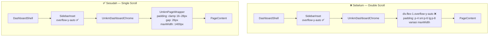
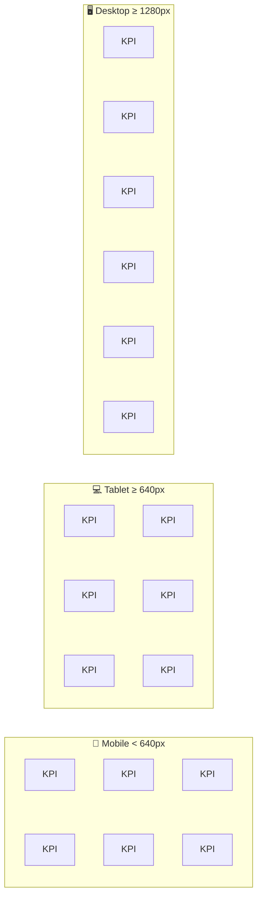

# Design Document: UMKM Layout System

## Overview

Spec ini mendefinisikan arsitektur layout terpusat untuk seluruh halaman UMKM dashboard di `marketiv-web`. Masalah utama saat ini adalah inkonsistensi padding, maxWidth, gap vertikal, dan adanya **double `overflow-y-auto`** yang menyebabkan scroll bermasalah. Solusinya adalah membuat satu komponen `UmkmPageWrapper` sebagai standar layout tunggal, dan merefactor semua page route / client component untuk menggunakannya.

Acuan desain: prototype `DashboardPage.tsx` dan `CampaignPage.tsx` dari `C:\Users\user\Downloads\Implement PRD with UI Kits\`.

---

## Architecture

### Sebelum Perbaikan (Problem State)

```
DashboardShell (overflow-y-auto di SidebarInset ✅)
└── UmkmDashboardChrome
    └── <div class="flex-1 overflow-y-auto p-4 sm:p-6 lg:p-8"> ← DOUBLE SCROLL ❌
        └── <PageContent>
              maxWidth: bervariasi (max-w-7xl, 1440px, tidak ada)
              gap: bervariasi (space-y-6, gap:0, pb-24)
              padding: bervariasi (p-4 sm:p-6 lg:p-8, clamp 32px)
```

### Sesudah Perbaikan (Target State)

```
DashboardShell (overflow-y-auto di SidebarInset ✅ — satu-satunya scroll)
└── UmkmDashboardChrome
    └── <UmkmPageWrapper>   ← SATU WRAPPER STANDAR ✅
          padding: clamp(16px, 3vw, 28px)
          maxWidth: 1400px (default) atau override via prop
          gap: 26px
          display: grid; alignContent: start; width: 100%
        └── <PageContent>
```

**Prinsip utama:**
- `DashboardShell.SidebarInset` adalah **satu-satunya** elemen dengan `overflow-y-auto` di level shell.
- Semua page content wrapper **tidak boleh** punya `overflow-y-auto`.
- `UmkmPageWrapper` menggantikan pola `<div className="flex-1 p-4 sm:p-6 lg:p-8 overflow-y-auto ...">`.

### Diagram Alur Scroll (Mermaid)



---

## Components and Interfaces

### `UmkmPageWrapper`

**Path:** `src/components/features/umkm-dashboard/shared/UmkmPageWrapper.tsx`

**TypeScript Interface:**

```typescript
import { type ReactNode } from "react";
import { cn } from "@/lib/utils";

interface UmkmPageWrapperProps {
  children: ReactNode;
  /** Override maxWidth default 1400px. Gunakan untuk Campaign (1440px) atau Pengaturan (768px). */
  maxWidth?: number;
  /** Class tambahan digabung via cn() ke atas style default. */
  className?: string;
}
```

**Implementasi:**

```typescript
export function UmkmPageWrapper({
  children,
  maxWidth = 1400,
  className,
}: UmkmPageWrapperProps) {
  return (
    <div
      className={cn(className)}
      style={{
        padding: "clamp(16px, 3vw, 28px)",
        display: "grid",
        gap: 26,
        maxWidth,
        marginLeft: "auto",
        marginRight: "auto",
        width: "100%",
        alignContent: "start",
      }}
    >
      {children}
    </div>
  );
}
```

**Keputusan desain:**
- Menggunakan **inline style** bukan Tailwind className untuk nilai numerik presisi (`gap: 26px`, `maxWidth: 1400px`) yang tidak ada padanannya di Tailwind default config.
- `clamp(16px, 3vw, 28px)` mengikuti prototype persis — max 28px, bukan 32px yang ada di implementasi Overview saat ini.
- `display: grid` dengan `alignContent: start` memastikan konten tidak memanjang mengisi sisa viewport kosong.
- `cn(className)` memungkinkan override class dari luar tanpa mengorbankan inline style.

**Export di `index.ts`:**

```typescript
export { UmkmPageWrapper } from "./UmkmPageWrapper";
export type { UmkmPageWrapperProps } from "./UmkmPageWrapper";
```

---

## Data Models

### Design Tokens

Nilai-nilai yang dipakai dalam `UmkmPageWrapper` dan seluruh refactor ini bersumber dari `src/app/globals.css` dan prototype:

| Token | Value | Sumber | Digunakan di |
|---|---|---|---|
| `--shadow-1` | `0 8px 24px rgba(15,23,42,.06)` | `globals.css` | Default card shadow |
| `--shadow-2` | `0 18px 46px rgba(15,23,42,.10)` | `globals.css` | Hover card shadow |
| `--border` | `rgba(17, 24, 39, 0.10)` | `globals.css` | Border card |
| `--border-strong` | `rgba(17, 24, 39, 0.16)` | `globals.css` | Border strong |
| `--radius-1` | `12px` | `globals.css` | Radius kecil (input, badge) |
| `--radius-2` | `18px` | `globals.css` | Radius medium (toolbar) |
| `--radius-3` | `26px` | `globals.css` | Radius besar (card) |
| `--orange-500` | `#f97316` | `globals.css` | Brand primary |
| `--orange-600` | `#ea580c` | `globals.css` | Brand CTA |
| `--ink-900` | `#182033` | `globals.css` | Text heading |
| `--ink-500` | `#737f91` | `globals.css` | Text muted |

### Layout Tokens (Hardcoded — dari Prototype)

| Nama | Value | Keterangan |
|---|---|---|
| `PAGE_PADDING` | `clamp(16px, 3vw, 28px)` | Padding semua sisi `UmkmPageWrapper` |
| `PAGE_GAP` | `26px` | Gap vertikal antar section |
| `MAX_WIDTH_DEFAULT` | `1400px` | maxWidth halaman standar (Overview, Keuangan, Kreator, Negosiasi, Analitik) |
| `MAX_WIDTH_CAMPAIGN` | `1440px` | maxWidth halaman Campaign (sesuai prototype) |
| `MAX_WIDTH_PENGATURAN` | `768px` | maxWidth halaman Pengaturan (form sempit) |
| `KPI_GAP` | `12px` | Gap antar KPI card |
| `COLUMN_GAP` | `26px` | Gap antara kolom kiri dan kanan di 2-column layout |
| `LEFT_COL_GAP` | `26px` | Gap antar komponen di kolom kiri Overview |
| `RIGHT_COL_GAP` | `22px` | Gap antar komponen di kolom kanan Overview |
| `CAMPAIGN_GRID_GAP` | `18px` | Gap antar campaign card |
| `SUMMARY_CARDS_GAP` | `14px` | Gap antar summary card (`auto-fit, minmax(170px,1fr)`) |
| `CHART_GAP` | `20px` | Gap antar chart di Analitik |
| `2COL_BREAKPOINT` | `1100px` | Breakpoint aktivasi 2-column di Overview |
| `CHART_2COL_BREAKPOINT` | `900px` | Breakpoint 2-column chart di Analitik |
| `CAMPAIGN_BP_2` | `640px` | Campaign grid → 2 kolom |
| `CAMPAIGN_BP_3` | `1100px` | Campaign grid → 3 kolom |
| `CAMPAIGN_BP_4` | `1400px` | Campaign grid → 4 kolom |

---

## Mapping Perubahan Per File

| File | Perubahan | Requirements |
|---|---|---|
| `src/components/features/umkm-dashboard/shared/UmkmPageWrapper.tsx` | **BUAT BARU** — komponen wrapper standar | R1 |
| `src/components/features/umkm-dashboard/shared/index.ts` | Tambah export `UmkmPageWrapper` | R1.7 |
| `src/app/dashboard/umkm/keuangan/page.tsx` | Ganti `<div className="flex-1 p-4 sm:p-6 lg:p-8 overflow-y-auto">` → `<UmkmPageWrapper>` | R2.2, R3.3, R5.2, R11.1 |
| `src/app/dashboard/umkm/kreator/page.tsx` | Ganti `<div className="flex-1 p-4 sm:p-6 lg:p-8 overflow-y-auto">` → `<UmkmPageWrapper>` | R2.3, R3.4, R5.2, R11.2 |
| `src/app/dashboard/umkm/negosiasi/page.tsx` | Ganti `<div className="flex-1 p-4 sm:p-6 lg:p-8 overflow-y-auto">` → `<UmkmPageWrapper>` | R2.4, R3.5, R5.2, R11.3 |
| `src/app/dashboard/umkm/campaign/buat/page.tsx` | Ganti `<div className="flex-1 p-4 sm:p-6 lg:p-8 overflow-y-auto">` → `<UmkmPageWrapper>` | R2.5, R5.2, R11.4 |
| `src/app/dashboard/umkm/analitik/page.tsx` | Tambah `<UmkmDashboardChrome>` wrapper, render `<AnalitikClient>` tanpa chrome | R9.4 |
| `src/app/dashboard/umkm/pengaturan/page.tsx` | Tambah `<UmkmDashboardChrome>` wrapper, render `<PengaturanClient>` tanpa chrome | R10.3 |
| `src/components/features/umkm-dashboard/analytics/AnalitikClient.tsx` | Hapus `UmkmDashboardChrome`, ganti wrapper `div.flex-1...overflow-y-auto` → `<UmkmPageWrapper maxWidth={1400}>` | R2.6, R3.6, R4.5, R9.1–9.3 |
| `src/components/features/umkm-dashboard/settings/PengaturanClient.tsx` | Hapus `UmkmDashboardChrome`, ganti wrapper `div.flex-1...overflow-y-auto.max-w-3xl` → `<UmkmPageWrapper maxWidth={768}>` | R2.7, R3.7, R4.6, R10.1–10.2 |
| `src/components/features/umkm-dashboard/campaign/CampaignsPage.tsx` | Hapus `UmkmDashboardChrome`, ganti wrapper div dengan `<UmkmPageWrapper maxWidth={1440}>`, fix campaign grid breakpoints & gap | R2.8, R3.2, R4.2, R8, R12 |
| `src/components/features/umkm-dashboard/overview/UmkmOverviewClient.tsx` | Ganti wrapper div → `<UmkmPageWrapper>`, fix gap di 2-column layout (24→26px), fix padding (32px→28px) | R3.1, R4, R5.3, R6 |
| `src/components/features/umkm-dashboard/finance/FinanceOverviewPage.tsx` | Hapus `space-y-6 max-w-7xl mx-auto pb-20`, biarkan wrapping dilakukan `page.tsx` | R3.3, R4.3, R11.5–6 |
| `src/components/features/umkm-dashboard/creators/CreatorDirectoryPage.tsx` | Hapus `space-y-6 max-w-7xl mx-auto`, biarkan wrapping dilakukan `page.tsx` | R3.4, R4.4, R11.5–6 |
| `src/components/features/umkm-dashboard/negotiation/NegotiationListPage.tsx` | Hapus `space-y-6 max-w-7xl mx-auto pb-24`, biarkan wrapping dilakukan `page.tsx` | R3.5, R4.7–8, R11.5–6 |

---

## Grid Specifications

### KPI Grid (KPISection.tsx) — Sudah Benar, Pertahankan

Implementasi saat ini di `KPISection.tsx` **sudah memenuhi** semua requirement. Tidak perlu perubahan struktur grid, hanya pastikan gap tetap 12px.

```
Mobile  (< 640px):   repeat(2, minmax(0, 1fr))  →  2 kolom × 3 baris
Tablet  (≥ 640px):   repeat(3, minmax(0, 1fr))  →  3 kolom × 2 baris  ← tidak ada orphan card
Desktop (≥ 1280px):  repeat(6, minmax(0, 1fr))  →  6 kolom × 1 baris
Gap: 12px
```



> **Mengapa fixed column count, bukan auto-fill?** `auto-fill` dengan `minmax` dapat menghasilkan orphan card (1 card sendirian di baris terakhir jika lebar tidak pas). Fixed column count (`repeat(2,…)`, `repeat(3,…)`, `repeat(6,…)`) memastikan 6 kartu selalu habis dibagi sempurna.

### Campaign Card Grid (CampaignsPage.tsx) — Perlu Diperbaiki

**Sebelum (saat ini):** `md:grid-cols-2 lg:grid-cols-3` (breakpoints 768px dan 1024px), gap: `gap-6` (24px)

**Sesudah (sesuai prototype `CampaignPage.tsx`):**

```
Mobile  (< 640px):   grid-template-columns: 1fr
Tablet  (≥ 640px):   repeat(2, 1fr)    ← breakpoint 640px, bukan md:768px
Laptop  (≥ 1100px):  repeat(3, 1fr)    ← breakpoint 1100px, bukan lg:1024px
Wide    (≥ 1400px):  repeat(4, 1fr)    ← breakpoint baru sesuai prototype
Gap: 18px
```

Implementasi CSS (via `<style>` tag atau Tailwind custom breakpoint):

```css
.campaign-grid {
  display: grid;
  gap: 18px;
  grid-template-columns: 1fr;
}
@media (min-width: 640px)  { .campaign-grid { grid-template-columns: repeat(2, 1fr); } }
@media (min-width: 1100px) { .campaign-grid { grid-template-columns: repeat(3, 1fr); } }
@media (min-width: 1400px) { .campaign-grid { grid-template-columns: repeat(4, 1fr); } }
```

### 2-Column Layout Overview

**Sebelum:** gap `24px`, kolom kiri gap `20px`, breakpoint inline style tanpa mx-auto di wrapper.

**Sesudah (sesuai prototype `DashboardPage.tsx`):**

```
Mobile  (< 1100px):  grid-template-columns: 1fr      ← single column
Desktop (≥ 1100px):  minmax(0, 1.85fr) minmax(0, 1fr)  ← 2 kolom
Gap antara kolom: 26px
Kolom kiri gap: 26px  (CampaignSection + ActivityTimeline)
Kolom kanan gap: 22px (FinancialOverview + InsightSection + QuickActions)
```

### Campaign Summary Cards

```css
/* Sesuai prototype — auto-fit membolehkan kartu menyesuaikan, bukan fixed count */
grid-template-columns: repeat(auto-fit, minmax(170px, 1fr));
gap: 14px;
```

---

## Refactor Pattern

### Pattern A: Halaman yang Sudah Punya Page Route Wrapper

Berlaku untuk: Keuangan, Kreator, Negosiasi, Campaign Buat.

**Sebelum (`page.tsx`):**

```tsx
// /dashboard/umkm/keuangan/page.tsx
return (
  <UmkmDashboardChrome businessName={businessName}>
    <div className="flex-1 p-4 sm:p-6 lg:p-8 overflow-y-auto">
      <FinanceOverviewPage />
    </div>
  </UmkmDashboardChrome>
);
```

**Sesudah (`page.tsx`):**

```tsx
// /dashboard/umkm/keuangan/page.tsx
import { UmkmPageWrapper } from "@/components/features/umkm-dashboard/shared";

return (
  <UmkmDashboardChrome businessName={businessName}>
    <UmkmPageWrapper>
      <FinanceOverviewPage />
    </UmkmPageWrapper>
  </UmkmDashboardChrome>
);
```

**Sebelum (`FinanceOverviewPage.tsx` — wrapper div terluar):**

```tsx
return (
  <div className="space-y-6 max-w-7xl mx-auto pb-20">
    {/* ... */}
  </div>
);
```

**Sesudah (`FinanceOverviewPage.tsx` — hapus padding/maxWidth luar):**

```tsx
// Komponen ini tidak lagi punya wrapper div sendiri — layout dikelola oleh UmkmPageWrapper di page.tsx
return (
  <>
    <FinanceHeader onTriggerExport={() => setIsExportOpen(true)} />
    <FinanceSummaryCards summary={computedSummary} />
    <EscrowOverviewCard overview={computedEscrowOverview} />
    <FinanceToolbar {/* ... */} />
    <TransactionHistorySection {/* ... */} />
    {/* modals ... */}
  </>
);
```

> Pola yang sama berlaku untuk `CreatorDirectoryPage.tsx` (hapus `space-y-6 max-w-7xl mx-auto`) dan `NegotiationListPage.tsx` (hapus `space-y-6 max-w-7xl mx-auto pb-24`).

### Pattern B: Refactor Analitik & Pengaturan (Chrome di dalam Client Component)

Kedua halaman ini saat ini melakukan `UmkmDashboardChrome` **di dalam client component**-nya sendiri, bukan di page route. Ini berbeda dari pola halaman lain dan menyebabkan inkonsistensi.

#### Analitik — Sebelum

```tsx
// /dashboard/umkm/analitik/page.tsx
export default function AnalitikPageRoute() {
  return <AnalitikClient businessName="Dapur Sehat Sukabumi" />;
}

// AnalitikClient.tsx
export function AnalitikClient({ businessName }: AnalitikClientProps) {
  return (
    <UmkmDashboardChrome businessName={businessName}>  {/* ← Chrome di sini */}
      <div className="flex-1 p-4 sm:p-6 lg:p-8 overflow-y-auto space-y-6 max-w-7xl mx-auto w-full">
        {/* konten */}
      </div>
    </UmkmDashboardChrome>
  );
}
```

#### Analitik — Sesudah

```tsx
// /dashboard/umkm/analitik/page.tsx
import { UmkmDashboardChrome } from "@/components/features/dashboard/UmkmDashboardChrome";
import { AnalitikClient } from "@/components/features/umkm-dashboard/analytics/AnalitikClient";

export default function AnalitikPageRoute() {
  return (
    <UmkmDashboardChrome businessName="Dapur Sehat Sukabumi">  {/* ← Chrome pindah ke sini */}
      <AnalitikClient />
    </UmkmDashboardChrome>
  );
}

// AnalitikClient.tsx — tidak lagi terima businessName, tidak lagi import UmkmDashboardChrome
export function AnalitikClient() {
  return (
    <UmkmPageWrapper maxWidth={1400}>
      {/* Header, KPI row, Charts row, Top campaigns */}
    </UmkmPageWrapper>
  );
}
```

#### Pengaturan — Sebelum

```tsx
// /dashboard/umkm/pengaturan/page.tsx
export default function PengaturanPageRoute() {
  return <PengaturanClient businessName="Dapur Sehat Sukabumi" />;
}

// PengaturanClient.tsx
export function PengaturanClient({ businessName }: PengaturanClientProps) {
  return (
    <UmkmDashboardChrome businessName={businessName}>
      <div className="flex-1 p-4 sm:p-6 lg:p-8 overflow-y-auto space-y-6 max-w-3xl mx-auto w-full">
        {/* form sections */}
      </div>
    </UmkmDashboardChrome>
  );
}
```

#### Pengaturan — Sesudah

```tsx
// /dashboard/umkm/pengaturan/page.tsx
import { UmkmDashboardChrome } from "@/components/features/dashboard/UmkmDashboardChrome";
import { PengaturanClient } from "@/components/features/umkm-dashboard/settings/PengaturanClient";

export default function PengaturanPageRoute() {
  return (
    <UmkmDashboardChrome businessName="Dapur Sehat Sukabumi">
      <PengaturanClient />
    </UmkmDashboardChrome>
  );
}

// PengaturanClient.tsx — tidak lagi import UmkmDashboardChrome
export function PengaturanClient() {
  return (
    <UmkmPageWrapper maxWidth={768}>
      {/* Header, profile card, notifications, danger zone */}
    </UmkmPageWrapper>
  );
}
```

> **Mengapa `maxWidth={768}` untuk Pengaturan?** Halaman pengaturan adalah form sempit — desain memang dimaksudkan lebih kecil dari halaman listing. `max-w-3xl` yang ada saat ini = 768px, jadi nilainya dipertahankan, hanya dipindahkan ke `UmkmPageWrapper` prop.

### Pattern C: CampaignsPage (Chrome di dalam, tapi tetap di component)

`CampaignsPage` mirip dengan `UmkmOverviewClient` — `UmkmDashboardChrome` ada di dalam component, bukan page route. Ini **dipertahankan** (tidak direfactor ke page.tsx) karena komponen ini sudah kompleks dan ada banyak state. Perubahan hanya pada wrapper div inner:

**Sebelum:**

```tsx
<UmkmDashboardChrome businessName={businessName}>
  <div
    className="flex-1 overflow-y-auto relative"
    style={{ padding: "clamp(16px, 3vw, 28px)", display: "grid", gap: 0, maxWidth: 1440, alignContent: "start", width: "100%" }}
  >
    {/* sections */}
  </div>
</UmkmDashboardChrome>
```

**Sesudah:**

```tsx
<UmkmDashboardChrome businessName={businessName}>
  <UmkmPageWrapper maxWidth={1440}>
    {/* sections — gap:0 dihapus, overflow-y-auto dihapus */}
  </UmkmPageWrapper>
</UmkmDashboardChrome>
```

Dan campaign grid diubah:

**Sebelum:** `<div className="grid grid-cols-1 md:grid-cols-2 lg:grid-cols-3 gap-6">`

**Sesudah:**
```tsx
<div className="campaign-grid" style={{ display: "grid", gap: 18 }}>
  {/* ... */}
</div>
{/* + CSS breakpoints via <style> tag */}
```

### Pattern D: UmkmOverviewClient (sudah pakai inline style, perlu disesuaikan)

**Sebelum:**

```tsx
<UmkmDashboardChrome businessName={data.businessName}>
  <div
    className="w-full max-w-[1400px] mx-auto overflow-x-hidden"
    style={{
      padding: "clamp(16px, 3vw, 32px)",  // ← max 32px, harus 28px
      display: "grid",
      gap: 24,                              // ← harus 26
      alignContent: "start",
    }}
  >
    {/* ... */}
    <div className="umkm-dash-grid">
      <div style={{ display: "grid", gap: 20, ... }}>  {/* ← harus 26 */}
```

**Sesudah:**

```tsx
<UmkmDashboardChrome businessName={data.businessName}>
  <UmkmPageWrapper>   {/* maxWidth default 1400, padding clamp 28px, gap 26 */}
    <HeroOverview ... />
    <KPISection ... />
    <div className="umkm-dash-grid">
      <div style={{ display: "grid", gap: 26, minWidth: 0, alignContent: "start" }}>
        <CampaignSection ... />
        <ActivityTimeline ... />
      </div>
      <div style={{ display: "grid", gap: 22, alignContent: "start", minWidth: 0 }}>
        <FinancialOverview ... />
        <InsightSection ... />
        <QuickActions />
      </div>
    </div>
  </UmkmPageWrapper>

  <style jsx global>{`
    .umkm-dash-grid {
      display: grid;
      grid-template-columns: 1fr;
      gap: 26px;
    }
    @media (min-width: 1100px) {
      .umkm-dash-grid {
        grid-template-columns: minmax(0, 1.85fr) minmax(0, 1fr);
      }
    }
  `}</style>
</UmkmDashboardChrome>
```

---

## Correctness Properties

*A property is a characteristic or behavior that should hold true across all valid executions of a system — essentially, a formal statement about what the system should do. Properties serve as the bridge between human-readable specifications and machine-verifiable correctness guarantees.*

Setelah prework analysis, hanya **satu requirement** yang menghasilkan universal property yang layak untuk property-based testing: Requirement 1.6 (prop `maxWidth` override). Semua requirement lainnya adalah CSS value assertions, structural/code constraints, atau responsive layout checks yang lebih tepat diuji dengan example-based tests, snapshot tests, atau smoke tests.

### Property 1: maxWidth prop override diterapkan dengan tepat

*For any* numeric value `n` yang diberikan sebagai prop `maxWidth` ke `UmkmPageWrapper`, elemen container yang dirender SHALL memiliki `style.maxWidth` sama dengan `n` (dalam satuan pixels).

**Validates: Requirements 1.6**

> Ini adalah property karena input bervariasi secara bermakna (nilai numerik apapun: 768, 1000, 1400, 1440, dll.), dan behavior yang diharapkan adalah fungsi langsung dari input tersebut. 100 iterasi dengan nilai random akan menemukan edge case seperti `0`, nilai negatif, nilai sangat besar, atau nilai float.

---

## Error Handling

### Skenario Error Selama Migrasi

| Skenario | Risiko | Mitigasi |
|---|---|---|
| Double-padding setelah migrasi | Jika komponen inner (FinanceOverviewPage, dll.) masih punya padding luar sendiri, konten akan terlalu jauh dari edge | Saat memindahkan wrapper ke `page.tsx`, **hapus** padding/maxWidth dari komponen inner secara bersamaan |
| `UmkmPageWrapper` digunakan di luar scope UMKM | Komponen lain di kreator dashboard bisa ter-affect jika impor dilakukan sembarangan | `UmkmPageWrapper` hanya diekspor dari `umkm-dashboard/shared/index.ts`, bukan dari path lain |
| `overflow-y-auto` tidak sengaja terbawa | Jika ada copy-paste partial, `overflow-y-auto` bisa tertinggal | Task checklist eksplisit per file: cek `overflow-y-auto` sebelum commit |
| `mx-auto` hilang dari inner component, lupa di-handle UmkmPageWrapper | Konten tidak ter-center | `UmkmPageWrapper` sudah punya `marginLeft: auto; marginRight: auto` — tidak perlu di komponen inner |
| `PengaturanClient` kehilangan `businessName` prop | Setelah refactor, prop tidak diteruskan ke komponen | Hardcode `businessName` di `page.tsx` seperti pattern yang ada saat ini |

---

## Testing Strategy

### Pendekatan

Fitur ini adalah **refactoring struktural** (pola wrapper, CSS layout). Bukan business logic atau pure function. Oleh karena itu:

- **Property-based tests**: Hanya 1 property yang valid (maxWidth override)
- **Example-based unit tests**: Untuk assertions CSS value pada `UmkmPageWrapper`  
- **Smoke tests**: Untuk verifikasi struktural (tidak ada `overflow-y-auto`, file di path yang benar)
- **Visual regression** (opsional): Storybook + Chromatic untuk cross-page consistency

### Unit Tests — `UmkmPageWrapper`

```typescript
// UmkmPageWrapper.test.tsx
describe("UmkmPageWrapper", () => {
  it("menerapkan padding clamp(16px, 3vw, 28px)", () => {
    const { container } = render(<UmkmPageWrapper>test</UmkmPageWrapper>);
    expect(container.firstChild).toHaveStyle({ padding: "clamp(16px, 3vw, 28px)" });
  });

  it("menerapkan gap 26px dan display grid", () => {
    const { container } = render(<UmkmPageWrapper>test</UmkmPageWrapper>);
    expect(container.firstChild).toHaveStyle({ display: "grid", gap: "26px" });
  });

  it("menerapkan maxWidth default 1400px", () => {
    const { container } = render(<UmkmPageWrapper>test</UmkmPageWrapper>);
    expect(container.firstChild).toHaveStyle({ maxWidth: "1400px" });
  });

  it("menggabungkan className tambahan via cn()", () => {
    const { container } = render(
      <UmkmPageWrapper className="test-class">test</UmkmPageWrapper>
    );
    expect(container.firstChild).toHaveClass("test-class");
  });
});
```

### Property-Based Test — maxWidth Override

Library yang digunakan: **fast-check** (TypeScript/JavaScript PBT library).

```typescript
// UmkmPageWrapper.pbt.test.tsx
// Feature: umkm-layout-system, Property 1: maxWidth prop override diterapkan dengan tepat
import fc from "fast-check";

describe("Property 1: maxWidth prop override", () => {
  it("For any numeric maxWidth, rendered element uses that value", () => {
    fc.assert(
      fc.property(
        fc.integer({ min: 100, max: 3000 }),  // generate berbagai nilai maxWidth
        (maxWidth) => {
          const { container } = render(
            <UmkmPageWrapper maxWidth={maxWidth}>content</UmkmPageWrapper>
          );
          const el = container.firstChild as HTMLElement;
          expect(el.style.maxWidth).toBe(`${maxWidth}px`);
        }
      ),
      { numRuns: 100 }
    );
  });
});
```

### Smoke Tests

```typescript
// Verifikasi tidak ada overflow-y-auto di wrapper pages
describe("Scroll architecture — no double overflow-y-auto", () => {
  it("keuangan page.tsx menggunakan UmkmPageWrapper, bukan div.overflow-y-auto", () => {
    // Import dan render KeuanganPage, cek bahwa tidak ada elemen dengan
    // className yang mengandung overflow-y-auto di wrapper konten
    const { container } = render(<KeuanganPage />);
    const overflowEls = container.querySelectorAll('[class*="overflow-y-auto"]');
    expect(overflowEls.length).toBe(0);  // hanya DashboardShell yang boleh punya ini
  });
  // Ulangi untuk kreator, negosiasi, campaign/buat, AnalitikClient, PengaturanClient
});
```

### Tag Format untuk PBT

```
Feature: umkm-layout-system, Property 1: maxWidth prop override diterapkan dengan tepat
```
