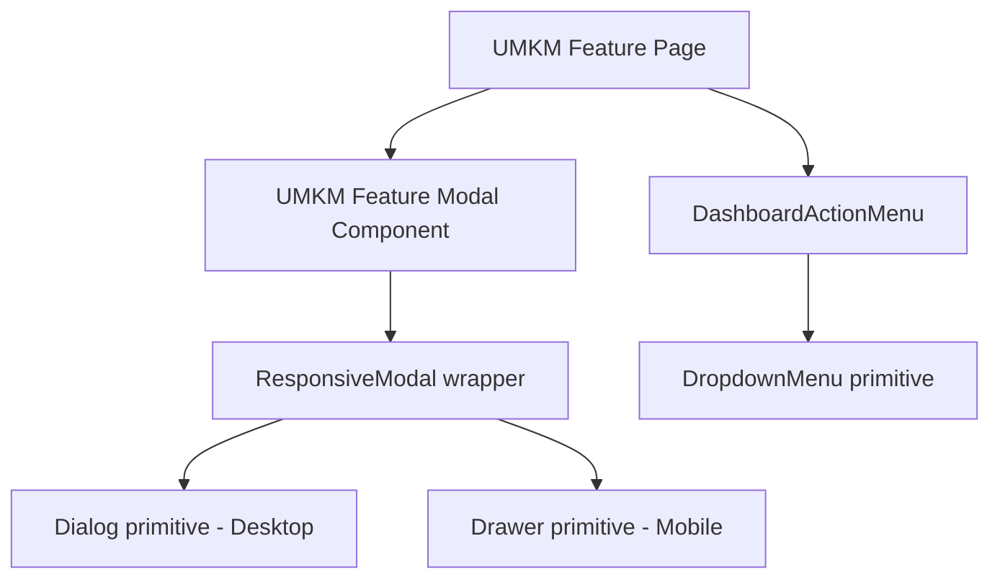

# Design — UMKM Radix UI Refactor

## Overview

Desain ini menetapkan standarisasi arsitektur komponen dialog/modal dan menu dropdown aksi pada seluruh fitur dashboard UMKM di Marketiv. Komponen modal yang masih menggunakan backdrop manual, manipulasi DOM kustom, dan control visibilitas manual akan digantikan dengan `@/components/ui/responsive-modal` yang secara cerdas berganti antara Dialog (Desktop) dan Drawer (Mobile). Komponen menu aksi akan dimigrasikan menggunakan `@/components/ui/dropdown-menu`.

---

## Architecture

Desain arsitektur menunjukkan bagaimana komponen domain UMKM mengonsumsi komponen primitive wrapper Radix UI yang telah diintegrasikan dengan Tailwind CSS:



---

## Components and Interfaces

### 1. Refaktorisasi Modal UMKM (`src/components/features/umkm-dashboard/.../modals/*.tsx`)

Seluruh file modal di bawah folder `src/components/features/umkm-dashboard/` akan dimigrasikan dengan pola standard berikut:

**Sebelum Refaktor (Logika Manual):**
```tsx
export function CancelCampaignModal({ isOpen, onClose }) {
  if (!isOpen) return null;
  return (
    <div className="fixed inset-0 z-50 flex items-center justify-center p-4 bg-black/40 backdrop-blur-xs">
      <div className="bg-white p-6 rounded-xl">...</div>
    </div>
  );
}
```

**Sesudah Refaktor (Radix UI ResponsiveModal):**
```tsx
import {
  ResponsiveModal,
  ResponsiveModalContent,
  ResponsiveModalHeader,
  ResponsiveModalTitle,
  ResponsiveModalDescription,
  ResponsiveModalFooter,
} from "@/components/ui/responsive-modal";

interface CancelCampaignModalProps {
  isOpen: boolean;
  onClose: () => void;
  campaignTitle: string;
  onConfirm: (reason: string) => void;
}

export function CancelCampaignModal({
  isOpen,
  onClose,
  campaignTitle,
  onConfirm,
}: CancelCampaignModalProps) {
  // State dan logika internal tetap dipertahankan
  return (
    <ResponsiveModal open={isOpen} onOpenChange={(open) => !open && onClose()}>
      <ResponsiveModalContent className="max-w-md w-full p-6">
        <ResponsiveModalHeader>
          <ResponsiveModalTitle className="text-lg font-bold text-text-primary">
            Batalkan Campaign?
          </ResponsiveModalTitle>
          <ResponsiveModalDescription className="text-sm text-text-secondary">
            Apakah Anda yakin ingin membatalkan campaign "{campaignTitle}"?
          </ResponsiveModalDescription>
        </ResponsiveModalHeader>
        
        {/* Konten Form / Detail tetap sama */}
        
        <ResponsiveModalFooter className="flex items-center justify-end gap-3 mt-6">
          {/* Button Actions */}
        </ResponsiveModalFooter>
      </ResponsiveModalContent>
    </ResponsiveModal>
  );
}
```

### 2. Refaktorisasi Menu Aksi (`src/components/features/umkm-dashboard/shared/DashboardActionMenu.tsx`)

Komponen `DashboardActionMenu` akan dimigrasikan menggunakan `@/components/ui/dropdown-menu` untuk menangani click-outside, navigasi keyboard, dan dynamic collision secara otomatis.

**Interface Props:**
```typescript
export interface ActionMenuItem {
  label: string;
  onClick: () => void;
  icon?: ReactNode;
  disabled?: boolean;
  danger?: boolean;
}

export interface DashboardActionMenuProps {
  items: ActionMenuItem[];
  trigger?: ReactNode;
  align?: "right" | "left";
  className?: string;
}
```

**Struktur JSX Baru:**
```tsx
import {
  DropdownMenu,
  DropdownMenuTrigger,
  DropdownMenuContent,
  DropdownMenuItem,
} from "@/components/ui/dropdown-menu";

export function DashboardActionMenu({ items, trigger, align = "right", className }: DashboardActionMenuProps) {
  return (
    <DropdownMenu>
      <DropdownMenuTrigger asChild className={className}>
        {trigger || (
          <button className="...">
            {/* Default Icon */}
          </button>
        )}
      </DropdownMenuTrigger>
      <DropdownMenuContent align={align} className="w-48">
        {items.map((item, idx) => (
          <DropdownMenuItem
            key={idx}
            disabled={item.disabled}
            onClick={item.onClick}
            className={cn(item.danger && "text-danger")}
          >
            {item.icon && <span>{item.icon}</span>}
            <span>{item.label}</span>
          </DropdownMenuItem>
        ))}
      </DropdownMenuContent>
    </DropdownMenu>
  );
}
```

---

## Error Handling Strategy

- **Fokus Transisi Backdrop:** Memastikan transisi buka/tutup modal tidak memicu *scroll bounce* pada iOS. Ini diatasi secara otomatis oleh library primitive Radix UI (`ScrollLock` internal).
- **Penanganan Click-Outside:** Menutup modal atau dropdown secara aman ketika pengguna menyentuh area luar tanpa memicu trigger aksi di bawah backdrop.

## Security Considerations

- **Keyboard Trap:** Radix UI Dialog secara bawaan membatasi navigasi `Tab` hanya di dalam modal aktif (focus trapping) sehingga mencegah pengguna mengakses form/elemen latar belakang yang tertutup secara tidak sengaja.
- **Escape Key Handling:** Pengguna dapat menekan tombol `Escape` untuk membatalkan/menutup modal kapan saja.

## Performance Considerations

- **Deferred Rendering:** Radix UI primitive menunda pemuatan (mount) konten modal ke DOM sampai pemicu diklik. Hal ini meningkatkan performa inisiasi loading halaman utama karena mengurangi ukuran DOM awal.
- **Smooth Transition CSS:** Semua animasi transisi menggunakan Tailwind `@theme` transition timing yang mendukung akselerasi hardware (`transform`, `opacity`).
