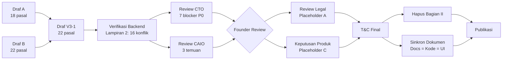

# Syarat & Ketentuan Marketiv — Dokumentasi & Analisis

Folder ini berisi seluruh dokumen terkait penyusunan, review, dan verifikasi Syarat & Ketentuan (T&C) Marketiv.

---

## Daftar Dokumen

| File | Deskripsi | Status |
|------|-----------|--------|
| `syarat-dan-ketentuan-marketiv-v3-1.pdf` | T&C V3-1 — Draf gabungan Draf A + Draf B, terverifikasi thd backend docs | **DRAF — BELUM REVIEW LEGAL** |
| `output/syarat-dan-ketentuan-marketiv-v3-1.md` | Konversi PDF ke markdown (via index.js) | Lengkap |
| `output/syarat-dan-ketentuan-marketiv-v3-1.json` | Metadata PDF (heading, list, paragraf, bounding box) | Lengkap |
| `output/syarat-dan-ketentuan-marketiv-v3-1.html` | Konversi PDF ke HTML | Lengkap |
| `output/syarat-dan-ketentuan-marketiv-v3-1_annotated.pdf` | PDF dgn anotasi | Lengkap |
| `midtrans-tnc-template-13-jan-2017-1.pdf` | Template T&C Midtrans (payment gateway) versi 13 Jan 2017 | **Gambar — perlu OCR** |
| `review-tnc-marketiv-v3-cto.md` | Review CTO atas T&C V3 — 7 blocker P0, 25+ temuan P1 | **Final — CTO** |
| *(inline)* | Review CAIO — Pasal 16.3, Pasal 18, catatan AI Generatif | **Telah diintegrasikan ke README ini** |
| `index.js` | Script konversi PDF (OpenDataLoader) | Utilitas |
| `README.md` | **File ini** — penjelasan & navigasi | Aktif |

---

## 1. Ringkasan T&C Marketiv V3-1

### Struktur

```
BAGIAN I — Syarat & Ketentuan Publik (Pasal 1-22)
├── Pasal 1-4:  Ketentuan umum, definisi, perubahan S&K
├── Pasal 5:    Pendaftaran & verifikasi (UMKM + Kreator)
├── Pasal 6:    Komunikasi elektronik
├── Pasal 7:    Deskripsi layanan (Campaign + Rate Card + Custom Offer)
├── Pasal 8-11: Pembayaran, escrow, biaya platform, wallet, withdrawal
├── Pasal 12-13: Kewajiban, larangan, fraud detection
├── Pasal 14-15: Sengketa, refund & pembatalan
├── Pasal 16-17: HKI, privasi & data pribadi
├── Pasal 18-19: Penangguhan akun, ganti rugi & batasan tanggung jawab
├── Pasal 20-22: Hukum berlaku, ketentuan lain, pertanyaan & masukan

BAGIAN II — Lampiran Internal (HAFUS SEBELUM PUBLIKASI)
├── Lampiran 1: Matriks perubahan Draf A → Draf B → V3
├── Lampiran 2: Verifikasi angka & aturan (K-1 s/d K-16)
├── Lampiran 3: Asumsi & pertanyaan terbuka (A/B/C)
├── Lampiran 4: Langkah berikutnya
```

### 22 Pasal — Poin Kunci

| Pasal | Topik | Kunci |
|-------|-------|-------|
| 1 | Ketentuan Penggunaan | Platform oleh [NAMA BADAN HUKUM] |
| 2 | Gambaran Umum | Intermediary, Midtrans gateway |
| 3 | Perubahan S&K | [X HARI] notice, tdk berlaku surut |
| 4 | Definisi | 12 istilah (Campaign Mode, Rate Card, Escrow, Wallet, dll) |
| 5 | Pendaftaran | Google OAuth UMKM+Kreator, verifikasi email [PLACEHOLDER] |
| 6 | Komunikasi | Transaksional wajib, promosi opt-out |
| 7.1 | Campaign Mode | PPV, zero-chat, budget min Rp50K, Claim first-come-first-served |
| 7.2 | Rate Card Mode | Fixed price, Direct Order + negosiasi, Collab Post wajib |
| 7.3 | Custom Offer | Offer 1 arah (UMKM→Kreator), final & mengikat |
| 8 | Pembayaran & Escrow | Midtrans webhook, held/released/refunded, saldo ≥ 0 |
| 9 | **Biaya Platform** | **5%** (bukan 10%/15% draf lama). Campaign = buyer side, Rate Card = seller side |
| 10 | Wallet | Available + pending, bukan produk bank |
| 11 | **Withdrawal** | Instan (tanpa review admin), min Rp50K, khusus Kreator |
| 12 | Kewajiban & Larangan | Zero-chat Campaign, anti-circumvention |
| 13 | Fraud Detection | AI-based, low/medium/high, auto-reject hanya admin bisa buka |
| 14 | **Dispute** | Via WhatsApp admin (manual), escrow freeze |
| 15 | Refund | Rate Card pasca-bayar → dispute, refund ke Wallet UMKM |
| 16 | **HKI + AI** | **CAIO:** Lisensi non-eksklusif Marketiv. Kepemilikan konten hasil kerja Kreator → **milik UMKM** (digunakan utk kebutuhan komersial). Konten buatan AI diperbolehkan, tanggung jawab Kreator |
| 17 | Privasi | UU PDP 27/2022, data kartu via Midtrans |
| 18 | **Penangguhan Akun** | **CAIO:** Proporsional: peringatan → suspend → permanen. **WAJIB tambah mekanisme banding/klarifikasi** sebelum keputusan akhir (mitigasi false positive) |
| 19 | Ganti Rugi | "As is", cap liability [PLACEHOLDER] |
| 20 | Hukum Berlaku | Hukum RI, [PN / BANI] |
| 21 | Ketentuan Lain | Severability, waiver, larangan pengalihan |
| 22 | Pertanyaan | [EMAIL DUKUNGAN], [SLA] |

### Verifikasi Backend (Lampiran 2 — 16 konflik)

| Kode | Konflik | Resolusi V3 |
|------|---------|-------------|
| K-1 | Komisi 10-15% → 5% | **5% per-modul** (Campaign buyer side, Rate Card seller side) |
| K-2 | Min withdrawal Rp10K vs Rp50K | **Rp50.000** |
| K-3 | Withdrawal review admin → instan | **Instan, tanpa review admin** |
| K-4 | Biaya admin Rp2.500 | **Tidak dicantumkan** (placeholder) |
| K-5 | Dispute in-platform → WhatsApp | **Manual via WhatsApp** |
| K-6 | Pengaju dispute: UMKM saja → **kedua pihak** |
| K-7 | Google OAuth khusus Kreator → **UMKM + Kreator** |
| K-8 | Platform TikTok/Instagram → **"Platform yg didukung"** |
| K-9 | Min budget campaign tdk ada → **Rp50.000** |
| K-10 | Kedaluwarsa Claim tdk ada → **Auto expired** |
| K-11 | Verifikasi email (10 menit) → **Dilunakkan** |
| K-12 | Kode MARKETIV-XXXX → **Dilunakkan** |
| K-13 | 3 paket aktif → **Dipertahankan** |
| K-14 | Min harga paket Rp10K → **Dihapus** |
| K-15 | Batas unggah 100MB per file → **per akun** |
| K-16 | Tujuan refund → **Wallet UMKM** (UMKM tdk bisa tarik) |

---

## 2. Ringkasan Review CTO

**Verdict:** ⛔ **BELUM LAYAK PUBLIKASI** — 7 blocker P0

### 7 Blocker P0

| ID | Issue | Pasal | Rekomendasi |
|----|-------|-------|-------------|
| CTO-01 | **Perhitungan views tdk didefinisikan** | 7.1.f | Ukur saat verifikasi, final saat approval, angka sistem mengikat. <1000 views = Rp0 |
| CTO-02 | **Tdk ada batas waktu review UMKM (Rate Card)** | 7.2.e-f, 8.4.b | Auto-approve 3 hari, reminder H-1 |
| CTO-03 | **Saldo Wallet UMKM terkunci** | 15.1.c vs 11.1 | Opsi B: bangun withdrawal UMKM |
| CTO-04 | **Wallet+Escrow berpotensi kena regulasi PJP** | 8, 10 | Rekening terpisah, hapus top-up MVP, Pasal 10.4-10.5 baru |
| CTO-05 | **Withdrawal instan tanpa reversal** | 11.4, 11.6, 8.7 | Status 4-state + reversal 3 hari + KYC |
| CTO-06 | **Tdk ada alat bukti sistem + zona waktu** | seluruh | Pasal 21.4-21.5 baru (alat bukti, WIB, hari kalender) |
| CTO-07 | **Collab Post vs escrow release bertentangan** | 7.2.g vs 8.4.b | Opsi 1: release saat deliverable approved, Collab Post = kewajiban kontraktual |

### Temuan P1 — 25+ item

- **Akun (5):** Role immutable, escrow saat suspend, verifikasi email wajib, simpan versi T&C
- **Campaign (7):** Race condition, link aset mati, pause/stop, over-allocation, pending→available, SUPPORTED_PLATFORMS, min budget vs Midtrans channel
- **Rate Card (5):** Custom Offer expired 7 hari, estimasi mulai escrow, video wajib link, limit 3 paket di Function, chat diarsipkan
- **Pembayaran (6):** Chargeback, webhook idempotensi, fee refund proporsional, MDR bisa negatif, pajak, definisi escrow
- **Wallet (4):** 3 angka wallet, ledger append-only, rate limit withdrawal, ADMIN_FEE Rp2.500

### Klausul Hilang (8)

1. Catatan sistem sebagai alat bukti
2. Zona waktu + definisi hari
3. Chargeback / penarikan dana
4. KYC verifikasi penerima dana
5. Pemeliharaan layanan (deadline diperpanjang)
6. Force majeure
7. Retensi data vs hak hapus PDP (10 tahun)
8. Batas ukuran berkas

### Matriks Konsistensi 4 Lapisan

| Topik | T&C | Docs | Kode | UI | Aksi |
|-------|-----|------|------|-----|------|
| Fee 5% | ✅ | ✅ | ✅ | ❌ 10%/15% | Perbaiki UI |
| Min withdrawal Rp50K | ✅ | ✅ | ✅ | — | Perbaiki docs lama |
| Withdrawal instan | ✅ | ✅ | ✅ | ❓ "ditinjau admin" | Audit UI |
| Biaya admin | placeholder | tdk ada | tdk ada | ❌ Rp2.500 | Hapus/resmikan |
| Platform Bukti Tayang | netral | TikTok | TikTok | ? | Satu konstanta |
| Limit 3 paket | ✅ | ❌ | ? | ? | Tambah docs + Function |
| Collab Post vs release | ❌ syarat | bukan | bukan | ? | Sinkronkan |
| Refund ke Wallet UMKM | ya | ya | — | ❌ tdk ada tarik | Bangun withdrawal UMKM |
| Pending→available | ❌ | "pending" | ? | ❌ mock "24 jam" | Putuskan durasi |

### Checklist Implementasi Teknis

**Collections baru/ubah:** submissions (views), orders (deadline, auto_approve, revision), custom_offers (expires_at), withdrawals (4-state), profiles (tos_version, npwp), transactions (reverses_id), conversations (archived_at), campaigns (committed_budget)

**Fungsi baru:** auto-approve-orders (cron), expire-custom-offers (cron), reconcile-ledger (cron), withdrawal-callback, claim-campaign (atomik), midtrans-webhook (idempotensi)

---

## 3. Midtrans T&C Template

| Metadata | Nilai |
|----------|-------|
| File | `midtrans-tnc-template-13-jan-2017-1.pdf` |
| Halaman | 10 |
| Author | Stacy |
| Tanggal | 13 Jan 2017 |
| Format | **100% gambar** (scanned/rendered) — tdk bisa ekstrak teks langsung |

**Kegunaan:** Referensi template T&C payment gateway. Dapat dipakai untuk:
- Bandingkan klausul liability, dispute, fee
- Pastikan T&C Marketiv selaras dg kewajiban sbg merchant Midtrans
- Lihat struktur pasal standar payment gateway

**Keterbatasan:** Perlu OCR untuk ekstrak teks aktual.

---

## 4. Ringkasan Review CAIO

**Reviewer:** CAIO Marketiv  
**Scope:** Pasal 16.3 (HKI), Pasal 18 (penangguhan akun), catatan AI Generatif di seluruh T&C

### 3 Temuan CAIO

| ID | Issue | Pasal | Rekomendasi | Dampak |
|----|-------|-------|-------------|--------|
| CAIO-01 | **Kepemilikan konten masih placeholder** | 16.3 | Brief fokus generate brief. Hasil karya/konten → **hak milik UMKM** (kebutuhan komersial UMKM) | Tutup placeholder C.6. Perevisian Pasal 16.3 |
| CAIO-02 | **Tidak ada mekanisme banding atas suspend/terminasi akun** | 18 | Tambah mekanisme banding/klarifikasi sblm keputusan akhir. Mitigasi false positive dr sistem deteksi otomatis (AI) | Pasal 18 perlu tambahan ayat |
| CAIO-03 | **Tidak ada kejelasan soal AI Generatif** | seluruh T&C | AI diperbolehkan (full/partial) selama tdk langgar hak cipta pihak lain. Pelanggaran → tanggung jawab Kreator | Klausul baru wajib ditambahkan |

### Analisis & Rekomendasi Detail

#### CAIO-01 — Kepemilikan Konten Hasil Kerja Kreator (Pasal 16.3)

**Kondisi saat ini:**
```
Pasal 16.3: Kepemilikan dan lisensi atas konten hasil kerja Kreator mengikuti
kesepakatan para pihak dalam brief atau Custom Offer.
[DEFAULT KEPEMILIKAN/LISENSI KONTEN JIKA TIDAK DIATUR — PERLU KEPUTUSAN PRODUK & LEGAL]
```

**Masalah:** Tidak ada default. Jika brief/Custom Offer tidak menyebut, terjadi vakum hukum.

**Rekomendasi CAIO:**
- Brief → tetap fungsinya sbg generator spesifikasi konten
- Hak milik konten final → **UMKM** (karena digunakan utk kebutuhan komersial UMKM)
- Kreator tetap diakui sbg pembuat (attribution/moral rights)
- Ini default — para pihak tetap bisa atur berbeda di Custom Offer

**Redaksi saran:**
```
16.3 — Kepemilikan Konten Hasil Kerja. (a) Kecuali diperjanjikan lain secara
tertulis dalam Custom Offer, seluruh konten hasil kerja Kreator yang dibuat
berdasarkan pesanan UMKM melalui Platform menjadi milik UMKM sepenuhnya
setelah escrow dirilis. (b) Kreator tetap diakui sebagai pembuat konten
(attribution) dan UMKM tidak boleh menghapus kreditasi Kreator tanpa
persetujuan. (c) Hak moral Kreator tetap dilindungi sesuai peraturan
perundang-undangan yang berlaku.
```

#### CAIO-02 — Mekanisme Banding Penangguhan Akun (Pasal 18)

**Kondisi saat ini:** Pasal 18 hanya menyebut sanksi proporsional dari peringatan → suspend → permanen. Tidak ada jalur banding.

**Masalah:** False positive bisa terjadi, terutama jika sistem deteksi otomatis (AI-based fraud detection di Pasal 13) keliru. Pengguna kena suspend tanpa kesempatan klarifikasi.

**Rekomendasi CAIO:**
- Tambah mekanisme banding/klarifikasi sebelum keputusan akhir
- Pengguna berhak ajukan peninjauan ulang dalam batas waktu tertentu
- Admin wajib merespons dalam SLA tertentu

**Redaksi saran (ayat baru di Pasal 18):**
```
18.5 — Pengguna yang akunnya dikenai tindakan penangguhan atau penghentian
berhak mengajukan banding kepada Marketiv dalam waktu [14] hari kalender
sejak pemberitahuan tindakan, disertai alasan dan bukti pendukung. Marketiv
akan meninjau dan memberikan keputusan banding dalam waktu [7] hari kerja.
Keputusan banding bersifat final di tingkat Platform.
```

#### CAIO-03 — Penggunaan AI Generatif dalam Konten

**Kondisi saat ini:** T&C V3-1 **tidak menyentuh AI sama sekali**. Padahal platform kreator sangat mungkin menggunakan AI tools (generative AI utk video, gambar, naskah, musik).

**Masalah:**
- UMKM perlu tahu apakah konten Kreator dibuat dgn AI
- Hak cipta konten AI bermasalah jika tidak diungkapkan
- Platform bisa kena risiko jika AI Kreator melanggar hak pihak ketiga

**Rekomendasi CAIO:**
- **AI diperbolehkan** (full atau partial) — tdk dilarang
- **Wajib diungkapkan** jika UMKM meminta informasi penggunaan AI
- **Tanggung jawab** atas pelanggaran hak cipta akibat AI tetap di Kreator
- Sederhana, tidak perlu aturan teknis yg rigid

**Redaksi saran (Pasal 12.3 — Larangan Umum, ayat baru):**
```
12.5 — Kreator dapat menggunakan kecerdasan buatan (AI) generatif dalam
pembuatan konten, sebagian atau seluruhnya, sepanjang tidak melanggar hak
kekayaan intelektual pihak ketiga. Kreator wajib mengungkapkan penggunaan
AI apabila diminta oleh UMKM atau oleh Marketiv dalam rangka verifikasi.
Kreator bertanggung jawab penuh atas setiap pelanggaran hak pihak ketiga
yang timbul dari konten buatan AI.
```

### Catatan Tambahan — AI di Seluruh T&C

Selain klausul di atas, AI bersinggungan dengan beberapa pasal lain:

| Pasal | Singgungan AI | Implikasi |
|-------|---------------|-----------|
| 7.1.e (Bukti Tayang) | Platform sosial mungkin punya kebijakan AI content labeling | Konten yg dilabel "AI-generated" oleh platform tetap sah sbg Bukti Tayang |
| 13 (Fraud Detection) | Sistem Marketiv sendiri menggunakan AI utk deteksi fraud (Pasal 13.1) | False positive → mekanisme banding CAIO-02 makin relevan |
| 13.4 (Banding Fraud) | Banding atas auto-reject | Jalurnya via WhatsApp admin — perlu dipastikan bisa tangani banding terkait AI |
| 16 (HKI) | Hak cipta konten AI adalah area abu-abu hukum | Klausul CAIO-01 (kepemilikan UMKM) + CAIO-03 (tanggung jawab Kreator) menjadi proteksi |

---

## 5. Placeholder Terbuka (Lampiran 3)

### A. Legal (wajib diisi founder/penasihat hukum)

| # | Item | Pasal |
|---|------|-------|
| 1 | Nama badan hukum (PT/CV) & alamat | 1.1, 16.1, 22 |
| 2 | Tanggal efektif dokumen | — |
| 3 | Usia minimum pengguna | 5.1.f |
| 4 | Masa pemberitahuan perubahan material | 3.2 |
| 5 | Forum penyelesaian perselisihan (PN/BANI) | 20.2 |
| 6 | Batas waktu pengajuan sengketa | 14.7 |
| 7 | SLA refund | 15.1.c |
| 8 | SLA respon support | 22 |
| 9 | Batasan tanggung jawab (cap liability) | 19.3 |
| 10 | Tautan Kebijakan Privasi + email dukungan | 17.1, 22 |
| 11 | Kebijakan transfer withdrawal gagal | 11.6 |

### B. Konflik dokumen (perlu konfirmasi founder)

| # | Item | Status |
|---|------|--------|
| 1 | Fee 5% → update docs lama (06-business-rules, 05-dashboard, 02-collections, mock UI) | **Diputuskan V3** |
| 2 | Min withdrawal Rp50K → update 06-business-rules par.15 | **Diputuskan V3** |
| 3 | Withdrawal instan → update technical-guidelines/11 + UI | **Diputuskan V3** |
| 4 | Dispute manual → update feature docs 15-dispute | **Diputuskan V3** |
| 5 | Biaya admin Rp2.500 → resmi/tidak? | **Perlu keputusan** |
| 6 | Platform TikTok-only vs +Instagram | **Perlu keputusan** |
| 7 | Limit 3 paket → tambah ke RateCards docs | **Perlu eksekusi** |
| 8 | Harga min paket Rp10K → resmi/tidak? | **Perlu keputusan** |
| 9 | Verifikasi email → fitur ada/tidak? | **Perlu keputusan** |
| 10 | Kode MARKETIV-XXXX → fitur ada/tidak? | **Perlu keputusan** |

### C. Keputusan produk (belum di-backend)

| # | Item | Pasal |
|---|------|-------|
| 1 | Pembatalan Campaign + hitung sisa budget | 15.2 |
| 2 | Refund sisa budget otomatis/manual | 15.2.b |
| 3 | Biaya platform refund dikembalikan/tidak | 15.3 |
| 4 | Biaya Midtrans saat refund | 15.3 |
| 5 | Pencairan Wallet UMKM (UMKM tdk punya withdrawal) | 15.1.c |
| 6 | **Default kepemilikan konten** — **CAIO sudah putuskan:** milik UMKM setelah escrow release, attribution Kreator tetap diakui | 16.3 |
| 7 | Mekanisme saldo saat akun ditutup | 18.3 |
| 8 | Durasi pending → available | 7.1.g, 10 |
| 9 | Collab Post vs escrow release urutan | Lampiran 3.C.10 |

---

## 6. 13 Keputusan Sebelum Sign-off (CTO + CAIO)

Beberapa keputusan sudah dijawab oleh CAIO. Sisanya tetap perlu diputuskan.

| # | Keputusan | Owner | Status |
|---|-----------|-------|--------|
| 1 | Sumber & waktu pengukuran views | CTO + CAIO | **Perlu keputusan** |
| 2 | Auto-approve Rate Card: ya/tidak, berapa hari | CTO + Ketua Tim | **Perlu keputusan** |
| 3 | Withdrawal UMKM: bangun atau refund ke sumber | Ketua Tim | **Perlu keputusan** |
| 4 | Fitur top-up: hapus dari MVP? | Ketua Tim + CTO | **Perlu keputusan** |
| 5 | Rekening terpisah untuk dana pengguna | Ketua Tim | **Perlu keputusan** |
| 6 | Collab Post syarat release: ya/tidak | CTO + CMO | **Perlu keputusan** |
| 7 | Fee dikembalikan proporsional saat refund? | Ketua Tim | **Perlu keputusan** |
| 8 | Channel Midtrans diaktifkan (MDR) | CTO + Ketua Tim | **Perlu keputusan** |
| 9 | Verifikasi email wajib sebelum withdrawal | CTO | **Perlu keputusan** |
| 10 | Durasi pending → available | CTO | **Perlu keputusan** |
| 11 | **Kepemilikan konten: default milik UMKM?** (CAIO-01) | CAIO + Legal | ⬆️ **Diputuskan CAIO** — milik UMKM |
| 12 | **Mekanisme banding suspend: berapa hari?** (CAIO-02) | CTO + CAIO | **Perlu keputusan** — durasi banding & SLA |
| 13 | **Kebijakan AI Generatif: diizinkan?** (CAIO-03) | CAIO + Legal | ⬆️ **Diputuskan CAIO** — izinkan, tanggung jawab Kreator |

---

## 7. Alur Penyusunan & Review



---

## 8. Langkah Selanjutnya

1. **Founder review** Lampiran 2 (B) & 3 (C) → putuskan semua item
2. **CAIO review final** — konfirmasi redaksi Pasal 16.3 (kepemilikan UMKM), Pasal 18 (mekanisme banding), dan klausul AI Generatif baru (Pasal 12.5)
3. **CTO sign-off** setelah 7 blocker P0 tertutup
4. **Review legal** untuk placeholder A + buat Kebijakan Privasi
5. **Sinkron dokumen** yg kalah (06-business-rules, technical-guidelines, dll)
6. **Update index.js** untuk konversi Midtrans PDF (perlu OCR)
7. **Wiring** ke `src/app/syarat-ketentuan/page.tsx` setelah final
8. **Hapus Bagian II** sebelum publikasi

---

## 9. Script Konversi

`index.js` menggunakan `@opendataloader/pdf` untuk konversi PDF ke JSON/HTML/Markdown.

```js
// Konversi Marketiv T&C
await convert(["syarat-dan-ketentuan-marketiv-v3-1.pdf"], {
  outputDir: "output/",
  format: "json,html,pdf,markdown",
});

// Konversi Midtrans T&C — perlu dijalankan
await convert(["midtrans-tnc-template-13-jan-2017-1.pdf"], {
  outputDir: "review-sechan/",
  format: "json,html,pdf,markdown",
});
```

**Catatan:** Folder `review-sechan/` belum ada — jalankan script.
