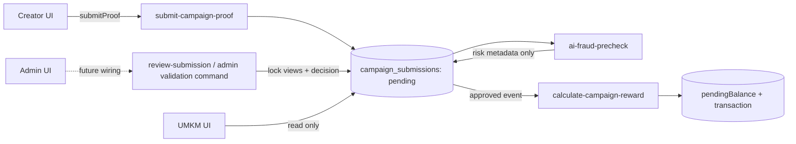
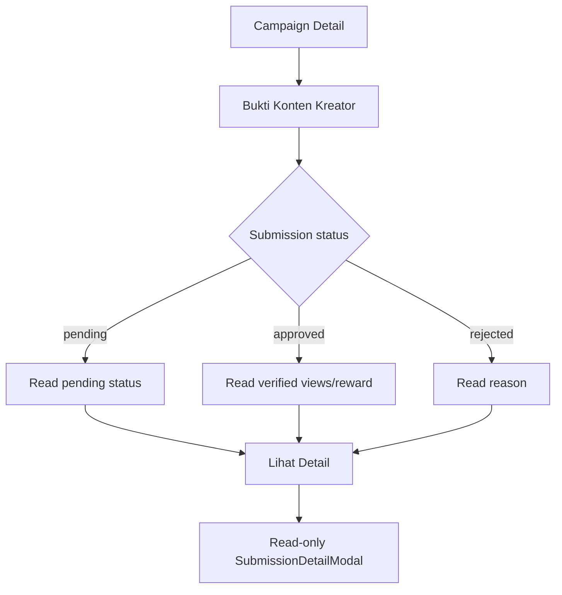

# Design — Campaign Submission Admin Authority UI

## 1. Design Goal

Membuat Creator dan UMKM UI sudah merepresentasikan business authority yang benar **sebelum** Admin backend selesai di-wiring, tanpa membuat mock business logic baru atau mengikat UI pada detail Appwrite.

The key design property is **authority separation**:



## 2. Role Model

| Actor | Can read | Can mutate in Campaign submission flow |
|---|---|---|
| Creator | own claim/submission | submit proof for own claim only |
| UMKM | submissions for owned campaign | none |
| Admin | review queue + context | validate views, approve/reject via trusted Function |
| Fraud precheck | submission + brief | risk metadata only |
| Reward backend | approved submission + campaign | financial downstream only |

## 3. State Model

### Canonical database states

```text
SubmissionStatus = pending | approved | rejected
FraudStatus      = safe | review | rejected
ClaimStatus      = claimed | submitted | approved | rejected | expired
```

Do not create UI-only database values such as `Valid`, `Paid`, `Fraud`, or translated PascalCase states. Presentation labels may be Indonesian.

### Presentation matrix

| Submission | Fraud | Creator label | UMKM label | Primary meaning |
|---|---|---|---|---|
| none | — | Belum Kirim | — | Creator action required |
| pending | undefined/safe | Menunggu Validasi Marketiv | Menunggu Validasi | Admin decision pending |
| pending | review | Perlu Pemeriksaan Lanjut | Ditinjau Marketiv | Risk flag, not final decision |
| pending | rejected | Pemeriksaan Diperlukan | Ditinjau Marketiv | Strong risk signal but status still pending |
| approved | any | Disetujui | Disetujui | Final submission decision |
| rejected | any | Ditolak | Ditolak | Final submission decision |

## 4. Creator Flow

```mermaid
sequenceDiagram
  actor Creator
  participant UI as ActiveWorkDetailView
  participant Service as creator-dashboard.service
  participant Fn as submit-campaign-proof

  Creator->>UI: Open claimed campaign
  UI->>UI: Resolve platform from campaign
  Creator->>UI: Enter public post URL + optional note
  UI->>UI: Validate format/domain
  UI-->>Creator: Confirmation with exact URL
  Creator->>UI: Confirm
  UI->>Service: submitProof(existing contract)
  Service->>Fn: trusted Function call
  Fn-->>Service: success / typed error
  Service-->>UI: ServiceResult
  alt success
    UI->>UI: Render pending state
    UI-->>Creator: "Menunggu Validasi Marketiv"
  else failure
    UI-->>Creator: specific error; no fake local success
  end
```

### Form information architecture

```text
Kirim Bukti Tayang
  Platform Campaign: TikTok          [read-only chip]
  Public Post URL                    [input]
  Catatan untuk Tim Marketiv         [optional textarea]
  Info: video final tidak diupload ke Marketiv
  [Kirim untuk Diverifikasi]
```

The platform selector is intentionally removed. The platform is an invariant of the job the Creator already claimed.

### Creator post-submit card

Pending:

```text
Bukti Tayang Diajukan
Platform        TikTok
Postingan       https://...
Dikirim         14 Agu 2026, 09:xx
Status          Menunggu Validasi Marketiv
Views           Belum diverifikasi
Reward          Belum dihitung
```

Approved:

```text
Status          Disetujui
Views           15.800 views
Diverifikasi    Marketiv
Reward          Rp150.000   (only if authoritative/valid calculation available)
```

Rejected:

```text
Status          Ditolak
Catatan Marketiv <reason>
Reward          Tidak diproses
```

## 5. UMKM Flow



No branch contains approve/reject or views input.

### UMKM guidance block

Replace “Petunjuk Cara Memeriksa Konten” with:

**Cara Validasi Bukti Tayang**

1. **Kreator mengirim tautan** — postingan publik dikirim melalui Marketiv.
2. **Marketiv melakukan pemeriksaan** — tautan, data pendukung, dan views diperiksa oleh tim/platform.
3. **Hasil tampil di dashboard** — UMKM dapat memantau status dan hasil validasi tanpa melakukan audit manual.

## 6. Component Architecture

### Creator

`ActiveWorkDetailView` remains the orchestration component for now to minimize scope.

Recommended internal presentational extraction only if it reduces complexity without refactor spillover:

```text
ActiveWorkDetailView
  ├─ SubmissionFormCard
  ├─ SubmissionStatusCard
  ├─ SubmissionProgressTimeline
  └─ ValidationSummaryCard
```

Do not create these components just for abstraction if the existing file can be safely edited. Preserve current architecture unless extraction clearly improves testability.

### UMKM

```text
CampaignDetailPage
  ├─ CampaignOverviewCards      (observer terminology)
  ├─ CampaignSubmissionSection (read-only)
  │    └─ CampaignSubmissionCard
  ├─ CampaignQuickActionsCard   (view action, not review)
  ├─ CampaignHealthChecklistCard
  └─ SubmissionDetailModal      (read-only)
```

`ReviewSubmissionModal` is removed from this graph.

## 7. Frontend Data Contract

### Do not change canonical domain enums

`src/types/domain.ts` remains authority for runtime status unions.

### Suggested optional presentation metadata

Only add fields if they can be mapped from current Appwrite data without inventing values:

```ts
interface SubmissionValidationMeta {
  verifiedViews?: number;
  viewsSource?: "manual_admin" | "api" | "scrape";
  viewsCapturedAt?: string;
  viewsFinal?: boolean;
  validatedAt?: string;
  validationNote?: string;
}
```

Rules:

- fields are optional for legacy compatibility;
- `scrape` may exist in historical/schema enum but UI must not advertise scraping as active capability;
- UI maps `manual_admin` to user-facing `Marketiv` / `Diverifikasi Marketiv`, not `UMKM`;
- no new Appwrite field is introduced during UI phase.

### Creator work mapper

Current pre-submit `CreatorActiveWork.platform` is undefined because it is mapped only from submission. Change mapping conceptually to:

```text
platform = submission.platform ?? first supported campaign.platforms value
```

For MVP, only supported `tiktok` should be rendered. If unresolved, disable submission.

### Locked views preference

Read layers should use:

```text
verifiedViews = views_final && views_count != null
  ? views_count
  : legacy views only as legacy/fallback display
```

The UI must differentiate legacy/fallback from verified data when that distinction matters.

## 8. Reward Presentation Contract

### Do not use `releasedFund` as payout truth

Current mapper has a calculation inconsistent with Campaign fee rules. The UI should transition away from finance-semantic names that imply actual settlement.

Recommended presentation field names:

```text
rewardAmount?: number
rewardState?: "unavailable" | "calculated" | "financially_confirmed"
```

This spec does **not** require introducing this exact persisted type now. It defines the semantic boundary for future wiring.

UI rules:

- pending → `Belum dihitung`
- approved + authoritative locked views + rate → may show `Reward terhitung`
- only transaction/payout truth → may show `Dana dibayarkan/cair`

## 9. Fraud Presentation

Admin can see detailed score/reasons. Creator/UMKM should receive low-cognitive-load status:

- `safe` → no special warning required;
- `review` → `Perlu pemeriksaan lanjut`;
- `rejected` + submission pending → `Sedang ditinjau Marketiv`, not final `Ditolak`;
- final rejection derives from `submissionStatus=rejected`.

This avoids conflating AI risk with a final financial decision.

## 10. Exact UI Copy Migration

| Legacy copy | Target copy |
|---|---|
| `Kirim Bukti Postingan` | `Kirim untuk Diverifikasi` |
| `Catatan Tambahan untuk Admin` | `Catatan untuk Tim Marketiv (Opsional)` |
| `UMKM akan memverifikasi...` | `Marketiv akan memverifikasi...` |
| `UMKM memasukkan jumlah views...` | `Jumlah views ditetapkan saat validasi Marketiv.` |
| `Total Reward Cair` | `Reward Terhitung` / `Belum dihitung` |
| `Perlu Diperiksa` | `Menunggu Validasi` |
| `Periksa Bukti Konten Baru` | `Lihat Bukti Konten` |
| `Petunjuk Cara Memeriksa Konten` | `Cara Validasi Bukti Tayang` |
| `Ada N bukti ... yang perlu Anda periksa` | `N bukti sedang menunggu validasi Marketiv` |
| `Data Otomatis` | `Data Kampanye` / `Data Tervalidasi` |
| `Detail Validasi` action | `Lihat Detail` |

## 11. Error Handling

### Creator submission

- validation → inline field error;
- 401 → auth/session handling already used by app;
- 403 → explicit access error;
- 404 → job not found;
- 409 → `Bukti untuk pekerjaan ini sudah pernah dikirim` and refresh server state;
- 500/network → toast/general error + safe retry.

Never convert an error into local `pending` state unless the server actually succeeded.

### UMKM read

- failed submission fetch ≠ empty list;
- show section-level retry/error;
- campaign detail remains available if optional submission metadata is missing.

## 12. Responsive Design

### 375px

- single-column form;
- external URL can wrap/truncate but remains copy/open capable;
- status label visible without hover;
- modal becomes existing responsive sheet/modal behavior;
- no horizontal status table required.

### Tablet/Desktop

- preserve current card/grid hierarchy;
- avoid adding a second desktop-only review workflow to UMKM.

## 13. Accessibility

- maintain visible labels for status;
- field error attached via `aria-describedby` where existing primitives allow;
- do not encode fraud/status meaning using color only;
- external post link has text label + icon;
- no disabled action without explanatory helper text;
- reuse `ResponsiveModal` and existing button primitives.

## 14. Backend Plug-and-Play Contract

The UI is deliberately prepared for a future Admin command similar to:

```ts
type ReviewSubmissionCommand =
  | {
      submissionId: string;
      decision: "approved";
      verifiedViews: number;
      note?: string;
    }
  | {
      submissionId: string;
      decision: "rejected";
      reason: string;
    };
```

Expected trusted response:

```ts
type ReviewSubmissionResult = {
  submissionId: string;
  status: "approved" | "rejected";
  verifiedViews?: number;
  viewsCapturedAt?: string;
  viewsSource?: "manual_admin";
  rewardAmount?: number;
};
```

This is a **future contract**, not permission to implement new client-side mutation now.

## 15. Migration Strategy

### Phase UI-1 — Canonical docs

Update SOT + ADR before code slicing.

### Phase UI-2 — Creator

Fix actor copy, platform ownership, state rendering, reward wording.

### Phase UI-3 — UMKM

Remove all review mutation surface; convert to observer wording.

### Phase UI-4 — Read adapters

Correct locked views/reward display mapping without adding writes.

### Phase UI-5 — Verification

Build, typecheck, unit tests, grep for stale authority copy.

### Phase BE-1 — Deferred

Change Admin authorization/wiring per backend handoff document.
