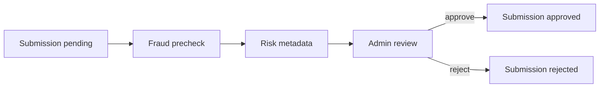

# Workflow: Campaign Submission Fraud/Risk Precheck

## Purpose

Provide supporting risk evidence for Campaign submission validation without conflating AI/rule-based risk scoring with the final financial decision.

## Trigger

`campaign_submissions.create` after Creator successfully submits proof.

## Current Behavior

`ai-fraud-precheck` reads the submission and evaluates available checks such as:

- URL syntax;
- platform/domain match;
- URL accessibility;
- duplicate URL;
- optional caption/brief text relevance.

It writes:

```text
fraudScore
fraudStatus = safe | review | rejected
fraud_checks history
```

On the current baseline it does **not** mutate `campaign_submissions.status`.

## Separation of Concerns



`fraudStatus` is supporting evidence. `submission.status` is the final workflow/financial decision.

## Admin Usage

Admin review UI may prioritize or decorate submissions based on risk:

- `safe` — no elevated warning;
- `review` — manual attention recommended;
- `rejected` — strong warning/evidence requiring careful review.

Admin still uses the trusted validation command for final status.

## Creator/UMKM Presentation

Do not expose raw AI scoring as a definitive accusation unless product/legal policy explicitly requires it.

Preferred user-facing language:

- `Perlu pemeriksaan lanjut`
- `Sedang ditinjau Marketiv`

Final `Ditolak` is rendered only when `submission.status=rejected`.

## Financial Guardrail

Neither a low fraud score nor `fraudStatus=safe` is sufficient to trigger Campaign reward. Reward begins only after authoritative submission approval.

## Failure Case

If fraud precheck fails/times out:

- submission remains `pending`;
- Admin can still manually validate;
- failure should be observable in ops/logging without silently approving.

## Future Evolution

If automatic platform data is introduced later, it may enrich risk evidence or views source. It must not weaken Admin/backend authorization, audit, idempotency, or financial state controls without a new approved decision record.
