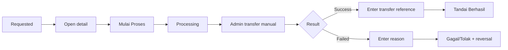

# Phase 04 — Design

## Existing Pattern to Follow
- `admin/src/features/admin/submissions/**`
- `admin/src/app/submissions/page.tsx`
- `admin/src/lib/admin/execute-function.ts`
- `admin/src/lib/admin/appwrite.ts`
- `admin/src/components/admin/AdminSidebar.tsx`

Ikuti current feature/service/type separation; jangan clone buta.

## Expected Files
Change:
- `admin/src/lib/admin/appwrite.ts`
- `admin/src/components/admin/AdminSidebar.tsx`

Add recommended:
- `admin/src/app/withdrawals/page.tsx`
- `admin/src/features/admin/withdrawals/types.ts`
- `admin/src/features/admin/withdrawals/services/withdrawal.service.ts`
- `admin/src/features/admin/withdrawals/components/WithdrawalTable.tsx`
- `admin/src/features/admin/withdrawals/components/WithdrawalDetailDialog.tsx`
- focused tests

Exact component split boleh mengikuti conventions current admin.

## Function IDs
Add admin wrapper IDs untuk exact backend IDs Phase 03.

## DTO
Frontend type mirror server DTO, bukan raw Appwrite document.

## Account Masking
Table: `****1234`; detail: full account number.

## Action Flow

## Refresh Strategy
After mutation re-fetch authoritative queue. Jangan mengandalkan optimistic final status jika server/refresh berbeda. No broad private realtime required untuk MVP.
