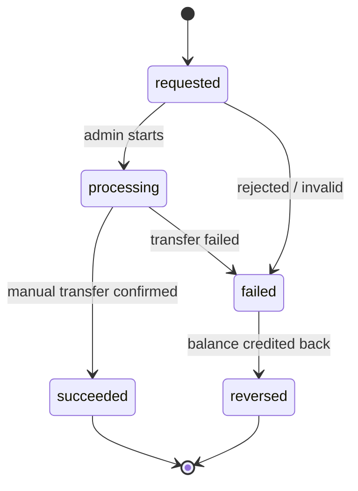

# Master Spec — Campaign Reward & Manual Admin Withdrawal

## 1. Problem Statement

Current staging memiliki dua behavior utama yang akan diubah.

### Campaign reward
`calculate-campaign-reward` saat ini:
- dipicu oleh update `campaign_submissions`,
- hanya memproses submission `approved`,
- menghitung reward dari final views,
- menambah reward ke `wallet.pendingBalance`,
- membuat transaction `type = release`,
- mengurangi `campaign.remainingBudget`,
- menambah `campaign.spentAmount`.

`mature-pending-balance` kemudian menunggu fixed `MATURATION_DAYS = 7` sebelum memindahkan `pendingBalance → balance`.

### Withdrawal
`request-withdrawal` saat ini:
- memvalidasi user, role, KYC/TOS/email/rate-limit,
- membuat row `withdrawals`,
- melakukan debit atomik `wallet.balance`,
- membuat ledger withdrawal,
- langsung memanggil Midtrans Iris,
- mengubah state ke `processing` atau failure/reversal.

`withdrawal-callback` kemudian menerima callback Iris untuk final `succeeded/failed`.

## 2. Desired State

### Reward
Setelah current admin validation berhasil:

```text
submission approved
→ calculate reward
→ wallet.balance += reward
→ transaction release
→ campaign.remainingBudget -= reward
→ campaign.spentAmount += reward
```

Tidak ada fixed 7-day maturation untuk reward Campaign baru.

### Withdrawal
```text
creator request
→ validate
→ create withdrawal(requested)
→ debit balance atomically
→ ledger withdrawal(pending)
→ STOP

admin starts processing
→ withdrawal(processing)

admin transfers manually
→ admin marks succeeded
→ withdrawal(succeeded)
→ withdrawal transaction(completed)
```

Failure/rejection:
```text
requested|processing
→ admin fail/reject
→ idempotent balance reversal
→ append withdrawal_reversal ledger
→ original withdrawal transaction failed
→ withdrawal reversed
```

## 3. Financial Invariants

### I1 — No client-side financial finality
Browser tidak boleh menentukan final reward, final wallet balance, atau final withdrawal success.

### I2 — Withdrawal reserves funds immediately
Ketika request valid dibuat, `wallet.balance` turun atomik sehingga nominal yang sama tidak dapat dipakai untuk request kedua.

### I3 — No money disappearance on failure
Withdrawal yang gagal sebelum transfer final harus mengembalikan balance tepat sekali, membuat reversal ledger append-only, dan tidak double-credit saat retry.

### I4 — No automated payout
Tidak boleh ada network call ke Iris/Xendit/payout provider dari withdrawal path baru.

### I5 — Campaign budget independent from withdrawal
Campaign progress tetap:
```text
usedPercent = spentAmount / budget * 100
```
Withdrawal hanya menjawab apakah saldo creator sudah dibayarkan ke rekening.

### I6 — Admin success means actual manual transfer
Admin tidak boleh menandai `succeeded` sebelum transfer manual benar-benar dilakukan.

### I7 — Auditability
Successful manual transfer harus dapat ditelusuri melalui withdrawal ID, user, amount, destination, admin processor, timestamps, transfer reference, dan optional note.

## 4. Withdrawal State Machine



Terminal: `succeeded`, `reversed`.

## 5. Schema Direction

Existing `withdrawals` sudah memiliki payout destination, status, `processedAt`, `failure_reason`, `reversed_at`, `requester_role`, `source_origin`, `kyc_status`, dan `iris_reference`.

Tambahan minimal:
- `processing_at: datetime?`
- `processed_by: string?`
- `transfer_reference: string?`
- `admin_note: string?`
- index `status`

`iris_reference` jangan dihapus pada rollout awal.

## 6. Security Boundaries

- Admin functions wajib memverifikasi active admin server-side.
- Reuse current `review-submission` / `get-admin-submission-queue` authority pattern.
- Jangan percaya role dari payload.
- Jangan expose Appwrite server key.
- Jangan menulis wallet dari browser.
- Jangan biarkan creator mengubah status withdrawal.
- Semua balance mutation tetap trusted Function.
- Reversal harus idempotent.

## 7. Time Semantics

### Submission validation
Current staging memiliki **72-hour observation window** sebelum views dapat difinalisasi admin. Spec ini mempertahankan behavior tersebut.

### Reward availability
Setelah admin approval berhasil dan reward event diproses, reward baru langsung masuk `balance`.

### Withdrawal operation
Gunakan wording **“umumnya diproses dalam 1–2 hari kerja”**, bukan “maksimal 2 hari kerja”. Tidak ada timer buatan 1–2 hari dalam sistem.

## 8. Rollout Principle

- Jangan disable legacy maturation sebelum data legacy aman.
- Jangan disable Iris callback sebelum legacy Iris withdrawal terminal.
- Jangan klaim staging E2E pass sebelum deployment + runtime UAT.
