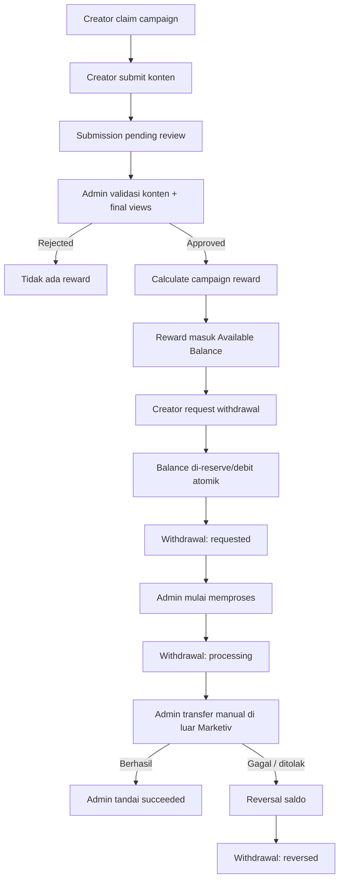

# Marketiv Manual Withdrawal Admin Spec v1

Spec pack ini dibuat untuk implementasi bertahap perubahan flow **Campaign reward + withdrawal manual oleh Admin Marketiv** pada repository `marketiv-id/marketiv-web`.

## Baseline

- Target branch: `staging`
- Baseline saat spec disusun: `05da858b3537b86a170147ffb23d6ed34def2c33`
- Baseline message: `feat(campaign): add 72h view observation window`
- Current repository selalu lebih authoritative daripada spec ini jika HEAD sudah berubah.

Sebelum setiap fase, Codex WAJIB:
1. membaca current `staging`,
2. mencatat HEAD,
3. membandingkan current code dengan baseline/spec,
4. melaporkan konflik bila current code sudah berubah,
5. tidak mengembalikan kode ke versi lama hanya demi mengikuti spec.

## Target Business Flow

## Keputusan yang Dikunci

1. **Campaign reward tidak lagi memakai fixed maturation 7 hari untuk reward baru.**
2. Setelah admin berhasil approve submission, reward Campaign masuk langsung ke `wallet.balance`.
3. `pendingBalance` tidak dihapus pada fase awal karena dapat berisi legacy data.
4. Current **72-hour view observation window** di `review-submission` adalah current behavior dan **tidak diubah oleh spec ini**.
5. Withdrawal tidak memanggil Midtrans Iris / payout provider.
6. Creator membuat request withdrawal; saldo langsung di-reserve dengan debit atomik.
7. Admin melakukan transfer manual di luar sistem.
8. Marketiv hanya mencatat state/audit transfer: `requested → processing → succeeded` atau failure/reversal.
9. Copy user-facing tidak menjanjikan SLA keras. Gunakan wording seperti **“umumnya diproses dalam 1–2 hari kerja”**.
10. `campaigns.spentAmount` tetap bertambah saat reward submission approved, bukan ketika withdrawal succeeded.
11. Midtrans payment untuk pembayaran UMKM **tetap dipertahankan**. Spec ini hanya menghapus automated payout dari withdrawal.

## Explicit Non-goals

Spec ini TIDAK:
- mengubah Campaign claim flow;
- menghapus current 72h observation window;
- mengubah `review-submission` authority model kecuali adaptation kecil benar-benar diperlukan;
- mengganti Midtrans sebagai payment gateway UMKM;
- mencampur Campaign dan Rate Card;
- membuat settlement tracking rekening merchant Midtrans;
- memperkenalkan auto payout provider baru;
- membuat `withdrawal_items` atau allocation per-campaign;
- mengubah progress Campaign dari `spentAmount / budget`;
- melakukan refactor besar di luar scope.

## Catatan `pendingBalance`

Diskusi produk sebelumnya membedakan pending vs available berdasarkan ketersediaan dana nyata. Namun current repository belum memiliki authoritative state yang membuktikan **merchant bank settlement** dari Midtrans. Karena itu spec ini tidak mengarang `fundsStatus`, settlement timer, atau trigger bank settlement.

Untuk current MVP:
- reward Campaign baru → `balance` setelah admin approval;
- `pendingBalance` → dipertahankan hanya untuk legacy/reconciliation sampai Phase 06;
- settlement-aware wallet dapat dibuat sebagai spec terpisah ketika source of truth settlement memang tersedia.

## Fase Implementasi

1. `01-reward-availability`
2. `02-manual-withdrawal-request`
3. `03-admin-withdrawal-backend`
4. `04-admin-withdrawal-ui`
5. `05-creator-finance-ui-contract`
6. `06-legacy-retirement-and-staging-uat`

**Jangan mengerjakan lebih dari satu fase dalam satu run Codex.**

Setiap fase memiliki:
- `requirements.md`
- `design.md`
- `tasks.md`
- `PROMPT_CODEX.md`

Gunakan `PROMPT_CODEX.md` dari fase aktif sebagai prompt copy-paste ke Codex CLI.
